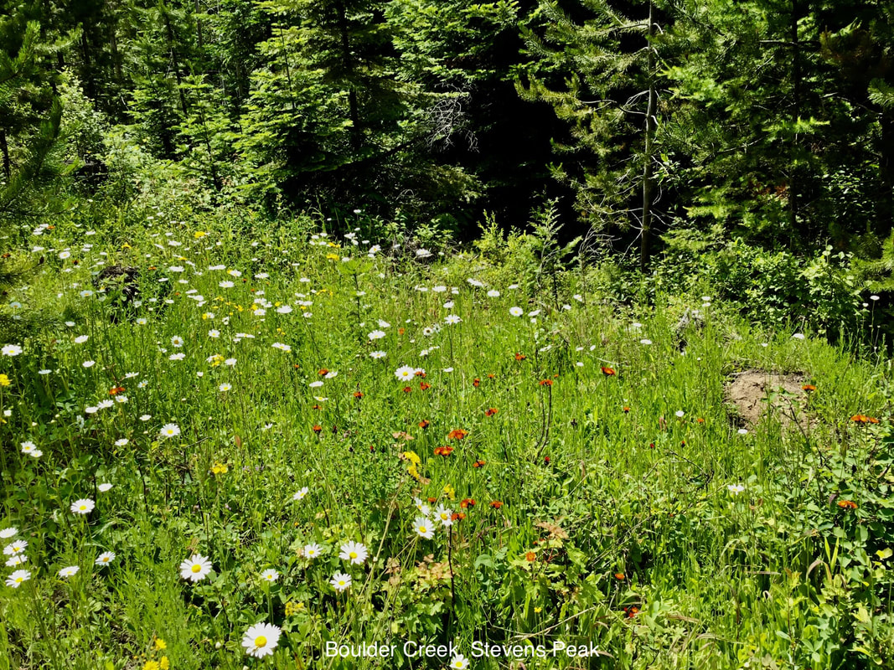

---
tags:
- Trails & Scrambles
stats:
- label: Genesis Name
  icon: book-open-variant
  value: Chrysanthemum leucanthemum
- label: Distribution
  icon: earth
  value: The oxeye daisy is native to **Europe and Asia and has naturalized in the
    United States**. The plant grows about 60 cm (2 feet) high and has notched oblong
    leaves and long petioles (leafstalks).
- label: Season
  icon: calendar
  value: May to Roctober
- label: Medical Use
  icon: medical-bag
  value: The herb is used in the treatment of **whooping cough, asthma and nervous
    excitability**. The root is used successfully for stopping the night-sweats of
    pulmonary consumption. Externally, it is used as a medicinal lotion for wounds,
    bruises, and ulcers
- label: Edibility
  icon: food-apple
  value: Not advised. Toxic to children
- label: Features
  icon: information-outline
  value: Oxeye daisy (Chrysanthemum leucanthemum) is a pretty little perennial flower
    that might remind you of Shasta daisies, with a central yellow eye surrounded
    by 20 to 30 white petals. However, don’t let this similarity fool you. This plant
    can quickly invade areas of the landscape, making it necessary for some oxeye
    daisy control measures.
- label: Leaves
  icon: leaf
  value: its leaves are **alternately arranged along the stems**, but form a basal
    rosette during the early stages of growth. the rosette leaves are stalked and
    have slightly toothed to lobed margins, while the upper stem leaves are smaller,
    narrower, and usually stalkless with toothed margins.
- label: Fruits
  icon: fruit-cherries
  value: 'Fruits and Seeds: The seeds are brown to black and are usually 16th of an
    inch long. They have up to 10 white ridges down the side.'
notes:
- '.Poisonous:'
- Look for a yellow disk with a dimple the center.
- The name Daisy is said to come from "day's eye" because the flower closes at night.
- the pedal like quality of the rays, distinguish these Daisies from Fleabanes.
---

# 0Xeye Daisy

*Oxeye daisy. aka field daisy*

## Description

The plant spreads aggressively by producing seeds and underground through spreading rhizomes, eventually
finding its way into unwanted areas such as crop fields, pastures, and lawns. The average plant produces
1,300 to 4,000 seeds annually and a particularly vigorous plant can produce as many as 26,000 seeds that
germinate rapidly when they land on bare soil. Historically, there have been several attempts to legislate
control of oxeye daisies. The Scotts, who called them "gools," made the unfortunate farmer whose wheat
fields had the most oxeye daisies pay an extra tax. Even so, the weed spread throughout the European
continent and eventually found its way to the U.S., probably in bags of forage grass and legume seeds. It
now grows in every state in the U.S. Several states have made it illegal to sell oxeye daisy seeds and
plants, but both are available on the internet and are sometimes included in wildflower mixes.

How to Control Oxeye Daisy An important part of oxeye daisy control is pulling up or cutting down the plant
before it flowers and produces seeds. The plants have shallow root systems and are easy to pull. Mow lawns
that are infested with oxeye daisy perennials regularly so they never have a chance to flower. Mowing causes
the leaves to spread outward and flatten, so that if you later apply an herbicide, the leaves have a broader
surface area over which to absorb the chemical.

Read more at Gardening Know How: Oxeye Daisies In The Landscape – How To Control Oxeye Daisy Plants
<https://www.gardeningknowhow.com/plant-problems/weeds/controlling-oxeye-daisies.htm>

---

## Photo gallery

---

