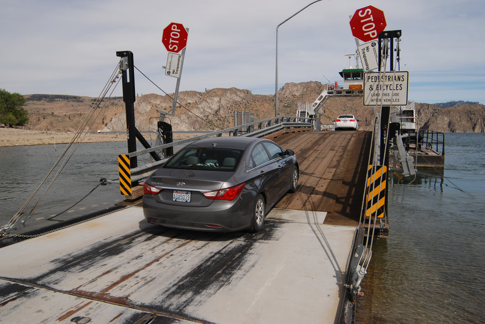
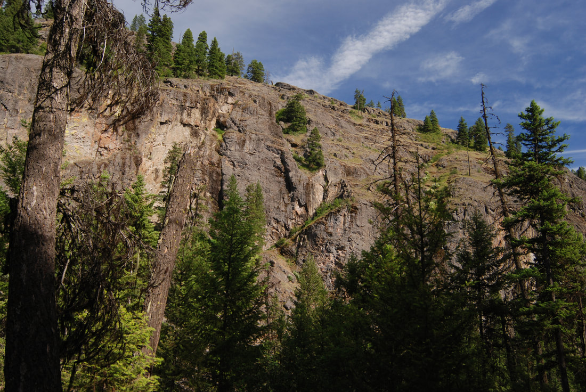
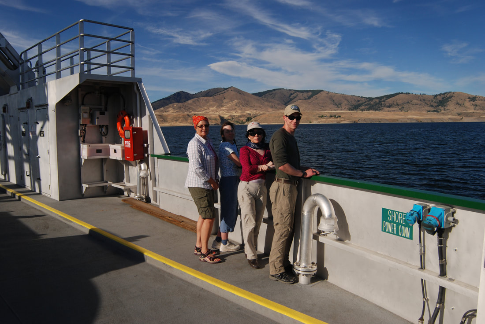

---
tags:
- Trails & Scrambles
- Moderate
- Day Hiking
- Backpacking
- Equestrian
- Mountain Biking
stats:
- label: Event Type
  icon: hiking
  value: Day hiking, backpacking, equestrian and mountain biking
- label: Distance
  icon: map-marker-distance
  value: 9+ mileS RT
- label: Elevation
  icon: terrain
  value: 1700 verts
- label: Difficulty
  icon: speedometer
  value: moderate
- label: Maps
  icon: map
  value: Colville National Forest, Thirteenmile Creek, and Bear Mountain topos
- label: GPS
  icon: crosshairs-gps
  value: Trailhead 48°28’54" N 118°43’37" W
- label: Republic Ranger District
  icon: pine-tree
  value: 509.775.7400
- label: Ferry County Sheriff
  icon: shield-account
  value: 509.775.3132
---

# 13 Mile Canyon Trail 23

*Thirteenmile canyon trail #23*

## Description

Right from the trailhead, this trail skirts towering cliffs on their west side. Be aware, in the heat of the summer, this trail can be a scorcher. Fortunately, along the trail are ancient Ponderosas and other trees to offer some shade. In the spring, wildflowers blanket this area. But, BE AWARE, rattlesnakes and wood ticks are prevalent. The higher up the trail you get, the forest offers some shade. At just less then 2 miles, is an overlook to observe the canyon you just climbed out of. After about three miles the terrain becomes open steppes, and eventually flattens out some. There is a small wetland and the ruins of an old sheep herders camp. The area is part of a nearly 13,000 acre Thirteenmile Roadless Area.
Some of the ancient Ponderosa trees are the largest in Washington.

Be sure to call and find out if the ferry is running during fire season and high winds

## Directions

Drive Hwy 2 east to Wilbur. At Wilbur turn right (north) onto S.R 21 for 56 miles to the trailhead.
Along the Sanpoil River, watch for the Rattlesnake Gulch. The Thirteenmile trailhead is a little over 1 mile, on a wide left turn.

## Cool things close by

Bear Mountain, Cougar Mountain, Curlew Lake State Park, Sherman Peak, Columbia Mountain, Thirteenmile Mountain, and the Colville Indian Reservation

## Hazards

BE AWARE, TICKS AND RATTLESNAKES are a part of life up here. Wear light colored pants so you and your hiking partners can spot them. You might rubber band your pant cuffs around your boots.
Rattlesnakes come out in the morning to sun themselves and get warm. Watch for them on the west to south to east sides of rocks. If you step over rocks, know that your landing spot for your foot, isn’t on or near a sunning snake.
If you like hiking in the Steppes and in the Scablands, there are lower leg shields to prevent snake bites.

## R & p

NA

## Photo gallery

## Its alway fun to ride the keller ferry

*Picture (Image missing)*

## About 50 miles north of wilbur, ​is the keller ferry across the columbia river

*Picture (Image missing)*

## Wendy & ken pausing along trail #13's cliffs near the sanpoil river

## The cliffs along trail #13

*Picture (Image missing)*

## The hiking crew having lunch in the tall grass

---

*Picture (Image missing)*

## Wendy & ken heading back to the cars

## Part of the crew enjoying the ferry ride across the columbia river

---

---

---

---

---

---
