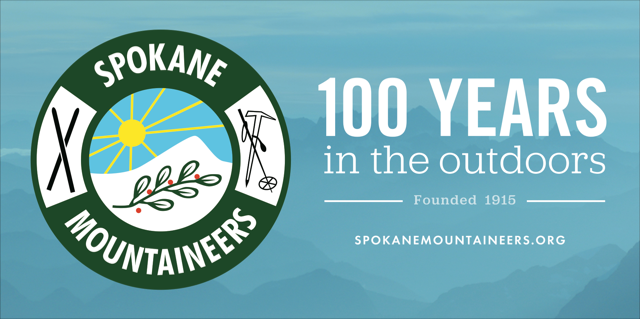

# 14 Essentials

as you read this section, please understand that it is designed to inform you. but more importantly, all these topics are things you should do your own research on to further your knowledge. The most important thing you can take with you on your outing is…… Knowledge

## 14+ essentials

## The 13 essentials has grown to 14

These items are to be carried by EVERY INDIVIDUAL, whether hiking solo or in a group. Couples are especially encouraged to carry their own 14 essentials, as well as their own food, water, and first aid supplies, just in case one or the other gets separated from their spouse or group. Please, error on the side of caution. NEVER rely on others. And know your equipment inside and out, before venturing into nature. KNOWLEDGE is the most important thing you can take into the mountains.

## 1. Fire Starter

Waterproof matches, lighters, small road flares (for winter conditions).
There are commercial pastes, matches, and other types of fire starters on the market.

When in nature, you may notice the stringy lichen hanging from tree limbs. Beard lichen is an excellent fire starter, and can be used as a sponge for collecting water.

Another use for something we all have around the house is dryer lint. Wrap it in paper like a tube, in a ziplock baggie, or stuff into an extra light container. Keep them in your 13 essentials for emergency use. See "HINTS"

## 2. Plastic Grocery Bags

I have added PLASTIC GROCERY BAGS, because it is up to US to take care of our FORESTS, LAKES, STREAMS, RIVERS, AND TRAILS.

In 2024 I personally extinguished three camp fires that were left burning for up to 3 days. Because I always pick up others trash and clean fire rings of debris. During a hike to Upper Glidden Lake to have dinner, I noticed that the fire pit was still hot. I had already picked up a lot of their trash, so I emptied the bag and went to the lake to scoop up about 1.5 gallons of water, 4 times.

Plastic grocery bags only weigh 6 grams per bag, and those 6 grams, could save a forest. But they can’t hold the weight of 1.5 gallons with holes in them. The next time you are at a Grocery Outlet, snag 6-12 grocery bags. Fold them up to fit in a ziplock bag, and keep them on your pack. They are stronger than most and can be used for so many purposes.

Please be kind to our natural forests resources.

## 3. Rain Gear, Umbrella, Poncho

It is essential that you stay as dry as possible. Rain suits tend to be too hot, while ponchos have more breathing ability. An umbrella is my choice for any hike that may be raining or snowing. Always carry a large lawn bag with many paper towels folded up.

The lawn bag can be used as rain gear, and weights very little.

## 4. Map & Compass...GPS

These items are useful tools

***A gps is not a replacement for a map & compas***S, and the knowledge to use them. Batteries die, but maps stay operational. Always have a copy of the National Forest Map, and topo map to the area you are hiking. A National Forest map, and a topo map are important for each member of the outing to have in case of separation or adverse weather conditions. They can be copied and folded into a ziplock bag.

If nothing else, PLEASE make a copy of the area you will be visiting, for each hiking partner.

### You must calibrate your watch that has a compass built into it, as well as your GPS

### Paper clip, pin, nail

### Another way to tell which way is magnetic north, I learned while watching NCIS. In your 14 ESSENTIAL pack, carry several paper clips

**Rub the paper clip against a larger piece of metal to magnetize the smaller piece. When you come across a small pond or stream with still water, place a straightened paper clip on a leaf. Then back away, so nothing on you effects the magnetic field.** **It may rotate a bit before it settles down.****It will show you the south -north line.**

### Watch

### You can use your watch, analog or digital. In the case of a digital, you will have to simulate a dial of an analog watch

### Point your hour hand at the sun, then observe the 12 o'clock position. Go half way between the two and opposite is north

### Stick method

**In a clearing, pound the stick in the ground, and place a rock at the tip of the shadow. Wait 15 minutes and place a rock at the tip of the shadow. The first rock will be on the west, while the second rock will be east. half way between the two is north, and\****opposite to the sun.**

### Using the stars

**Thruout life, and observe the stars often for weeks before a hike. By doing this, you will know what constellations are in the south, or the rotation of the Big Dipper in the north.
You can also look for the two stars farthest from the handle, of the Big Dipper. Draw a line from the bottom star to the top star, and continue for about 5 times the distance of the two stars. They will be pointing at the\****North Star, also known as Polaris.**

## 5. Extra Food

### Always carry extra food, maybe in the form of energy bars, but always high in protein. Choose an energy bar that does not require a lot of water to digest. Change out often

### A way to tell if your energy/protein bars are a good choice, is to look at the carbohydrates in the bar. Then look at the proteins. The proteins should be higher then the carbs

### My choice is a MET RX bar. They are available in the pharmacy at Walmart and at Winco. They have 32 grams of protein and 19 vitamins and minerals

## 6. Extra Water or Water Purifier

Because water is not always available along some trails, carrying enough water is paramount. I often drop water bottles along an out and back route, so I don’t have to carry so much water the full distance. Mark location carefully. See "HINTS"

## 7. Extra Clothing

Socks come to mind as an important item to have in case your feet get wet. A micro-fiber cloth works well and dries quickly. Other items may include polar fleece jacket and/or pants, spare wool or fleece gloves, stocking caps, and face masks. See "HINTS"

## 8. paper towels & trowel

I suggest paper towels over toilet paper, because a blow is very messy. The USFS suggests that all human waste be buried at least 6 inches deep, AND AT LEAST 200 FEET FROM ANY WATER SOURCE. THAT INCLUDES PEE.

I carry several ziplock bags of paper towels in my pack. They are light, and can be of great value, if needed.

## 9. Shelter

A piece of plastic sheeting and twine will suffice for a shelter if needed. However, a very light bivy tent is a good choice. There are other options to consider.

## 10. Headlight & Extra Batteries

I date my batteries when I install them in my headlight. Modern LED/LCD/COB headlights don’t need spare bulbs, so a second headlight is advised. Check the batteries before every trip to make sure you will have light when needed.
A COB type of headlight floods the view with way more lumens , hence I've noticed that depth of field and obstacles awareness is improved substantially. See "HINTS"

## 11. Knife

I carry several sizes of knives. One for small work like cutting up apples, but a large one if I’m on a potential difficult hike. A large Bowie type knife can be used to make kindling. See "HINTS"

## 12. First Aid Kit

You must decide what you take with you. Be extra careful in your selection of proper First Aid supplies.

Remember, you are responsible for yourself.

Carry what you may need, and add as necessary. Feminine pads are great items to have in your first aid kit.

Once on a week long ski trip in Kokanee Glacier National Park, one of the women started her period early. She was two weeks early, so she was in a bad way. We made a game of creating pads from the very sparse inventory of materials. It worked. And think of this...you could be a savior in case of a normal emergency. See "HINTS"

## 13. Signaling Devises

A whistle, canned air horn, or a mirror work well.

## 14. sun tan lotion & sun protection

Make sure your sun tan lotion is always fresh, and close at hand. I prefer a large sun hat like Sunday Afternoon, Solaris, or Sun Blocker. 100% UVA/UVB/IRA sun glasses are wise. If you spend time on snow, side and nose shades on sun glasses will protect your eyes and nose from reflected rays. Snow blindness is a very serious affliction while out. See"HINTS".

### S T O P

The below is information you need to know in the case you become misplaced.
Along with the information on this entire page, you can reduce your risk of getting lost, and how you can manage yourself after you realize you are misplaced.

### Stop think observe plan

**S**……STOP your movement and sit down and calm yourself. This is by far the hardest part of being lost. Start making noise with your whistle.
Three blasts of any noise means someone (maybe you) needs help. Keep making noise until you doze off.
**T**…..THINK calm down. Make sure you are calm enough to make wise decisions.
**O**…..OBSERVE look far and wide to see if you recognize any terrain features, trails, paths, rock bands, forests, scree slopes, summits, etc.
If one or more terrain features looks familiar, observe what it looks like now, as apposed to on your walk in. This will give you a direction to move toward. But be aware of what you crossed or didn’t cross as you walk in.
**P**…..PLAN form a plan for the immediate future, and for the up coming darkness.
Think this thru very carefully. What you decide, may save or cost you your life.
Well before you head out to hike, be sure to you pack your 14 ESSENTIALS pouch.
And if you have to spend the night out, start preparing your "camp" early. Creating a place to spend the night can be difficult the darker and colder it gets.
Gather wood for a fire, but only if it’s safe to lite one. If you are in a forest with light or dark colored stringy Lichen, hanging from tree branches, they are very good fire starter.
Pine bowls can be used for making a soft place to rest/sleep, and can act as a blanket.
Something I’ve done both in a group or solo, is mark the trail with a distinguishing mark. Put an X or arrow pointing in the direction you are walking.
When I come across it again, it gives me a clue as to where I was. Include an arrow showing the direction of travel. If you come across it again, you can correct your course, if needed.
Stop every once in a while to see if you are on course, remembering your terrain observations. If not, spend a moment to figure your next strategy.
DON’T PANIC. Take deep calming breaths, and clear your head.
Always be aware of the weather and what time it is.
MAKE NOISE ALL NIGHT LONG, but try to rest.
If it’s early, observe and plan your retreat. It’s wise to immediately back track. But junctions are always an issue when you are flustered.
I have in the past, used my phone to take pictures of complicated trail junctions.
When you do that, you can refer to them when you think you know where you are at.
The whole idea is also to point out that every hiker needs to carry their own 14 ESSENTIALS.
No one sets out to get misplaced, but stuff happens in Nature.
If you go out without your ESSENTIALS, you are taking unnecessary risks.
Risks that could change your life.

The following are other suggested items to take with you. I personally have 85 essentials I take on every trip. I have a check list to assure I’m not forgetting any items. You may have more or less.

Life flight network
800.982.9299
Lifeflight.org
If you ever need to be transported because of a medical emergency, Life Flight is a small membership fee, to pay for the services they provide.
A helicopter transport may cost tens of thousands of dollars. But for under 100$, you and all dependents living at your address are covered.
This membership does not act as a rescue service, tho.
Your transportation is determined by your medical need to be rushed to the nearest hospital.
It also covers ground and fixed wing medical transportation.
Call 800.982.9299, or log onto lifeflight.org.
Do not pass up this opportunity. call and become a member now.
But Be aware, if the Lifeflight helicopter is busy, this insurance does not cover other carriers.

-KNOWLEDGE: Know your equipment & how to use them, and know your outing particulars and goals. Set a precedence for what to do if separated from your group. I always tell fellow hikers, to return to the last place you were with the rest of your group.

-never, ever, ever be macho, or have a macho attitude in the mountains, ever.
Like cotton clothing, a macho attitude can get you in danger very quickly.

-A ziplock baggie with instructions on how to properly use your more complicated items like your compass, stove, water purifier, etc. is great assurance and in case they are needed. Cool or hot temps can play games with your head.

-An Emergency Locater Beacon or Personal Location Devise is a wise choice for off trail hiking and long, complicated, or dangerous terrain. There are beacons that do not use a subscription service to operate.
There is a new iPhone 14 that has a satellite SOS capability "See HINTS"
The app…AirFlare is an app for your phone.
It weights nothing and has a cost $4.99 A YEAR

-I carry a pen and a small tablet of paper to write notes on such things as "Y’s" in trails, notes to hikers behind me, essays, etc.

-Surveyors tape to mark off route or trail Y’s. But be sure the last person retrieves the tape. The next hiking party may not be going your way.
By looping the once folded tape over a twig, and pulling the loose ends thru the loop, they are easy to retrieve.

-If you are hiking in a large, strung out group, a walkie-talkie with key attendees, can help solve issues and call for help from the group.

-Remember, three of any kind of signal is a S.O.S. It is every hiker/ climber/ paddler’s responsibility to render aid to hurt or lost people on the trail.
Please be of help and be responsible.

-Sit pad for sitting on rocks or in wet terrain or snow.

-A face towel or a bandanna works well to wipe sweat out of your eyes.

-A large leaf bag can be used to keep you dry. Punch _small_ arm and neck holes where needed and pull it on. I’ve used string to secure my chest and hips from getting caught on branches.

Take along a length of parachute cord to secure items, make a tent, etc.

You may have other items you feel are necessary. But be aware of the additional weight these items will add.

---

[Washington Trails Association (WTA)](https://www.wta.org) — WTA mobilizes hikers and everyone who loves the outdoors to explore, steward and champion trails and public lands. WTA protects trails through lobbying and grassroots advocacy on issues that impact hikers, like trail funding, limited access and wilderness protection. WTA's advocacy voice is strengthened by the year-round work of our volunteers to keep trails open and accessible, from urban areas to remote wilderness and everything in between. More than 3,800 people come out annually to provide the more than 120,000 hours of volunteer trail work. Working with our land management partners WTA is striving to create a safe and sustainable trail system.

[Idaho Trails Association](http://www.idahotrailsassociation.org) — Idaho Trails Association's mission is "keeping Idaho's hiking trails open for all". As a voice for hikers, Idaho Trails Association promotes and advocates for the conservation and enjoyment of Idaho's incredible backcountry on foot or horseback. ITA mobilizes volunteers and organizes one day to weeklong trail maintenance projects, working in coordination with other organizations and Federal land management agency partners. We seek to educate hikers and other trail users in Leave No Trace principles, safe and responsible trail use, and traditional tool use in trail maintenance. For more information or to become a member, please visit their website.

## [Spokane mountaineers](https://www.spokanemountaineers.org)

The Spokane Mountaineers is an organization devoted to the conservation and enjoyment of the out-of-doors. By joining the Spokane Mountaineers, you have chosen to adopt these principles for your own and become a participant in some of the most exciting and enjoyable activities available in the Pacific Northwest. Founded in 1915 by a group of librarians who loved to hike, the club has grown to incorporate an amazing range of activities for members of all ages (15 and up) and abilities. Backpacking, day hiking, bicycling, skiing of all varieties - the Spokane Mountaineers have it! The annual schools and clinics are a wonderful testimony to the enthusiasm our club has for teaching others and to their firm belief that, although the dangers of mountaineering and the out-of-doors can never be ignored, good instruction can help minimize those dangers.

<http://spokanemountaineers.org>
