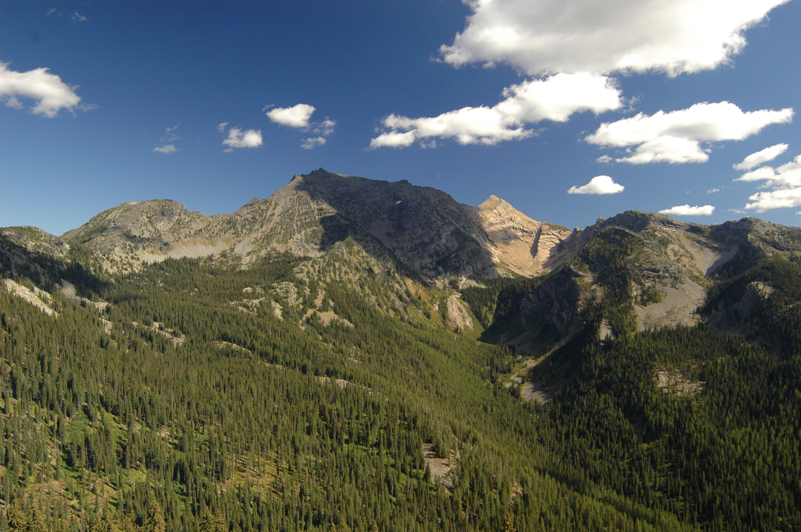
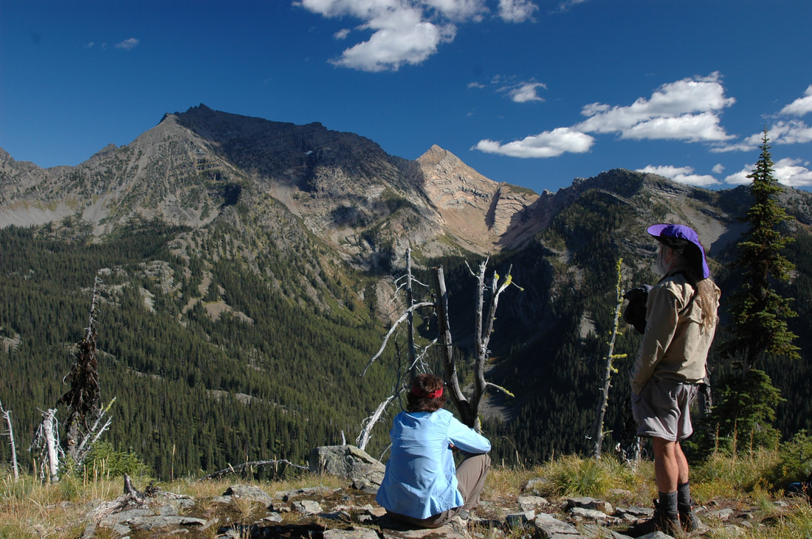
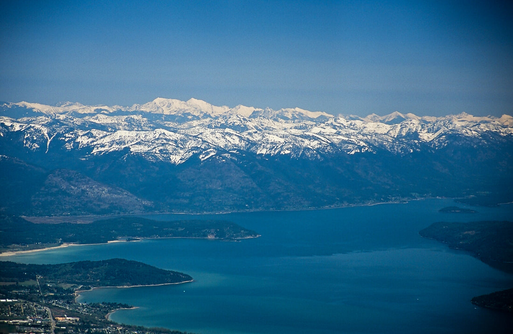
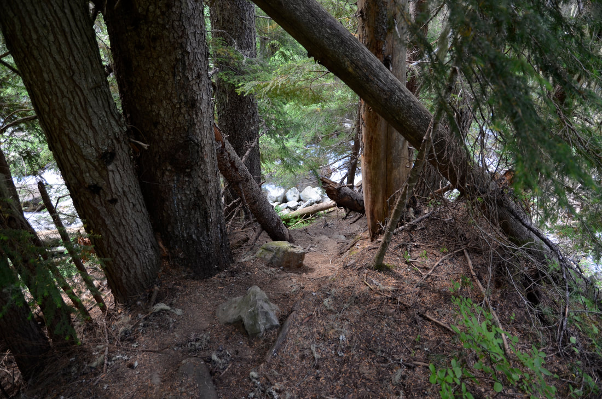
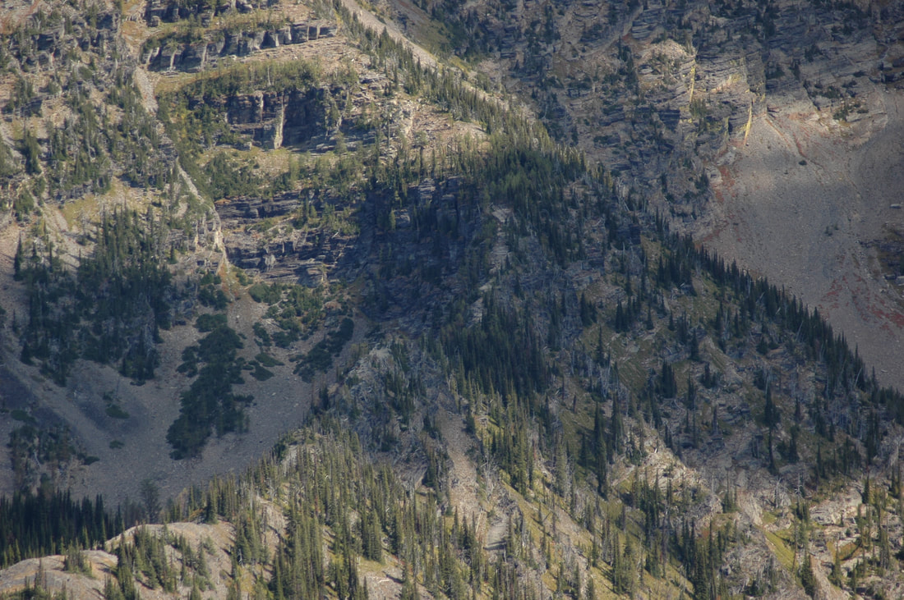
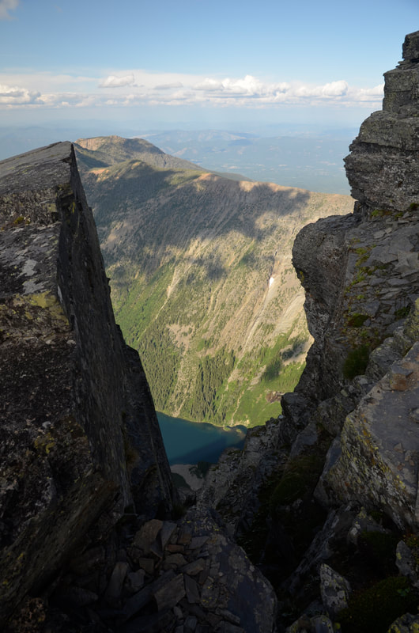

---
tags:
- Peaks & Mountains
- Very Difficult, Exposure
- Long Day Hike
- Backpack
- Scramble
stats:
- label: Event Type
  icon: hiking
  value: Long day hike, backpack & scramble
- label: Distance
  icon: map-marker-distance
  value: Trailhead 2446'. To high camp (approx. 3722')5.9 miles one way. Camp site
    to A Peak summit approx. 1.3.miles one way
- label: Elevation Gain
  icon: elevation-rise
  value: 6188 verts
- label: Difficulty
  icon: speedometer
  value: Very Difficult, exposure
- label: Maps
  icon: map
  value: Kooternai National Forest, Snowshoe Peak topo.
- label: Ranger District
  icon: pine-tree
  value: Libby R.D. 406.293.7773
- label: Sanders County Sheriff
  icon: shield-account
  value: CALL 911 FIRST or 406.827.3584
notes:
- Kootenai national forest/alerts<https://www.fs.usda.gov/alerts/kootenai/alerts-notices>
---

# A Peak 8634

!!! warning "Before you go"

    This hike is for the most Seasoned of scramblers If you haven't hiked this kind of terrain for decades. do not attempt

*A peak 8,634'*

## Description

We have added the areas sheriff’s emergency phone numbers for each trip write up under the ranger district info. if an emergency ocurrs, evaluate your circumstances and call only if needed.
The trail to A Peak is in part the Snowshoe Lake Trail #972, on the North Fork of the Bull River. When you get to Trail #972, Verdun Creek, do not go left, but rather stay on a little used unmarked trail to Snowshoe Lake.

At about 3 miles, you will come to a small waterfall on your right. Continue for about 1.5 miles to a horseshoe bend in the trail among trees with little or no undergrowth. At this bend, you will start climbing up a very steep slope on your left for about .5 of a mile, to an area that the summit ridge starts at.
Refer to the 5th and 6th image below.
Where the rock ridge starts, is where you should camp. There is a small water source near there.
In the morning, hike up the rock ridge line that you see that goes to the summit. Ropes aren't necessary, but you may want to carry a 75' length in case you need it.
Up near the summit, the ridge turns to loose rock.  BE EXTRA CAREFUL HERE.
It is my opinion that you should not attempt to scramble over to Snowshoe Peak.
It is a very dangerous route.
After summiting A Peak, follow your steps back to your camp.

please remember..this is grizzly country. use all precautions to protect you and your group.
Hang your food bag as high in a tree at least 10+ feet, and at least 5 feet from the trunk.

---

## Directions

From Sandpoint, drive east on HWY 200, to Hwy 56, or  milepost 17.in Montana
Drive up Hwy 56 to just pass the Vista, about 1.5 miles to the South Fork Bull River. If you get to Bull Lake, you've gone about 1.4 miles too far.
The signs may state the North Fork Bull River and the South Fork Bull River.
Head east on the South Fork for about 2 miles and turn left (NE) onto the North Fork Bull River Road #2722, to where the road crosses the North Fork Bull River. Just over the bridge is a small parking area on your right.

Trail #972 starts on the east side of the bridge, and heads North East up the North Fork Bull River.

If you were ever up the North Fork Trail, it is different from years ago. The area NE past the bridge washed out, and has been rerouted.
Before you travel there, call the Ranger Station listed above for more  details.

---

## Cool things close by

Bull Lake, Ross Creek Cedars, Engle Peak, St Paul Lake, Cliff Lake  & Rock Peaks, Rock Lake, Snowshoe Lake,Little Ibex Lake, the Kootenai Falls, and Dad Peak.

## Hazards

Every aspect of this hike/scramble can be dangerous. please use every precaution & do not take any risks.
You will be in grizzly coutry, plan ahead.

## R & P

Kaiju Bar & Grill in Libby. Henry's, The Shed, and a cool Rosauers in Libby

## Photo gallery

---

A peak, the point in the shade on left. Snowshoe peak is in the sun at mid top right image by chris herath

## a peak & snowshoe peak from below pine ridge, c.m.w. image by chris herath

---

---

## A peak top left of center & snowshoe peak from schweitzer mountain resort image by chris herath

*Picture (Image missing)*

## Ibex peak from a peak image by chris herath

Along the snow lake trail, This corner is where you ascend to the a peak ridge, and a place to camp with water near by. image by chris herath

*Picture (Image missing)*

The upper camp is by the far end of the snow patches The ridge to the left off the snow patches is the ascent route image by chris herath

*Picture (Image missing)*

## The upper camp area image by chris herath

## The lower section of the  route Image by chris herath

*Picture (Image missing)*

## Nearing the summit of a peak 8634' image by chris herath

## First peek of granite lake from the summit image by chris herath

*Picture (Image missing)*

## Granite lake from the summit image by chris herath

*Picture (Image missing)*

## From the summit of a peak looking at snowshoe peak Image by chris herath

---

---

---
