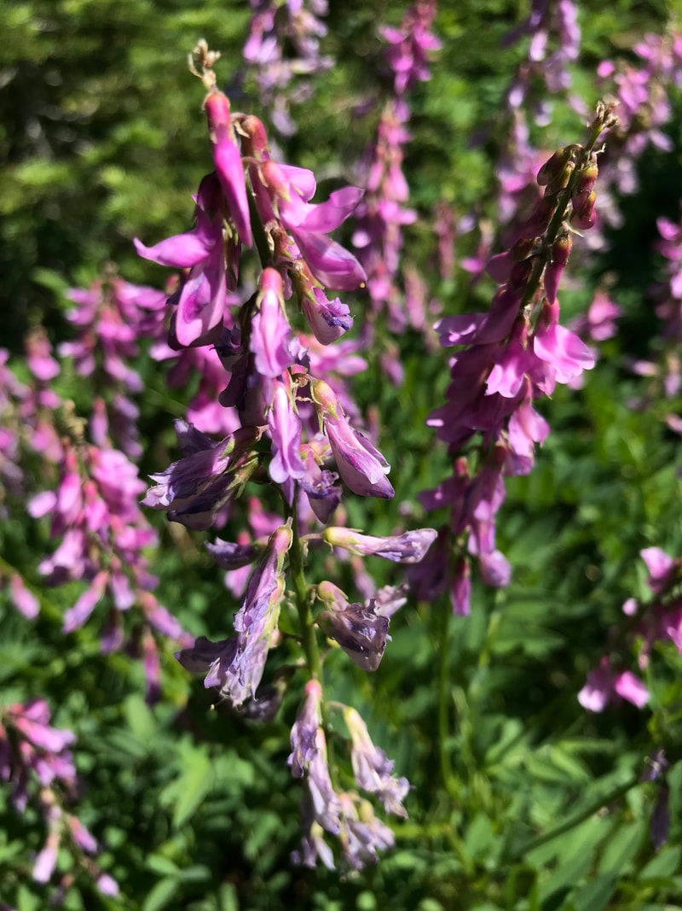

---
tags:
- Trails & Scrambles stats:
- label: Genesis Name icon: book-open-variant value: Hedysarum alpinum
- label: Distribution icon: earth value: ak , me , mi , mt , nd , nh , sd , vt , wy
- label: Season icon: calendar value: Blooms in June & July, but can last until late Roctober
- label: Medical Use icon: medical-bag value: 'The sweetvetch root decoction is used in traditional medicine
  as **an expectorant for treatment of coughing, bronchitis and pulmonary tuberculosis**, as well as a
  sedative for treatment of nervous disorders, insomnia, epilepsy, heartache, and
  atherosclerosisPoisonous: **The seeds are poisonous, especially when eaten raw**. There is some evidence
  that the seeds of alpine sweetvetch are what poisoned Christopher McCandless, the subject of Jon
  Krakauer''s popular book (made into a movie), Into the Wild.'
- label: Features icon: information-outline value: Alpine sweetvetch is an herbaceous, perennial legume. It
  produces numerous clumped stems from a branching
  [caudex](https://www.fs.fed.us/database/feis/glossary.html#CAUDEX:). Stems are erect and measure 8 to 30
  inches (20-70 cm) tall
  [[1](https://www.fs.fed.us/database/feis/plants/forb/hedalp/all.html#1),[8](https://www.fs.fed.us/database/feis/plants/forb/hedalp/all.html#8),[28](https://www.fs.fed.us/database/feis/plants/forb/hedalp/all.html#28),[39](https://www.fs.fed.us/database/feis/plants/forb/hedalp/all.html#39),[60](https://www.fs.fed.us/database/feis/plants/forb/hedalp/all.html#60)].
  Leaves are longer than they are wide, pinnately compound, and have an alternate arrangement. Leaves
  contain 9 to 31 leaflets that are 0.4 to 1 inch (10-35 mm) long and 5 to 10 mm wide
  [[1](https://www.fs.fed.us/database/feis/plants/forb/hedalp/all.html#1),[8](https://www.fs.fed.us/database/feis/plants/forb/hedalp/all.html#8),[17](https://www.fs.fed.us/database/feis/plants/forb/hedalp/all.html#17),[28](https://www.fs.fed.us/database/feis/plants/forb/hedalp/all.html#28),[40](https://www.fs.fed.us/database/feis/plants/forb/hedalp/all.html#40)].
  Alpine sweetvetch produces showy flowers that are densely organized in a long raceme. Flowers can be 9
  to 18 mm long and are often deflexed and spreading
  [[1](https://www.fs.fed.us/database/feis/plants/forb/hedalp/all.html#1),[18](https://www.fs.fed.us/database/feis/plants/forb/hedalp/all.html#18),[39](https://www.fs.fed.us/database/feis/plants/forb/hedalp/all.html#39)].
  Alpine sweetvetch produces flat, indehiscent, pod fruits that are constricted between the seeds. There
  are typically 2 to 5 but sometimes as many as 9 constricted joints/pod and just one seed/joint. Pods can
  be 5 to 7 mm long and 3 to 5.5 mm wide
  [[18](https://www.fs.fed.us/database/feis/plants/forb/hedalp/all.html#18),[28](https://www.fs.fed.us/database/feis/plants/forb/hedalp/all.html#28),[35](https://www.fs.fed.us/database/feis/plants/forb/hedalp/all.html#35),[60](https://www.fs.fed.us/database/feis/plants/forb/hedalp/all.html#60)].
  Seeds are smooth and measure 3.5 to 4 mm long and 2 to 2.5 mm wide
  [[28](https://www.fs.fed.us/database/feis/plants/forb/hedalp/all.html#28)]. Two hundred seeds weigh
  approximately 1 gram
- label: Leaves icon: leaf value: The green leaves tend to grow on the lower part of the stem. Their leaves
  are pointed oblong, and are spaced apart from each other on the stem
- label: Fruits icon: fruit-cherries
## value: The fruit is dry but does not split open when ripe
## Alpine Sweet Vetch
## Description
Several erect, branching stems rise 1 1/2-3 ft. from a woody crown. From the axils of pinnately compound
leaves rise long, straight, dense clusters of pinkish-lavender, pea-like flowers. Like other members of the
pea family, this plant needs the presence of microorganisms that inhabit nodules on the plant's root system
and produce nitrogen compounds necessary for the plant's survival. Special Value to Native Bees (Recognized
by pollination ecologists as attracting large numbers of native bees.) Black bears consume the aboveground
portions of alpine sweetvetch, and roots are consumed by grizzly bears.
---

# Alpine Sweet Vetch

## Photo gallery

---

