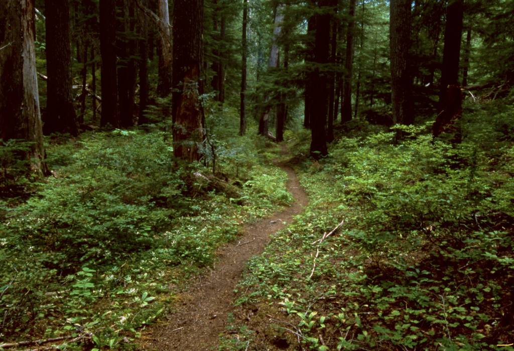
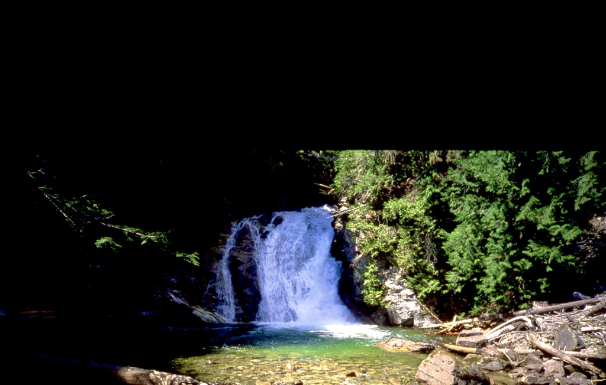
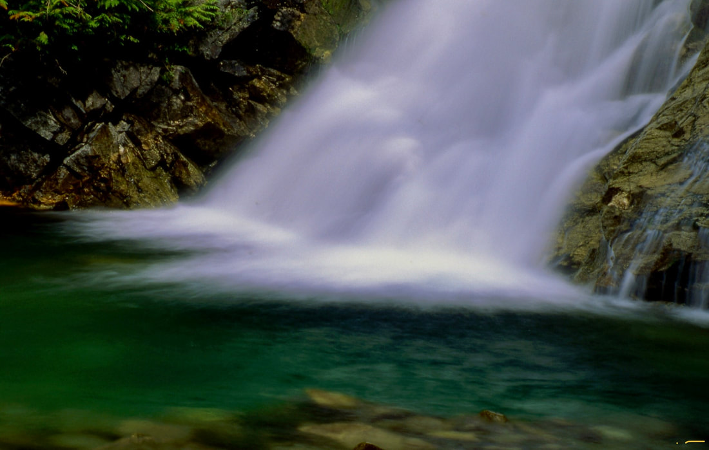

---
tags:
- Waterfalls
- Easy
- Day Hike
- Backpack
- Mt. Biking
- Swimming
stats:
- label: Event Type
  icon: waterfall
  value: Day hike, backpack, Mt. Biking, swimming
- label: Distance
  icon: map-marker-distance
  value: 16.2 miles RT
- label: Elevation Gain
  icon: elevation-rise
  value: 640’
- label: Difficulty
  icon: speedometer
  value: easy
- label: Maps
  icon: map
  value: I.P.N.F., Kaniksu N.F., Continental Mountain
- label: GPS
  icon: crosshairs-gps
  value: 48°53’45" n 116°57’51" w
- label: Ranger District
  icon: pine-tree
  value: Priest Lake r.d. 208.443.2512
- label: Boundary County Sheriff
  icon: shield-account
  value: CALL 911 FIRST or 208. 267.3151
notes:
- Idaho panhandle national forest/alerts [https://www.fs.usda.gov/alerts/ipnf/alerts-notices](https://www.fs.usda.gov/alerts/ipnf/alerts-notices)
---

# American Falls Trail 308

## Description

We have added the areas sheriff’s emergency phone numbers for each trip write up under the ranger district info. if an emergency ocurrs, evaluate your circumstances and call only if needed.
​Altho this trail seems long, it is a beautiful trail to hike on the hottest day of the year. Most of Trail #308 is surrounded by large Hemlocks and Cedars.

For the most part, this trail skirts the Upper Priest River. Along your hike or mt. bike, there are numerous wood walkways to protect the fragile, often moist ground. Trees make this hike a real memory. And this area is one of the largest, in tact old growth forests in the Pacific Northwest.
Some of the trees are up to 10 feet in diameter.
For a shorter hike, you can drive up FR1013, and turn onto FR 1388 to the Continental Trailhead. The hike is 1.5 miles and 1040 verts down to Trail #308. From 308, it’s another mile to American Falls, aka Upper Priest Falls. But it won’t be as cool as hiking the 308 trail. Cool meaning temps and beauty.

For mt. bikers, drive past, Trail 308 trailhead, leaving a shuttle car and turn up FR 1388 after it crosses Continental Creek to the end. You will be at the Continental Trail #28. This route is 14 miles back to the Trail #308 trailhead where you left a shuttle car. It is a 1040 foot drop down to Trail #308.

While at American Falls, look around for Orange Peel Fungus.

## Directions

From Priest River, drive north on Hwy 57 for about 37 miles to Nordman. Continue 14 miles on FR #302 to Granite Creek and the Stagger Inn Campground. Take a moment here to visit Granite Falls and the Roosevelt Grove of Ancient Cedars. From here drive 1.6 miles to the FR #1013 junction. Take the middle fork nearly 12 miles, and look for the parking area on the left.

For the upper trailhead, drive further up 1013, to the #28 trailhead at the end of the road.

---

## Cool things close by

Hughes Meadows & Ridge, Little Snowy Top, and Snowy Top.

## Hazards

The hiking, and biking hazards are simple. If you gawk too much, you will leave the trail.
​On Trail #28, you just pay attention to the trail as it drops 140’.

This area is frequented by moose and grizzly bears. make lots of noise to alert them that you are in the area.

## R & p

Burger Express in Priest River.

## Photo gallery

---

## A section of the american falls trail #308

*Picture (Image missing)*

## American falls, aka, upper priest river falls

---

## The upper priest river falls, aka american falls

---

## A long exposure of american falls

---

There are two things I like about life… Living it, and living in nature. ​ The solitude is deafening.                     chic     1.1.2023

---
