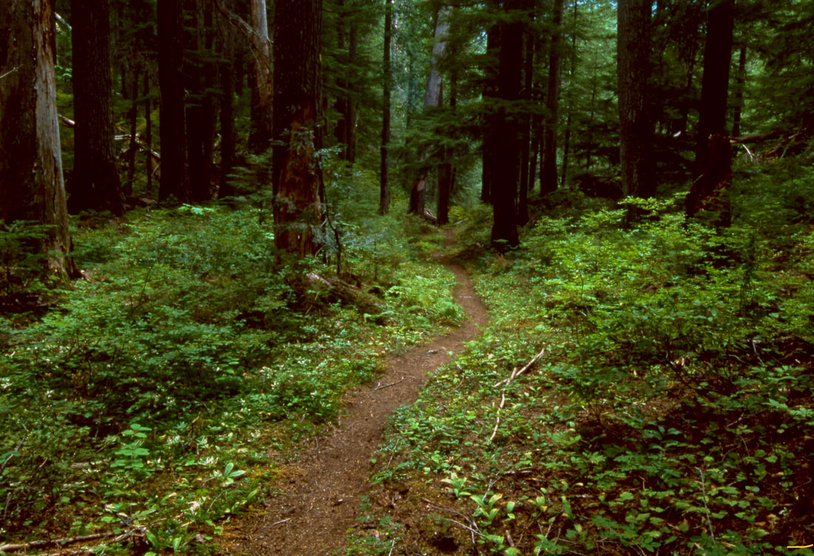
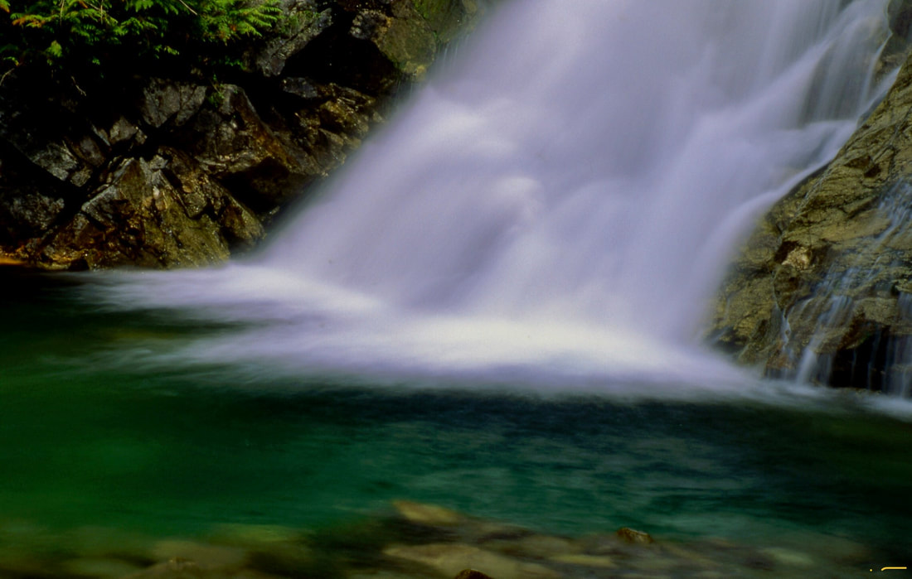

---
tags:
  - Waterfalls
stats:
  - label: Waterfall
    icon: waterfall
    value: American Falls
  - label: Drop
    icon: arrow-collapse-down
    value: 40'
  - label: Waterfall Type
    icon: waterfall
    value: Slide
  - label: Distance Car to Falls
    icon: map-marker-distance
    value: 16.2 miles RT with 1400 verts
  - label: Maps
    icon: map
    value: Kaniksu N.F., Continental Mountain 208.443.7223
  - label: GPS
    icon: crosshairs-gps
    value: Trailhead 48°53'53" N 116°57'59" W
---

# American Falls

## Description

Trail #308 hikes up the Upper Priest River for about 8 miles one way. The trail only gains 640 feet, making
it a great backpack, mountain bike, or long day hike.

Most of the trail wanders up through cedar forests. On the hottest day of the summer, this walk is around
20° cooler. The plant life, large or small, is worth the effort.

### Option #1

If your time is short, take your mountain bikes. It's a nice trail even for beginners.

### Option #2

For a one way bike, you can leave one car at Trail #308's trailhead. With the second car, you can drive up
F.R. #1013 to Trail #28. It's a 2.3 mile descent to near American Falls, then about 8 miles to the 308
trailhead. This bike trip is great for beginners and able kids.

## Directions

From Priest River, drive north on Hwy 57 for about 37 miles to Nordman. Continue up F.R. #302 to the Stagger
Inn Campground. Take the middle fork for 1.6 miles at the junction onto F.R. #1013. Drive about 12 miles and
look for the trail sign and parking area on the left.

## Cool Things Close By

Salmo-Priest Wilderness, Gypsy Peak, Hughes Meadows & Ridge, Upper Priest Lake, Trapper Falls, Granite
Falls, and the Roosevelt Grove of Ancient Cedars.

## Hazards

It's a long day hike, so start very early. Do not forget your First Aid Kit.

## R & P

Stagger Inn

## Plan Your Trip

Click for Current NOAA Weather Conditions

## Photo Gallery

_The trail to American Falls._

_The pool below American Falls._
