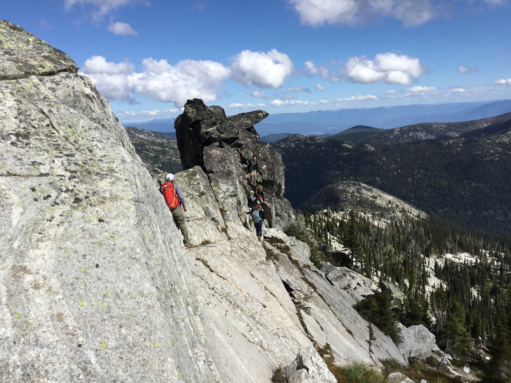
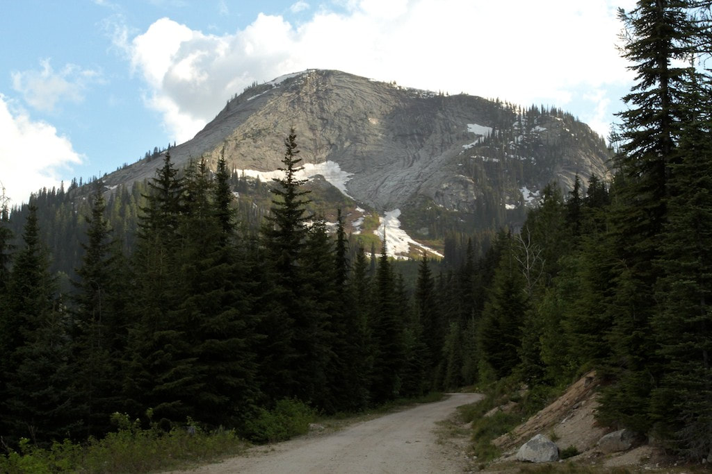
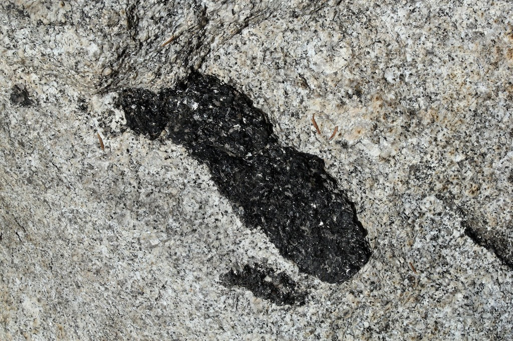
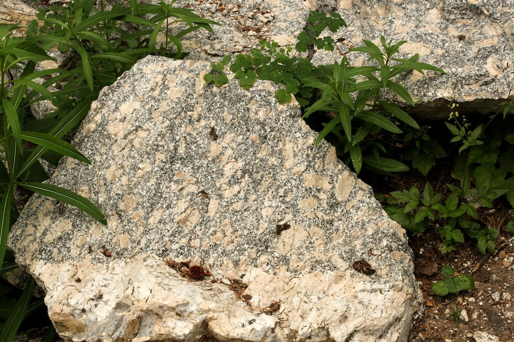
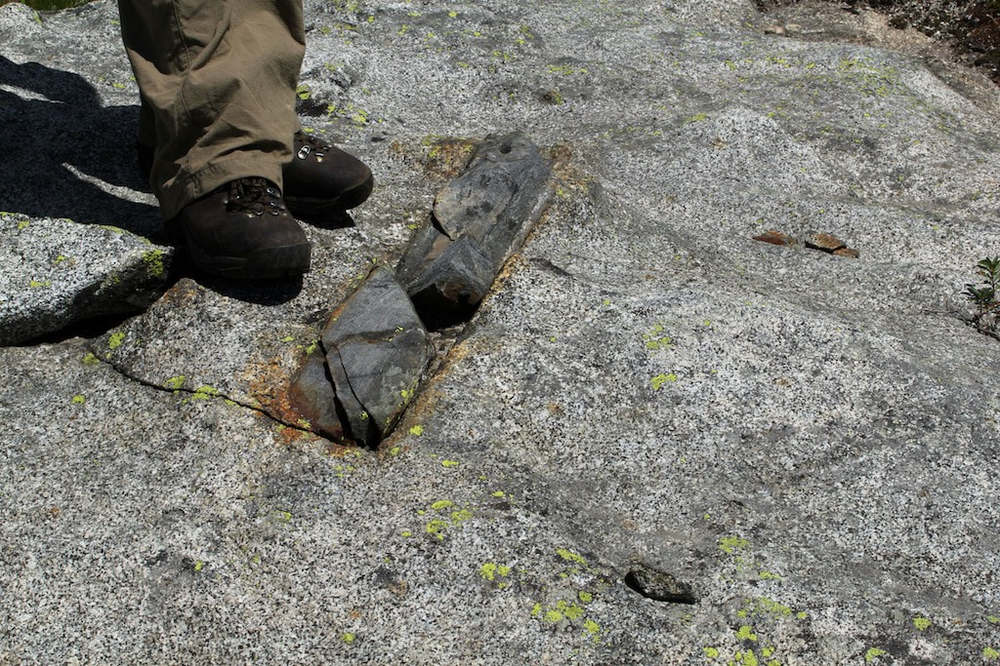
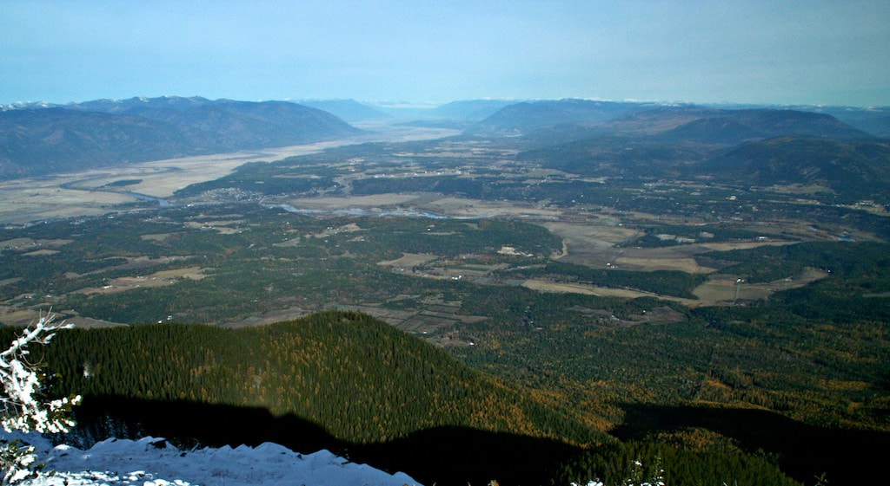
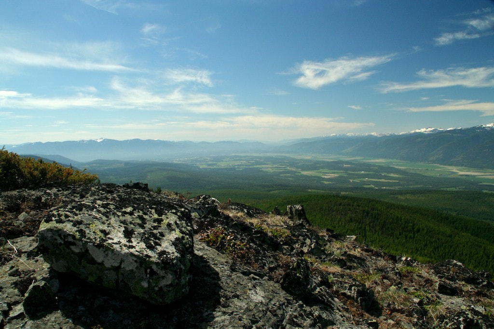
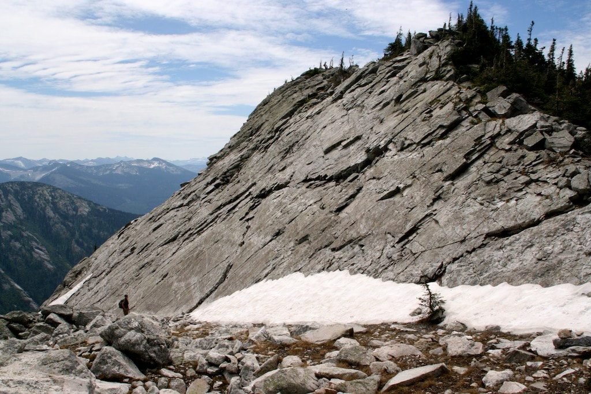
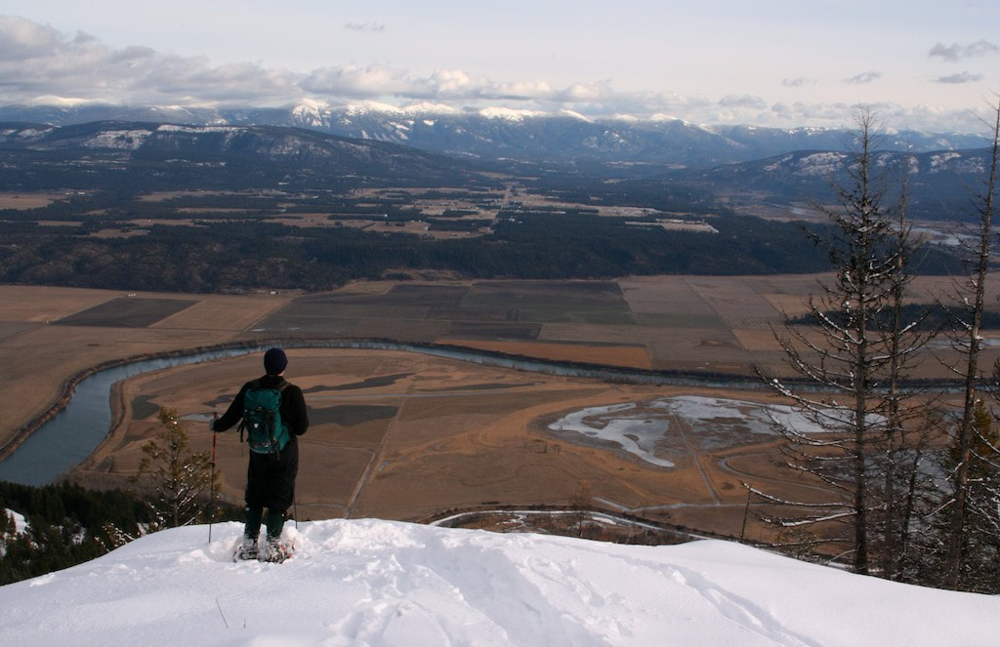

# American Selkirks

_The above image was taken from the Selkirk Crest above Little Harrison Lake & Beehive Lake_

## Beehive Dome & Upper Pack River Granitics

### Granitic Rock Formation & Exfoliation

Sometimes rocks weather by peeling off in sheets rather than eroding grain by grain—a process known as
**exfoliation**. Exfoliation can occur in thin layers on individual boulders or in massive thick slabs as
seen at Beehive Dome and Myrtle's Turtle in the Selkirks, as well as Enchanted Rock in Texas and Half Dome
in California's High Sierra.

These rocks were emplaced deep underground as molten plutons during tectonic uplift. Over millions of years,
erosion unroofed the plutons, removing the immense pressure of overlying rock. This pressure release created
fine joints and fractures, which mechanical weathering subsequently loosened into massive exfoliation slabs.

_Myrtle’s Turtle: A massive dome of exposed granitic rock in the Selkirks._

!!! info "Further Geologic Reading"
    For additional background on local geology, visit
    [Mountains moved to form the Purcell Trench](https://www.naturallynorthidaho.com/2012/12/mountains-moved-to-form-purcell-trench.htm){:target="_blank"}.

---

### Magma Crystallization & Texture Variations

Igneous rock forms through the crystallization ("freezing") of molten rock. Underground molten rock is
termed **magma**, whereas surface molten rock is termed **lava**. Magma crystallizes at extreme temperatures
ranging from 650°C to 1,100°C (1,202°F to 2,012°F).

| Mineral / Composition | Crystallization Temp | Common Examples & Rock Characteristics |
| :-------------------- | :------------------- | :------------------------------------- |

| **Silica-Rich (Felsic)** | Lower Temp | Quartz, Feldspar; forms light-colored granite & granodiorite |

| **Mafic-Rich** | Higher Temp | Hornblende; crystallizes earlier during pluton cooling |

| **Porphyritic (Two-Stage)** | Dual Phase | Large phenocrysts (often plagioclase) in fine matrix |

The Selkirk range is dominated by plutons—blob-like intrusions of magma tens of kilometers in extent. As
magma ascended, it melted surrounding host rocks of varying compositions, yielding diverse rock types across
the range.

_Slow cooling deep underground allowed large mineral crystals to grow._

#### Cooling Rates & Porphyritic Textures

Cooling rate directly controls crystal size:

- **Slow Cooling:** Allows minerals to grow into coarse grains (granite and granodiorite).

- **Fast Cooling:** Rapid crystallization yields small mineral grains.

- **Two-Stage Cooling (Porphyritic):** Features large isolated crystals (**phenocrysts**, commonly
  plagioclase) embedded within a finer-grained matrix. Phenocrysts crystallize first during slow initial
  cooling, followed by rapid crystallization of remaining minerals.

_Example of a porphyritic rock with large phenocrysts embedded in a matrix._

---

### Inclusions, Xenoliths & Quartz Veins

Scattered across the Selkirk backcountry are foreign rock fragments that contrast sharply with the host
granite (such as dark-colored rock along the Hidden Lake trail).

_A possible xenolith along the trail—dark rock contrasting sharply with surrounding granite._

!!! note "Origin of Intrusions & Inclusions"

    - **Xenoliths:** Foreign rock fragments that fell from the wall or ceiling of a magma chamber and were
      trapped without fully melting before the magma solidified.

    - **Mineral Veins:** Fractures (often created by fault movement) that filled with later-stage magma or
      silica-rich fluids, cooling into distinct quartz veins.

    Finding various granite types, granodiorite, quartz veins, and xenoliths makes exploring the Selkirks
    feel like a geological scavenger hunt without a map.

---

## Purcell Trench & Tectonic Evolution

### Geologic Faulting & Trench Formation

The **Purcell Trench** is a major bedrock valley structure separating the Selkirk Mountains to the west from

the Cabinet

and Purcell Mountains to the east. It extends from the Rathdrum Prairie (south of Sandpoint) north through
Boundary County into British Columbia, where it eventually merges with the Rocky Mountain Trench.

_View from Clifty Mountain in the Cabinets, looking north along the Purcell Trench into Canada._

Unlike valleys carved strictly by rivers or glaciers, the Purcell Trench is too long, wide, and straight to
be formed by erosion alone—it is the result of major bedrock faulting and crustal extension.

_The Purcell Trench stretching south, viewed from Tungsten Mountain in the Purcells._

#### Mechanism of Crustal Extension & Sliding

1. **Magma Intrusion & Crustal Bulging:** Long before the ice ages, a giant mass of granitic magma rose into
   the crust beneath the present-day Selkirks, stretching and bulging the overlying rock (similar to a
   bubble forming in pizza crust).

2. **Faulting & Gravitational Sliding:** To relieve severe tension, a major fault formed along the current
   eastern front of the Selkirks. Over millions of years, the overlying rock layers (which now form the
   Cabinet and Purcell Mountains) slowly slid eastward down the fault into their current position,
   leaving an open trench behind.

3. **Metamorphic Deformation:** Immense heat and pressure along the fault zone metamorphosed and folded
   rocks along the eastern Selkirk front (distinctly visible in folded rock cuts along Myrtle Creek Road
   off West Side Road).

4. **Glacial & Fluvial Reshaping:** Glaciers, lakes, and rivers subsequently scoured, eroded, and deposited
   sediment in the trench, forming the modern Kootenai Valley.

_Exposed Selkirk granite, which initially cooled miles beneath the Earth's surface._

_Looking east across the Purcell Trench toward the Purcell Mountains._

---

### Regional Tectonic & Glacial History

!!! quote "Geology of North Idaho & Western Montana"
    _Adapted from historical geological analyses by Charles Mortensen._

#### Prehistoric Timeline & Terrane Accretion

The Selkirks form the backbone of the **Priest River Uplift**, exposing Cretaceous granitic rocks of the
Kaniksu batholith intruding the Mesoproterozoic Belt Supergroup, Neoproterozoic Deer Trail and Windermere
groups, and Cambrian formations.

- **250–160 Million Years Ago:** The North American Plate collided with the Pacific oceanic plate. Sediments
  of the **Kootenay Arc** (an island-arc terrane) jammed against the continental margin and subducted into
  a deep

trench, recrystallizing into schist and gneiss or melting into granite.

- **160–100 Million Years Ago:** Tectonic collision pushed up a broad welt of sheared rock during
  mid-Jurassic to late Cretaceous time, reaching an estimated **20,000 feet** in height—resembling the
  modern Andes of South

America.

- **65 Million Years Ago:** Enormous volumes of molten granite rose into batholiths under the Coast
  Mountains and Idaho. Crustal slabs sheared off toward western Montana, unroofing the **Priest River Core
  Complex** and exposing

the Kaniksu Batholith granite base.

#### Glacial Landscape Carving

During maximum glaciation of the Ice Age, the **Cordilleran Ice Sheet** descended from Canada, encasing all

but the

highest Selkirk peaks in ice exceeding **4,500 feet** thick near Sandpoint.

[ Alpine Cirque ] ──► Accumulates snow & ice in steep-sided bowl basin │ [ Glacial Horn ] ──► Sharp peak
formed where cirques erode back on multiple sides │ [ Knife Arête ] ──► Narrow ridge separating adjacent
ice-carved valleys │ [ U-Shaped Trough ] ──► Broad valley with hanging basins & bedrock tarn lakes

- **Cirques & Tarns:** Steep-sided, rounded bowl features carved into mountains where snow accumulated into
  glacial ice. Meltwater now forms pristine bedrock lakes in cirque hollows.

- **Horns & Arêtes:** Sharp pyramidal peaks (horns) and knife-edge ridges (arêtes) separating adjacent
  glacial troughs.

- **Priest Lake Glacial Dam:** Between 7,000 and 25,000 years ago, a recent glacier scooped out the Priest
  River valley floor and pushed soil, gravel, and boulders into a natural terminal moraine dam at the
  south edge of Priest Lake, impounding meltwater into modern Priest Lake.

---

## Selkirk Crest Land Status & Climbing Notes

### Protected Status & Wilderness History

In 1987, the Idaho Panhandle National Forest designated **26,700 acres** of the high Selkirk Crest as a

Wilderness Study

Area. Although formal congressional wilderness designation was not enacted, the high country continues to be
managed to maintain primitive wilderness values.

### High-Country Climbing & Navigation

- **Granite Quality:** The high-friction granitic rock allows safe walking and scrambling on steep 45°+
  slabs.

- **Un-Named Peak Nomenclature:** Peaks listed as _"Peak 6514'"_ or similar refer to un-named summits
  designated by their spot elevation.

---

## Additional American Selkirks Overview & History

!!! info "Quick Facts: American Selkirks"

    - **Total Area:** ~2,500 square miles (~2/3 in Idaho, 1/3 in Washington)

    - **High Point:** UN 7,709 (*7,709 ft*)

    - **Designated Wilderness:** Salmo-Priest Wilderness (*39,937 acres*)

    - **Primary Land Manager:** Idaho Panhandle National Forest

    - **Base Elevations:** 2,400 ft (Priest Lake / West) | 1,700 ft (Purcell Trench / East)

### Regional Geography & Topography

The main mass of the American Selkirks forms an extended ridge system dividing the Kootenay Basin to the
east and the Priest Lake Basin to the west.

- **Boundaries:** Bounded on the south by the Pend Oreille River and extending north into British Columbia
  (connecting with the Nelson sub-range). Includes lower mountains and hills in Washington east of the
  Pend Oreille River.

- **Acreage & Extent:** Covering ~2,500 square miles (nearly 2/3 in North Idaho, 1/3 in Eastern Washington).

- **The Selkirk Crest:** Idaho's rugged backbone; sharp glacially carved ridges radiate east and west from
  the main divide.

- **Elevations:**

- **West Base (Priest Lake):** ~2,400 feet

- **East Foot (Purcell Trench):** ~1,700 feet

- **Main Crest Summits:** 7,200 feet to 7,500 feet

- **Northeast Ridges:** Up to 7,700+ feet

- **High Point:** Unnamed peak topping out at **7,709 feet** (_UN 7,709_, informally misnamed "South Selkirk
  Crest").

On both sides of the crest, ridges drop off abruptly due to the intense scouring of massive glacial ice
lobes that advanced southward from Canada during the last ice age. Smaller mountain groups also lie further
west between Priest Lake and the Pend Oreille River in Washington State.

!!! note "Peak Listing Criteria"
    Mountain listings for this area primarily highlight peaks above 7,000 feet in elevation that are either
    named or possess at least 300 feet of topographic prominence. Numerous worthwhile peaks exist
    between 6,000 and 7,000 feet; consult individual mountain pages in the sidebar for details.

---

### Land Management & Protected Areas

| Jurisdiction / Area | Primary Manager | Characteristics & Protection Status |
| :------------------ | :-------------- | :---------------------------------- |

| **Selkirk High Country** | Idaho Panhandle National Forest | Primitive, roadless granite alpine terrain; managed _de facto_ for wilderness values. |

| **Salmo-Priest Wilderness** | Colville National Forest & IPNF | Designated Wilderness (_39,937 acres_); high point Gypsy Peak (_7,309 ft_). |

| **State & Private Lands** | State of Idaho & Timber Industry | Lower east side canyons & Priest Lake east shore; managed primarily for timber production. |

#### Salmo-Priest Wilderness

Located in the far northeast corner of Washington State, the **Salmo-Priest Wilderness** encompasses 39,937

acres of

rugged alpine terrain and old-growth valley forests. It protects the headwaters of Sullivan Creek and the
South Fork of the Salmo River (which drains north into Canada). Its highest peak is **Gypsy Peak** (7,309
ft). Although

adjacent

roadless lands in Idaho have been repeatedly proposed for wilderness designation, political hurdles have
left them without formal legislative protection.

#### Long Canyon Basin

!!! tip "Long Canyon's Unique Character"
    **Long Canyon** is the largest unroaded and unmanaged valley in North Idaho, stretching roughly 18 miles
    from

    the crest

    down to a giant hanging valley in the Purcell Trench near the Canadian border.

    - **Old-Growth Canopy:** Features a spectacular 10-mile continuous corridor of ancient Western Red
      Cedar, Western Hemlock, and Western White Pine.

    - **Wilderness Status:** Despite being North Idaho's premier remote sanctuary, formal wilderness
      proposals have failed due to timber resource values and prohibitive road-building costs.

#### Priest Lake & Upper Priest Lake

Situated between the western foot of the main Selkirks and the lower Washington border mountains, **Priest
Lake** is

renowned as one of the clearest lakes in North America (underwater visibility can exceed 100 feet, rivaling
Lake Tahoe).

- **Dimensions:** 19 miles long, 1 to 5 miles wide, 360 feet max depth, featuring 8 islands.

- **Upper Priest Lake:** Connected to the main lake by the 2-mile **Thorofare** channel. Accessible only by
  boat or on foot, it is protected within the designated _Upper Priest Lake Scenic Area_.

- **Fishery History & Restoration:** Priest Lake historically produced a world-record Kokanee salmon and
  still holds the national record for Lake Trout (57 lbs). Mismanagement of the aquatic food web led to
  the extinction of Kokanee in the lake. Current management focuses on restoring native **Cutthroat
  Trout** and **Bull Trout**.

---

### Access & Transportation Routes

Access to trailheads across the American Selkirks is available via several major corridors:

- **Washington Side (West):** Accessible via Highways 20 and 31.

- **Priest Lake / Crest West Foot:** Highway 57 north from Priest River to Priest Lake. Turn east just south
  of the lake to Coolin, then head north on Dickensheet Road. Connecting forest roads ascend most major
  canyons.

- **Southeast Region (Pack River):** Pack River Road, turning north off Highway 95 north of Sandpoint.

- **East Central & Bonners Ferry:** West Side Road running along the eastern foot of the mountains. Reached
  from Bonners Ferry along the Kootenai River or via Copeland Road west from Highway 95.

---

### Human & Cultural History

#### Indigenous Heritage of the Kootenai

The **Lower Kootenai Tribe** has inhabited the region since prehistoric times. As one of six bands of the

Kootenai

Nation, their traditional territory spanned North Idaho, northwest Montana, and southeast British Columbia.
They lived a semi-nomadic lifestyle focused on hunting, fishing, and gathering, maintaining close ties with
neighboring Flathead, Kalispel, and Pend Oreille tribes.

!!! quote "The 1975 Declaration of War"
    The Kootenai Tribe was omitted from the 1855 Hellgate Treaty and left without recognized reservation
    lands. On **September 20, 1975**, the Kootenai Tribe of Idaho gained international attention when it
    formally declared war on the United States. The nonviolent protest successfully pressured the
    federal government to grant the tribe official reservation land in North Idaho.

#### Early Explorers, Missionaries & Place Names

- **David Thompson (1809):** The Welsh fur trader and geographer (working for the North West Company) was
  the first non-Native explorer to map the region. He established **Kullyspell House** at the mouth of the
  Clark Fork

River in 1809—the first European structure built in Idaho.

- **Father Peter DeSmet (1844–1846):** Jesuit missionary who brought Christianity to local tribes. Local
  Native Americans originally called Priest Lake _Kaniksu_ (meaning "black robe," referring to the
  Jesuits). Father DeSmet renamed it _Roothaan Lake_ after his Jesuit superior in Rome; over time it
  evolved into **Priest Lake**, while nearby **Mount Roothaan** still honors Father DeSmet's superior.

#### Mining, Logging & The CCC Era

- **Mining:** The 1860 gold rush brought prospectors into the lower Selkirks. While granite host rock is
  largely non-mineralized, operations like the **Continental Mine** (lead/silver north of Priest Lake,
  closed 1960s)

and lead/zinc mines near Metaline Falls were productive.

- **Timber & Railroads:** Arrival of transcontinental rail lines around 1900 catalyzed a major logging boom
  throughout north Idaho's dense pine and cedar forests.

- **Civilian Conservation Corps (CCC):** During the 1930s Great Depression, thousands of CCC workers
  established camps across the Selkirks, building hundreds of miles of access roads, trails, and
  backcountry structures.

- **Fire Lookout Density:** Following the devastating 1910 "Big Burn," the Forest Service instituted a
  strict wildfire suppression strategy requiring rapid detection. Northern Idaho developed the highest
  concentration of lookouts in the world, with over **220 lookouts in the Selkirks alone**. Today,
  aircraft and modern satellite monitoring have rendered most lookouts obsolete, though historic
  structures like Shorty Peak remain.

---

### Climate, Vegetation & Ecology

#### Inland Maritime Climate

Driven by prevailing Pacific westerlies, the Selkirks experience an **inland maritime climate**. Winters
feature prolonged gentle precipitation, high atmospheric humidity, and deep snowpack. Winter temperatures
are 15°F to 25°F warmer than locations at similar latitudes further inland. Summers (July–August) are warm
and dry (<1 inch rain per month), punctuated by afternoon convectional thunderstorms.

#### Forest Zones & Ancient Groves

| Elevation Zone | Dominant Tree Species | Forest Characteristics |
| :------------- | :-------------------- | :--------------------- |

| **Low Elevations (<4,500 ft)** | Western Red Cedar, Western Hemlock, Douglas Fir, Grand Fir, Larch, Ponderosa Pine | Lush, highly productive canopy; cedar/hemlock in moist draws; pine savannas on sunny south slopes. |

| **Mid-to-High Elevations** | Engelmann Spruce, Subalpine Fir, Lodgepole Pine | Cold-tolerant conifer forests; common in high basins and cold-air drainage flats. |

| **Subalpine Summits (6,000–7,700 ft)** | Subalpine Fir, Whitebark Pine | Stunted krummholz mats on wind-scoured ridges; rocky crests preclude dense timber. |

- **Ancient Cedar Groves:** Exceptional old-growth cedar stands persist at **Roosevelt Cedar Grove** (trees
  up to 12 feet in diameter and 2,000 years old) and **Hanna Flats**.

- **Rare Bogs & Fens:** Lowland depressions near Priest Lake host peat bogs containing rare circumboreal
  plant species at the extreme southern limit of their North American range.

!!! warning "Wildfire History: The 1967 Sundance Fire"
    In 1967, the famous **Sundance Fire** ignited east of Priest Lake. Fueled by extreme winds, it executed
    a

    terrifying

    16-mile run toward Bonners Ferry in under 8 hours—burning at an incredible rate of **100 acres per
    minute** and charring

    57,000 acres across Sundance Mountain, Pack River Canyon, and Roman Nose.

---

### Wildlife & Ecosystem Health

The Selkirk ecosystem remains extraordinarily intact—it is the only remaining forest ecosystem in the
contiguous Pacific Northwest that retains its full historical complement of native mammal species.

!!! important "Threatened & Sensitive Species"

    - **Woodland Caribou:** Historically roaming south to the Snake River Plain, the endangered Selkirk herd
      represents the last woodland caribou in the lower 48 states. They rely heavily on arboreal
      lichens in old-growth forests for winter survival.

    - **Grizzly Bears:** A small native population of 35 to 40 grizzly bears inhabits the US Selkirks.
      Management policies restrict motorized road access in timber units to prevent human-bear
      conflict.

    - **Grey Wolves & Lynx:** A naturally formed, self-established wolf pack returned to the Selkirks
in 2005. Canada lynx, wolverine, and pine marten also inhabit the high backcountry.

    - **Native Fish:** Native **Bull Trout** (federally Threatened) and **Westslope Cutthroat Trout**
      inhabit pristine mountain streams and lakes.

---

### Mountain Lakes, Camping & Access Regulations

#### High Alpine Lakes

The range features approximately **76 subalpine lakes and tarns** cradled within dramatic glacial cirques.

Most lakes

require backcountry hiking to reach and offer excellent trout fishing (stocked and native populations).

#### Camping & Lodging Options

- **Backcountry Camping:** There are no designated developed campgrounds in the central high country or
  eastern Selkirks; backpacking is required.

- **Frontcountry & State Parks:** Forest Service campgrounds line the west shore and islands of Priest Lake.
  **Priest Lake State Park** offers over 150 developed campsites on the east shore.

- **Lookout Rentals:** The historic **Shorty Peak Lookout** can be reserved for overnight stays for up to
  four people.

#### Access Fees & Parking Regulations

!!! caution "Red Tape & Trailhead Parking"

    - **Permits & Fees:** No general access fees or wilderness permits are required to enter the Selkirks at
      this time.

    - **Parking Enforcement:** Popular trailheads (such as **Pyramid Lake**) have strictly limited parking
      spaces. Parking outside designated areas is prohibited and subject to citation.

---

## Route Index & Descriptions

| **Destination / Peak** | **Elevation / Trail Details** | **Route Guide Link** |

| :--- | :--- | :--- |

| **Beehive Lake** | 6,457' | [Beehive Lake 6457'](index.md) |

| **Burton Peak** | 6,844' (Trail #9) | [Burton Peak 6844' Trail #9](burton-peak-6844-trail-9.md) |

| **Cooks Lake & Peak** | 5,993' (Trail #236) | [Cooks Lake & Peak 5993'](index.md) |

| **Fault Lake & Hunt Peak** | 5,980' / 7,058' (Trail #59) | [Fault Lake 5980' & Hunt Peak 7058'](fault-lake-5980--hunt-peak-7058-trail-59.md) |

| **Harrison Lake & Peak** | 7,292' (Trail #217) | [Harrison Lake & Peak 7292'](harrison-lake--peak-7292-trial--217.md) |

| **Hunt Lake & Gunsight Peak** | 5,813' / 7,352' | [Hunt Lake 5813' & Gunsight Peak 7352'](hunt-lake-5813-gunsight-peak-7352.md) |

| **Iron Mountain** | 6,426' (Trails #180 & #176) | [Iron Mountain 6426' Trails #180 & #176](iron-mountain-6426-trails-180--176.md) |

| **Long Canyon Trail** | Trail #16 | [Long Canyon Trail #16](long-canyon-trail-16.md) |

| **Long Mountain & Lake** | 7,265' | [Long Mountain 7265' and Lake](long-mountain-7265-and-lake.md) |

| **Little Harrison Lake & Harrison Peak** | 6,271' / 7,292' | [Little Harrison Lake 6271' & Peak 7292'](little-harrison-lake-6271--peak-7292.md) |

| **Parker Peak** | 7,670' | [Parker Peak 7670'](parker-peak-7670.md) |

| **Mount Roothaan & Chimney Rock** | 7,326' / 7,124' (Trail #256) | [Mount Roothaan 7326' & Chimney Rock 7124'](mount-roothaan-7326-and-chimney-rock-7124-trail-256.md) |

| **Myrtle Lake & Myrtle Peak** | 5,950' / 7,122' (Trail #286) | [Myrtle Lake 5950' & Myrtle Peak 7122'](myrtle-lake-5950--myrtle-peak-7122-trail-286.md) |

| **Pyramid Peak** | 7,355' (Trail #13) | [Pyramid Peak 7355' Trail #13](pyramid-peak-7355-trail-13.md) |

| **Pyramid & Ball Lakes** | Trail #43 | [Pyramid and Ball Lakes Trail #43](pyramid-and-ball-lakes-trail-43.md) |

| **Red Top Mountain** | 6,266' (Trail #102) | [Red Top Mountain 6266' Trail #102](red-top-mountain-6266-trail-102.md) |

| **Russell Peak & Russell Ridge** | 6,618' (Trails #12 & #92) | [Russell Peak 6618' Trail #12 & Russell Ridge #92](russell-peak-6618-trail-12--russell-ridge-92.md) |

| **Roman Nose Lakes & Peak** | 7,260' (Trails #165 & #160) | [Roman Nose Lakes & Peak 7260'](index.md) |

| **Two Mouth Lakes & Kent Lake Ridge** | 5,785' / 7,243' (Trail #286) | [Two Mouth Lakes to The Wigwams High Traverse](two-mouth-lakes-to-the-wigwams-high-traverse.md) |
