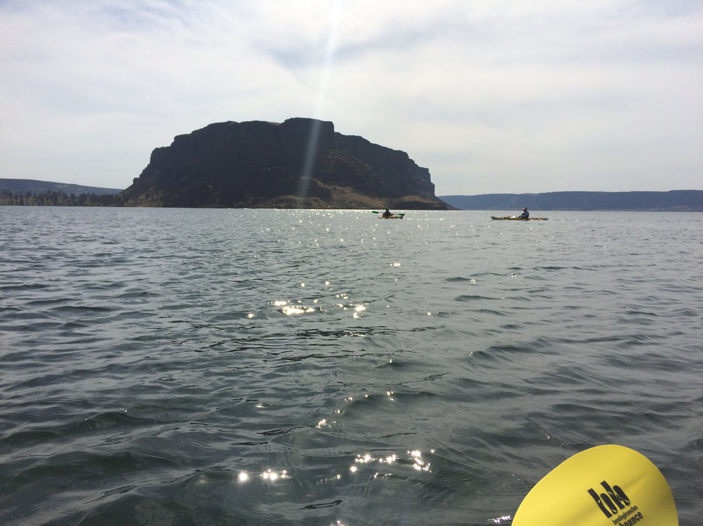
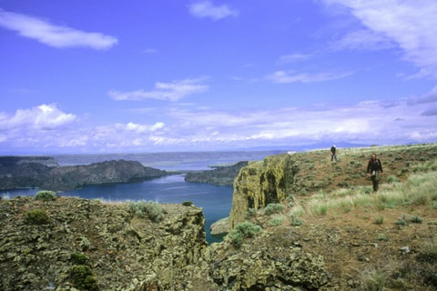
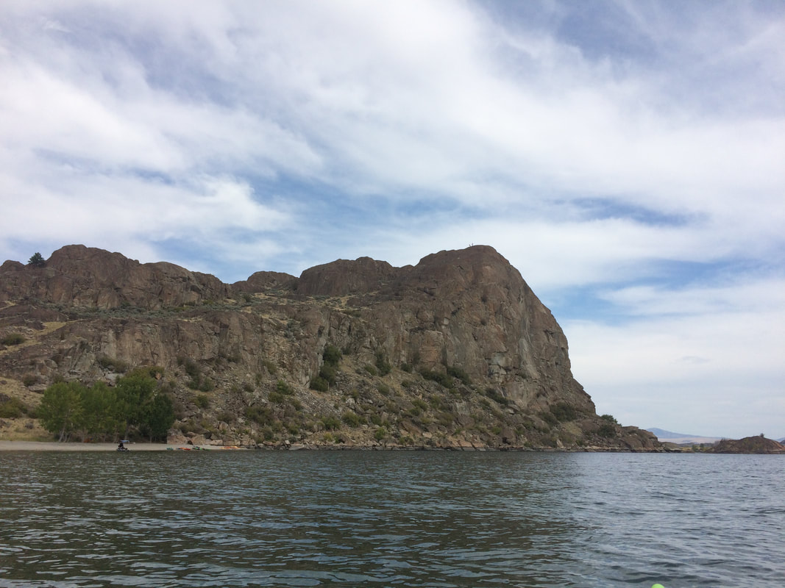
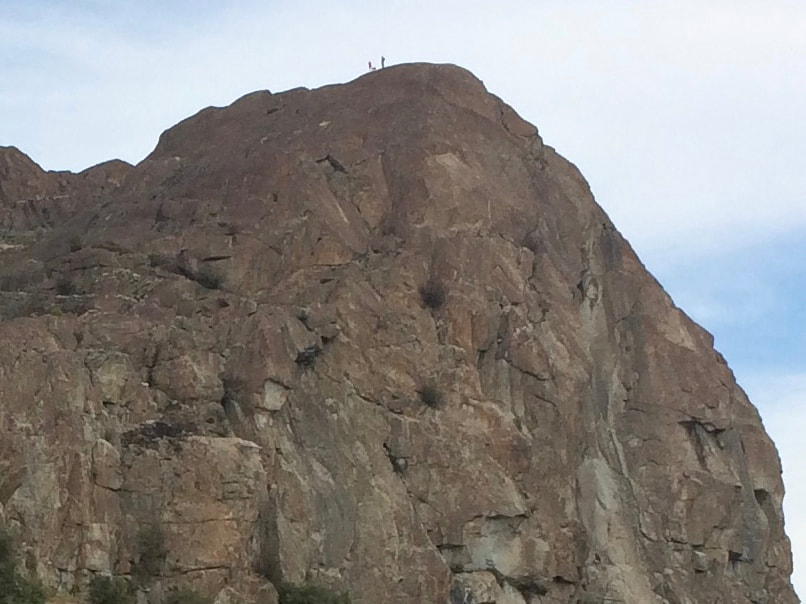

---
tags:
- Lakes
stats:
- label: Paddle Distance
  icon: map-marker-distance
  value: varies
- label: Elevation
  icon: terrain
  value: 1571’
- label: Length and Acreage
  icon: vector-square
  value: 26.7 miles long & 26,890 acres
- label: Maps
  icon: map
  value: Steamboat Rock SW
- label: GPS
  icon: crosshairs-gps
  value: 47°52’2" n 119°05’ 54" w
- label: Brant County Sheriff
  icon: shield-account
  value: 509.754.2011
---

# Banks Lake Kayak And Hike

*Banks lake 1,571’*

## Description

We have added the areas sheriff’s emergency phone numbers for each trip write up under the ranger district
info. if an
emergency ocurrs, evaluate your circumstances and call only if needed.
You can launch your boats at one of two boat launches: Northrop Point or Steamboat Rock S. P. Paddle north
from there
2.5 miles to a sandy beach with shade trees and eat lunch there. There is an obvious trail to the top of a big
granitic
rock that has commanding views in all directions. After the hike we paddled around the different rocks and
inlets on the
east side of the lake. Nearby camping options are Steamboat Rock S. P. or Jones Bay C. G.

## Directions

Take WA-2 west about 60 miles. Just past the town of Wilbur turn right onto WA-21N/WA-174/Republic. After a
quarter mile
or so stay left on WA-174 for 20 miles until you get to Grand Coulee. Turn left onto WA-155 for 10 miles. You
will pass
the Jones Bay CG. and Northrop Point boat launch just before you get to Steamboat Rock S. P. Turn right into
the park
and it is about two miles to the boat launch on the east end of the park. A Discovery Pass is required.
OR
Drive Hwy 2 due west until you get to Hwy 55. Turn right (north) up Hwy 55 to the Steamboat Rock State Park.

---

---

## Option #1

Hike one of the several other granitic knobs on the east side of the lake.

## Option #2

Hike Steamboat Rock

## Option #3

Hike Northrop Canyon

---

## Cool things close by

Grand Coulee Dam and the laser light show. Just north of Steamboat Rock, are nice vertical walls to climb
right out of
your boat among the many small islands.
Grand Coulee Dam, Sun Lakes S.P., Dry Falls, Steamboat Rock, Summer Falls, Northrup Canyon.
Great rock climbing at Northrup Canyon and Highway Rock with 70 routes on its 300 foot tall prominence.

## Hazards

This is sage brush country so there are rattlesnakes. Wear boots and snake gaiters if you have them and keep
dogs on a
leash.

## R & P

NA

---

## Plan your trip

[Click for Current NOAA Weather
Conditions](https://www.nws.noaa.gov/wtf/udaf/MapClick.php?lel=4000&uel=9000&polygon=49.016%2C-114.180%2C48.994%2C-114.381%2C48.890%2C-114.341%2C48.924%2C-114.151%2C&area=63)

## Photo gallery

---

## Steamboat Rock

## The Hike

## Two hikers on top of steamboat rock

## Two Hikers on Top

