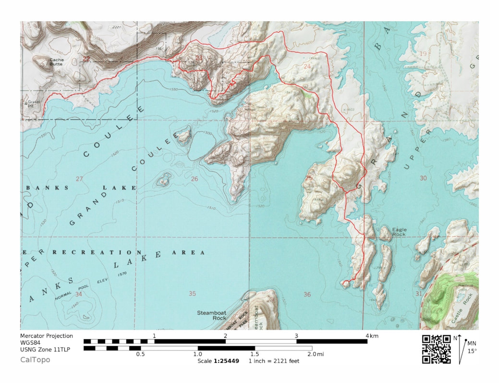

---
tags:
  - Trails & Scrambles
  - Lakes
  - Moderate
  - Day Hiking
stats:
  - label: Event Type
    icon: hiking
    value: Day hiking
  - label: Distance
    icon: map-marker-distance
    value: 12 mile loop
  - label: Elevation Gain
    icon: elevation-rise
    value: Under 500' gain
  - label: Difficulty
    icon: speedometer
    value: Moderate
  - label: Maps
    icon: map
    value: Monument Hills, Ephrata SW Topos
  - label: GPS
    icon: crosshairs-gps
    value: 47°35'21" N 119°09'54" W
  - label: Grant County Sheriff
    icon: shield-account
    value: CALL 911 FIRST or 509.754.2011
---

# Banks Lake North Trail

## Description

The Banks Lake North Trail is a 12-mile loop route located along the quiet northern arm of Banks Lake in
Grant County. Traversing open sagebrush steppes and rugged basalt coulee terrain, the trail offers solitude
and wide-open views across the Upper Grand Coulee region.

## Access & Directions

From Spokane, drive west on US-2 to Grand Coulee. At the junction of WA-174 and WA-155, follow WA-174
heading west to Barker Canyon Rex Road. Turn left (south) onto Barker Canyon Rex Road and drive
approximately 6 miles to the Barker Canyon parking area.

## Hazards & Safety

!!! warning "Rattlesnakes & Sun Exposure"

    Western rattlesnakes are common in the dry scablands of Grant County. Stay alert, watch your foot
    placement near rocks, and keep pets on a leash. The trail is fully exposed to sun and wind—bring
    plenty of drinking water and sun protection.

## Nearby Points of Interest

- **Grand Coulee Dam**
- **Banks Lake**
- **Steamboat Rock State Park**
- **Northrop Canyon**

## Photo Gallery

_Trail map of Banks Lake North Trail by Tyler Nyman._

## Plan Your Trip

- [Current NOAA Weather Conditions](https://www.nws.noaa.gov/wtf/udaf/MapClick.php?lel=4000&uel=9000&polygon=49.016%2C-114.180%2C48.994%2C-114.381%2C48.890%2C-114.341%2C48.924%2C-114.151%2C&area=63)
