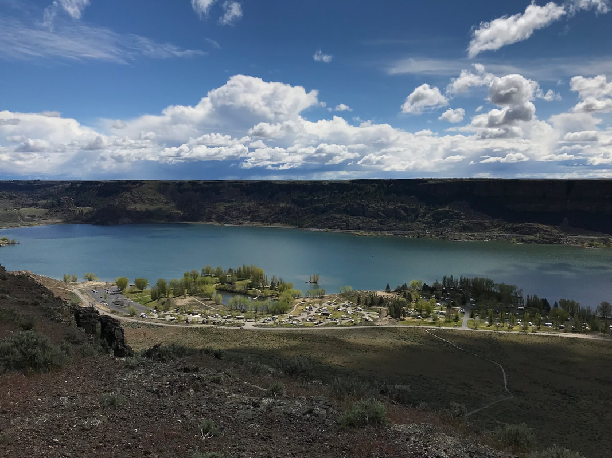
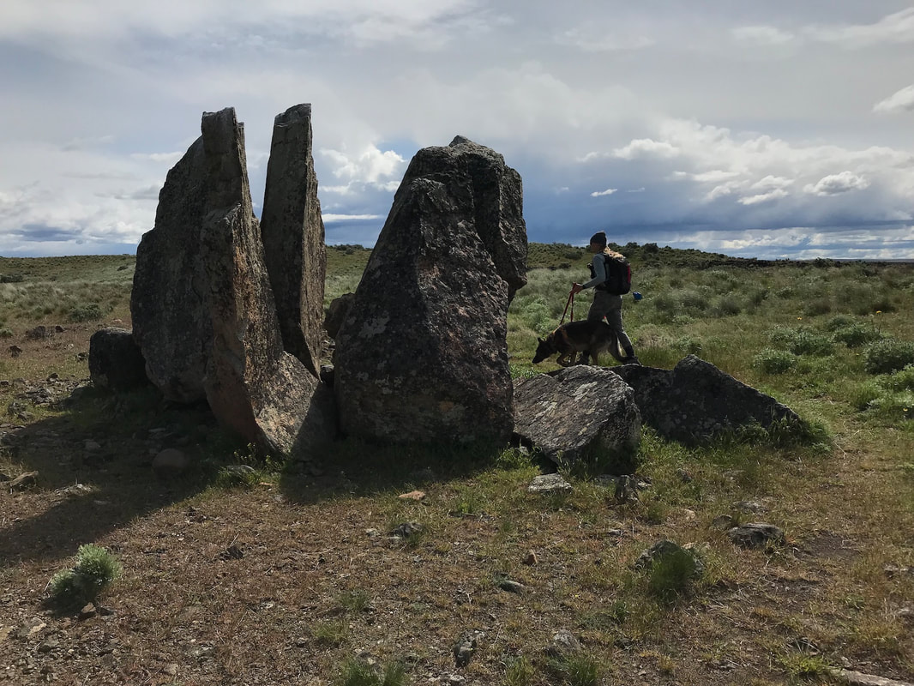
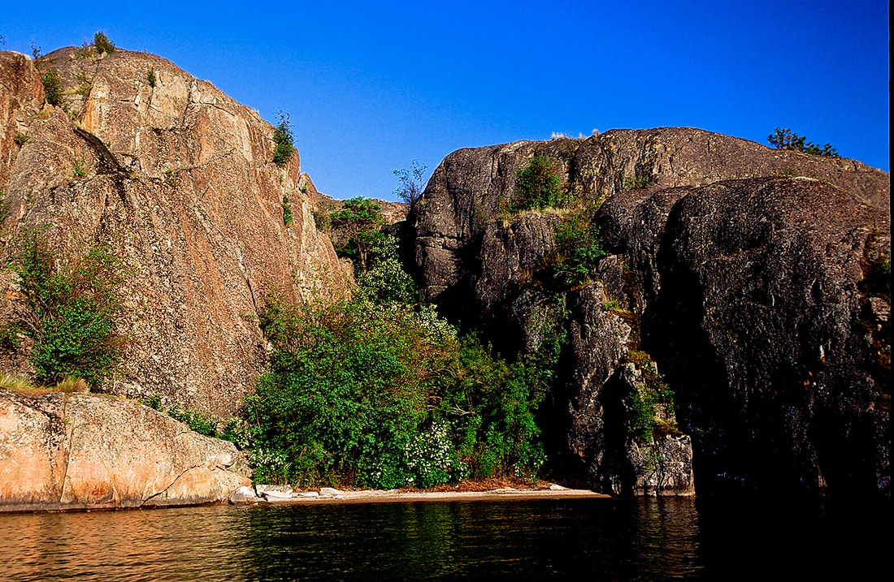

---
tags:
- Lakes
- Easy
- Day Hiking
- Backpacking
- Paddling
- Fishing
- Climbing
stats:
- label: Event Type
  icon: hiking
  value: Day hiking, backpacking, paddling, fishing, climbing
- label: Distance
  icon: map-marker-distance
  value: Varies by activity
- label: Elevation Gain
  icon: elevation-rise
  value: Up to 700' gain
- label: Acres
  icon: vector-square
  value: 26,890 acres
- label: Difficulty
  icon: speedometer
  value: Easy+
- label: Maps
  icon: map
  value: Coulee Dam Area
- label: GPS
  icon: crosshairs-gps
  value: 47°49′45″ N 119°08′01″ W
- label: Grant County Sheriff
  icon: shield-account
  value: CALL 911 FIRST or 509.754.2011
---

# Banks Lake

## Description

Banks Lake is a massive 26.7-mile long, 26,890-acre reservoir created in the Upper Grand Coulee during the
construction of the Grand Coulee Dam to supply irrigation water across the Washington scablands. Framed by
dramatic basalt coulee walls and granite monoliths, Banks Lake offers endless opportunities for hiking, rock
climbing, paddling, scramble routes, and camping.

Steamboat Rock dominates the center of the lake, rising 700 feet above the water with an upper loop trail
around its expansive mesa plateau. Near the north end of Steamboat Rock, hikers can view an active bald
eagle nest from above. Nearby Northrop Canyon features a scenic trail past historic settlement cabins and a
1930s dam construction workers' camp to a secluded canyon lake. Northrop Canyon and the Roadside Climbing
Area along Highway 155 also offer superb rock climbing, with routes ranging up to 5.9+. Paddlers can kayak
out to dozens of granite islands and climb directly out of their boats.

## Route Options

### Option 1: Northrop Canyon & Ridge Loop

Follow the trail past historic ranch cabins toward Northrop Lake. As the lake comes into view, bear left
off-trail to ascend the bluff above the lake for panoramic views and prime lunch spots. Short spires and
granite walls near the canyon entrance offer climbing options. Stay within the canyon for the return route,
as the eastern high ridge presents difficult terrain and loose rock.

### Option 2: Island & Inlet Kayaking

Paddling Banks Lake is a unique experience. Explore a labyrinth of granite islets, deep coves, and quiet
side channels along the eastern shore and northern bay.

## Access & Directions

From Spokane, drive west on US-2 for approximately 2 hours to the junction with WA-155 at Coulee City. Turn
right (north) onto WA-155 North and continue for 18 miles along the east shore of Banks Lake to Steamboat
Rock State Park.

## Hazards & Safety

!!! warning "Rattlesnake Country & Scabland Navigation"

    Western rattlesnakes are common throughout the scablands, particularly around sunny rock piles and
    ledges. Wear sturdy boots and snake gaiters, do not step blindly over rocks, and keep dogs on a
    leash. Carry a map and compass, stay on established trails, and monitor landmarks closely.

## Nearby Points of Interest

- **Grand Coulee Dam & Laser Light Show**
- **Steamboat Rock State Park**
- **Sun Lakes-Dry Falls State Park**
- **Lake Lenore Caves**
- **Lake Roosevelt National Recreation Area**

## Photo Gallery

_South end of Banks Lake from the Steamboat Rock trail._

_Steamboat Rock State Park viewed from atop Steamboat Rock._

_Basalt strata deposited during the Missoula Glacial Floods._

_One of the many granite islands on the north end of Banks Lake._

## Plan Your Trip

- [Current NOAA Weather Conditions](https://www.nws.noaa.gov/wtf/udaf/MapClick.php?lel=4000&uel=9000&polygon=49.016%2C-114.180%2C48.994%2C-114.381%2C48.890%2C-114.341%2C48.924%2C-114.151%2C&area=63)
