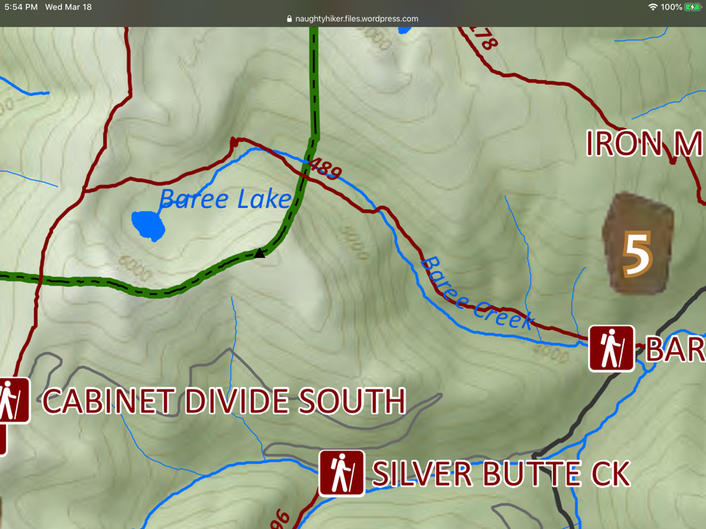

---
tags:
- Lakes
- Difficult
- Day Hiking
- Backpacking
stats:
- label: Event Type
  icon: hiking
  value: Day hiking, backpacking
- label: Distance
  icon: map-marker-distance
  value: 8 miles RT
- label: Elevation Gain
  icon: elevation-rise
  value: 2700 verts
- label: Acres
  icon: vector-square
  value: '10.1'
- label: Difficulty
  icon: speedometer
  value: Difficult
- label: Maps
  icon: map
  value: Kootenai N.F., Silver Butte Pass, Goat Peak topos
- label: GPS
  icon: crosshairs-gps
  value: 47°57’41" n 115°32’23" w
- label: Ranger District
  icon: pine-tree
  value: 'libby ranger district: 406.293.7773'
notes:
- Kootenai national forest/alerts
- <https://www.fs.usda.gov/alerts/kootenai/alerts-notices>
- 'LINCOLN COUNTY, MT SHERIFF: 911 or [406.293.4112](tel:406.293.4112)'
- Kootenai national forest/alerts
- <https://www.fs.usda.gov/alerts/kootenai/alerts-notices>
---

# Baree Lake

*Baree peak 6442’ & lake trail #489*

## Description

We have added the areas sheriff’s emergency phone numbers for each trip write up under the ranger district
info. if an emergency ocurrs, evaluate your circumstances and call only if needed. On the southern edge of
the Cabinet Mountain Wilderness, sits Baree Mountain 6050’. It’s grassy dome shaped has nice high meadows to
enjoy. Once at the lake, look SE for an old miners cabin, which is deteriorating. There is a primitive
campsite on the lake’s SE shore.

## Option #1

The route from the lake to Baree Mountain is done by skirting the lake to the south, then up several rocky
ledges SE to the summit. This route offers some great scrambling.

## Option #2

For a nice loop hike, try the below hike. Trail #489 continues past the lake to the Cabinet Divide Trail
#360. Once on 360, turn NNE to Trail #63, and turn SSE to a faint Trail out to Bear Lake. Then hike back to
Trail #63 and turn left (East) past Trail #360 to Trail
#531, to its
trailhead. Once on F.R #148, turn right SE for a short distance to the Baree Lake trailhead.

## Directions

East trailhead From Libby, head south on Hwy 2 towards G.N.P., for about 20 miles to Sedlak Park. Turn south
on Silver Butte-Fisher River Road #148, then drive about 10 miles to the trailhead.

West trailhead From the Vermillion River Road#154, look for milepost 7, and turn left up Silver Butte Road
#148, for about 8 miles to the trailhead.

## Hazards

None of note to the lake, but caution should be used scrambling up to Baree Mountain.

## Cool things close by

Bear Lake, Geiger Lakes, Bramlet Lake, Carney Peak, Leigh Lake, Wanless Lakes, Cliff-St.- Paul L. -Chicago

Peak-Rock

Lake

## R & P

Henry’s & Pizza Hut, in Libby, Clark Fork Pantry & Squeeze Inn in Clark Fork. Eicharts, Mr Sub & Jalapeños
in Sandpoint

---

## Photo gallery

---

## No images available. if you would like to contribute, contact chic
