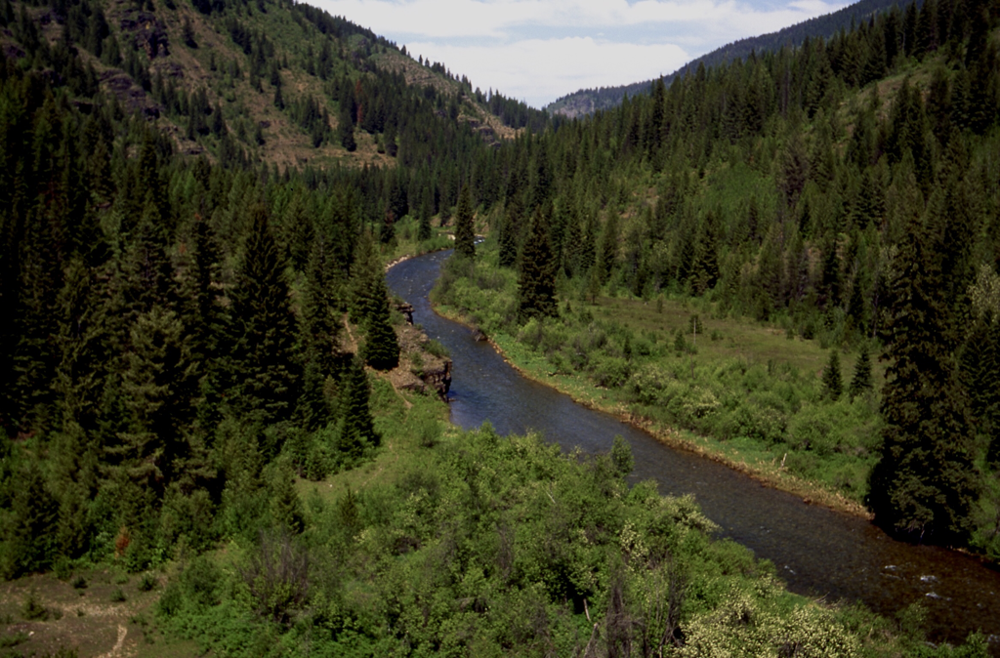
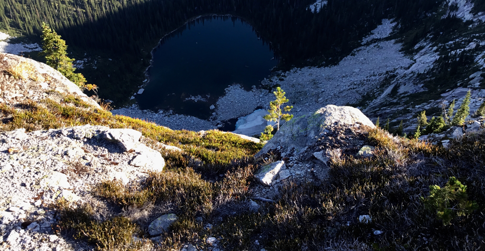

---
tags:
  - Lakes
  - Paddling
stats:
  - label: Paddle Distance
    icon: map-marker-distance
    value: Less than a mile around
  - label: Elevation
    icon: terrain
    value: 1867’
  - label: Length and Acreage
    icon: vector-square
    value: .5 miles long and 35 acres
  - label: Maps
    icon: map
    value: Spokane County, WDFW
  - label: Launch GPS
    icon: crosshairs-gps
    value: 47°55’33" N 117°21’11" W
---

# Bear Lake Launch

## Description

We have added the area's sheriff’s emergency phone numbers for each trip write up under the ranger district info. If an emergency occurs, evaluate your circumstances and call only if needed.

Find this quiet, spring-fed lake 15 miles north of Spokane, near Chattaroy. Attractions: Bear Lake Regional Park.

## Attractions

Bear Lake Regional Park, Long Lake.

## Plan Your Trip

[Click for Current NOAA Weather Conditions](https://www.nws.noaa.gov/wtf/udaf/MapClick.php?lel=4000&uel=9000&polygon=49.016%2C-114.180%2C48.994%2C-114.381%2C48.890%2C-114.341%2C48.924%2C-114.151%2C&area=63)

## Directions

From Spokane, drive north on Hwy 2 for 2.8 miles past the town of Chattaroy, and turn left onto Bear Lake Road.

## Cool Things Close By

Eloika Lake, Loon Lake.

## Rest & Provisions

N/A

## Photo Gallery

_Merganser Diving Duck._

---

_Legacy Aircraft Meets Drone._
