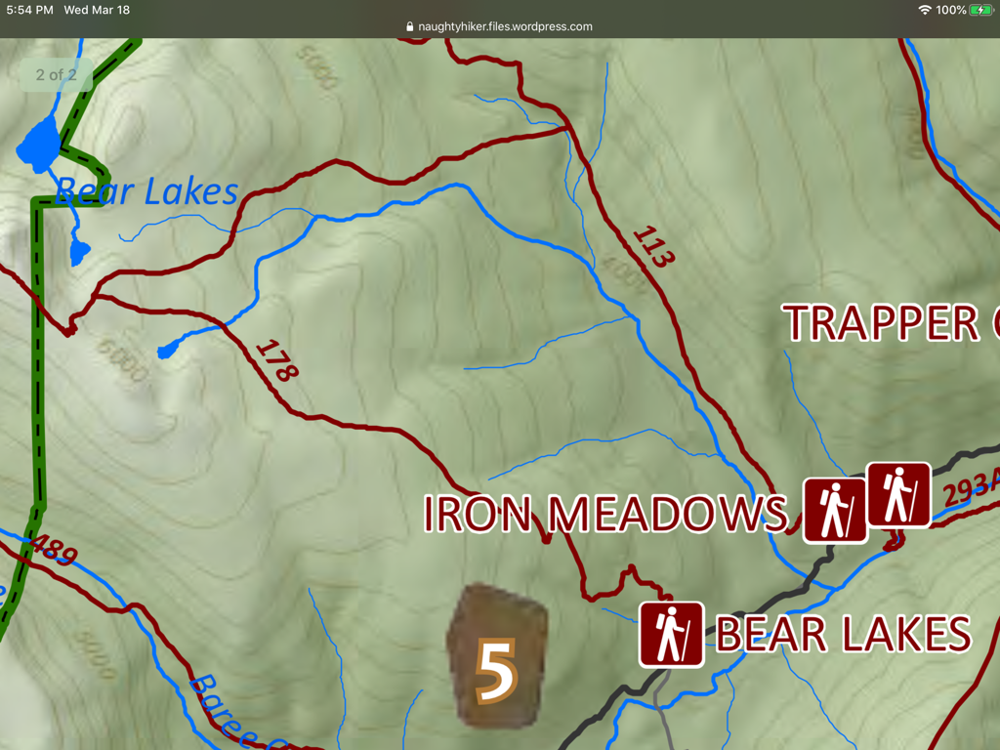

---
tags:
- Lakes
- Moderate
- Day Hiking
- Backpacking
stats:
- label: Event Type
  icon: hiking
  value: Day hiking, backpacking
- label: Distance
  icon: map-marker-distance
  value: 6 miles RT
- label: Elevation Gain
  icon: elevation-rise
  value: 2000 verts
- label: Difficulty
  icon: speedometer
  value: Moderate
- label: Maps
  icon: map
  value: K.N.F., Silver Butte Pass, Goat Peak topos
- label: GPS
  icon: crosshairs-gps
  value: 47°49’35" n 115°22’46" w
- label: Cabinet Ranger District
  icon: pine-tree
  value: 406.827.3533
- label: Lincoln County Sheriff
  icon: shield-account
  value: CALL 911 FIRST or 406.293.4112
notes:
- Kootenai national forest/alerts<https://www.fs.usda.gov/alerts/kootenai/alerts-notices>
---

# Bear Lake

## Description

In a little less the 3 miles, the trail enters the wilderness. Near this boundary, look for an obscure trail
heading north to Bear Lake. There are 3 lakes in the Bear Lakes group. A small lake is located NE of Bear
Lake, and NNW is a faint trail to the Upper Bear Lake.

## Option #1

Bear Lakes can be accessed via the Geiger Lakes trail and the Cabinet Divide Trail #360

## Directions

About 20 miles south of Libby on Hwy 2, is the Sedlak Park. Turn south onto Silver Butte Fisher River Road
#148 for 10
miles to the trailhead.

## Hazards

Trail #531 actually goes to the Cabinet Divide Trail 360. At the CMW boundary, look for a faint path north
to Bear Lake. There is no water along the trail until you get to the lake.

## Cool things close by

Cabinet Divide Trail, Geiger Lakes, Baree Mountain, Noxon, Mt., the Clark Fork River, Bull Lake & River, and
the Ross Creek Cedars.

## R & P

Clark Fork Pantry & Squeeze Inn in Clark Fork. Henry’s & Pizza Hut in Libby, Eicharts, Mr. Sub & jalapeño in
Sandpoint.

## Photo gallery

## No images available. contact chic to contribute
