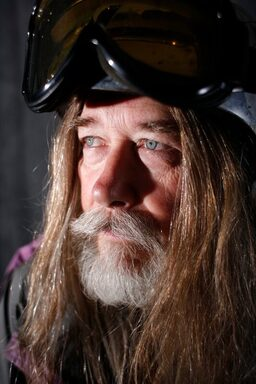

# Biography  Chic

## Chic burge

---

I was born and raised in the Spokane Coeur d’Alene area, and started hiking at a young age. Working in
retail camera sales for 50 years. At one time I was in the Spokane Astronomical Society in the early 80’s.

But the call of nature always won out. In 1984 I joined the Spokane Mountaineers, and have held various
jobs. In 2004 I was elected Honorary Member due to my work organizing 95 years of its meeting minutes, and
archives.

As I aged I realized that my life was fuller, and my photography reflected my love for the outdoors.

In the Spokane Mountaineers, I have led trips of all sorts throughout the region. My slide collection has
17,684 transparencies, all in trays, and cataloged for easy viewing. I’ve always wanted to make a coffee
table photo book of our region, but the cost and effort seemed unattainable.

I moved to Kellogg in September of 2018 to be closer to the mountains, and real close to Silver Mountain. I
even took a very part time job at Silver, because I hate skiing on Saturdays.

Then one day on a trail maintenance work party at Lone Lake, I got to talking to David Crafton. He told me
of his website, so I checked it out. It wasn’t long before I asked about a collaboration on creating this
website. It isn’t the coffee table photo book I wanted, but I think it’s way better. On a website, I can
pass on my knowledge of our mountains, with many images to entice you to go look for yourself. To make sure
I cover all the bases, I added sections on OPTIONS. This make the website useful to even seasoned hikers.

As time goes on, we will include the following activities:

- XC Skiing

- Mt. Biking

- Eventually, I would like to add Climbing in our region.

Since we have started our website, we have added the following topics: Wildflowers Waterfalls A link to Hot
Springs around the world. Why reinvent the wheel. And a "GALLERY" to showcase our images that aren't in each
write up, or topic.

And thru conservation discussion, show how we, the users, can protect and keep our region clean and
enjoyable for all.

So, I would like to ask you to help. I haven’t been everywhere, and done everything. If you go on any of the
above activities, I would like to ask you to contribute to this website by writing and photographing about
your outing in the template we are using.

Your contribution will be noted in its page on the website.

### A friend in the Spokane Mountaineers sent me this after a Two Mouth Lakes to The Wigwams key exchange backpack in the American Selkirks

"Thanks, that is exactly what I was looking for. My thigh muscles (especially on the left) were quite sore
but nothing that I won’t recover from easily. It’s a good kind of sore, not an injury.

When we sign up for an outing you are leading, we always expect several things:

1. It will be an adventure.

1. There will be a big payoff in scenery.

1. It will require some effort and probably some bushwhacking (Dave call's it chicwackin’.)

1. It will be fun!

This trip had all of that and more. Yes, it was difficult with Terrie, but she really came through on day 2.
We took few breaks, kept up a steady pace, and each time we thought we were near the exit (but were not),
she just bucked up and kept on going. Her post on Facebook showed all smiles and it was a glowing report. I
think she was very proud of herself but also aware that this was much tougher than she had anticipated. She
just needs more experience and to do easier hikes, so she can pare down her pack and see what others are
doing to lighten the load.

I will share a few of our better pictures with the group, and you can use any of them you like.

Thanks for all the immense effort you put into preparing and managing this trip. It was a logistical puzzle
for sure, but teamwork made it all go as smoothly as possible. And yes, thank goodness we had no injuries!

Carol & Chuck"

Chic Burge

---

[Email Protected]

---
