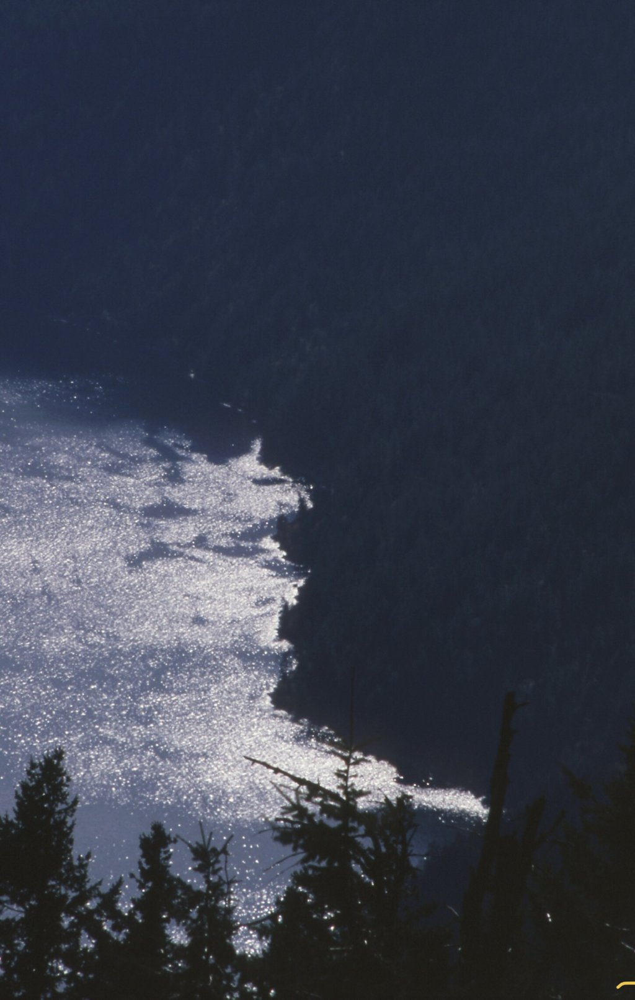
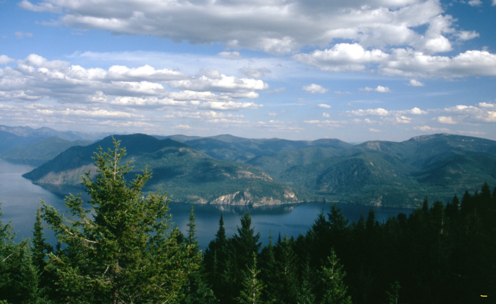
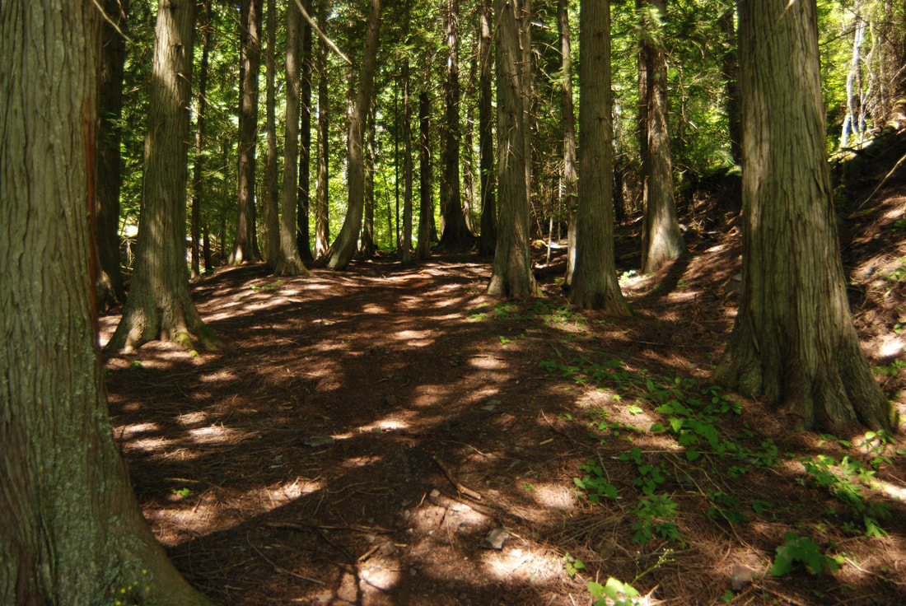
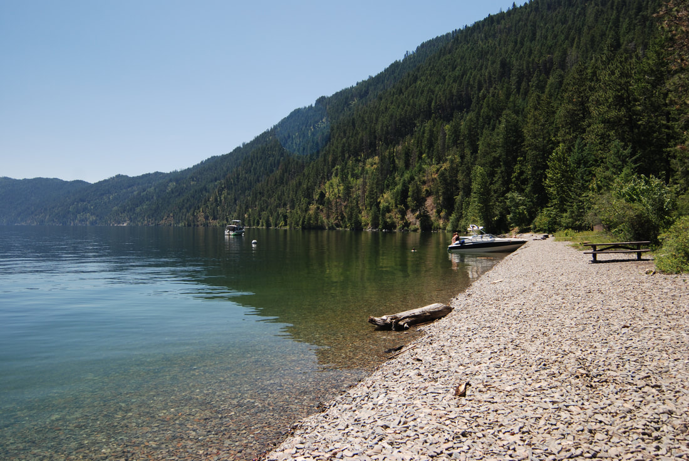

---
tags:

- Peaks & Mountains

- Moderately Difficult

- Day Hiking

- Scenic Overlook

stats:

- label: Event Type
  icon: hiking
  value: day hiking, scenic overlook.

- label: Distance
  icon: map-marker-distance
  value: 6.2 miles RT

- label: Elevation Gain
  icon: elevation-rise
  value: 1750 verts, Maiden Rock 2877 verts

- label: Difficulty
  icon: speedometer
  value: moderately difficult

- label: Maps
  icon: map
  value: IPNF, Cocolalla Lake topo

- label: GPS
  icon: crosshairs-gps
  value: 48°07’00"n 116°32’29"w

- label: Ranger District
  icon: pine-tree
  value: cda river r.d. 208.769.3000

- label: Kootenai County Sheriff
  icon: shield-account
  value: CALL 911 FIRST or 208.446.1300
notes:

- Idaho panhandle national forest/alerts [https://www.fs.usda.gov/alerts/ipnf/alerts-notices](https://www.fs.usda.gov/alerts/ipnf/alerts-notices)
---

# Blacktail Mountain Overlook

!!! warning "Before you go"

    Blacktail mountain overlook

*Pend orielle lake trail # 117*

## Description

We have added the areas sheriff’s emergency phone numbers for each trip write up under the ranger district info. if an emergency ocurrs, evaluate your circumstances and call only if needed.
The cool thing about this trailhead, is that it has two great hikes from it.
Trail #117 heads NE towards Blacktail Mountain. Altho it is an old dirt bike trail, I’ve never seem motorcycles on it.

Because of the bike use, the trail has lots of loose rock to walk on. PLEASE USE CAUTION.
In about 2.5 miles the trail skirts around the west side of Blacktail Mountain. Just as you loose site to the east, there is a faint trail heading down to the east. towards the lake.
 Take this faint trail for about .5 miles to a rock outcropping. Along this path, you will walk thru a thin forest before it breaks out into an open ridge. There are two rock outcroppings along the path. Once it was used to house a fire lookout, but you’d never know it. Go down to the next rock outcropping, where the views are about 220° wide.
Have your lunch here, and enjoy the views.
Some of the views include, Granite Point on Lake Pend Orielle, the Green Monarchs, Scotchman’s Peak and the Proposed Scotchman Peaks Wilderness, and the Cabinet Mountain Wilderness to the NNE.

## Option #1

From the same trailhead, you can walk DOWN to Maiden Rock on the west shore of Pend Orielle Lake. I capitalized DOWN for a reason. It’s almost 2 miles to the beach, and drops about 1200’. This means that after swimming and sunbathing, it’s an uphill walk to the trailhead. However, the trail is mostly in the trees, so you aren’t in the sun. Near the bottom of the trail, it drops down thru a cool but young cedar forest.
Things to do at the beach are, swimming, climbing and diving off the cliff, and my favorite sport, rock skipping. The whole beach is small, round, flat rocks.
There are picnic tables and a pit toilet. BE AWARE, this is a boat camp, so you won’t be alone. Also, just for reference. It is over 800’ deep 50’ off the Maiden Rock point.
Also, be very aware. along the base of the cliff is poison ivy.
Poison Ivy plants have three identical leaves that droop down from the single stem.
Do not get near it. but if you do, **Do not touch your any part of you.**
I had a friend years ago that scratched himself in a very sensitive spot. He suffered for over a week.

See the first picture below.
I’m very serious here. do not get close to it, its poisonous.

## Directions

From CDA, drive north on 95 to the south end of Lake Cocolalla. From the first Blacktail road on the right, drive .8 of a mile to the second Blacktail Road to the right. It is a sharp right turn. Continue on Blacktail Road for a short distance, to where it turns left onto Butler Road. Stay on Butler Road to the trailhead.

---

## Cool things close by

Lake Cocolalla, Evans Landing, N. & S. Chilco, Packsaddle Mountain, and Talache Landing,

## Hazards

Trail #117 is very rocky, and requires care.

Maiden Rock trail is a steep climb up from Pend Orielle Lake. Poison Ivy by the cliffs.

## R & p

Trails End Brewery, Moon Time, Franklins Hoagies, and the Mexican Food Factory.

*Picture (Image missing)*

## Photo gallery

*Picture (Image missing)*

## Poison ivy       do not touch     if you do, do not touch yourself anywhere

## The west shore line of pend orielle lake looking south

---

## Granite rock, pend orielle lake

---

*Picture (Image missing)*

## Scotchman’s peak, the proposed scotchman peaks wilderness, and snowshoe peak, c.m.w. beyond

---

## Trail #321 down to maiden rock boat camp thru a cedar forest

## Maiden rock beach

*Picture (Image missing)*

## Looking ne to the p.s.p.w. and the c.m.w

---

Friendship A challenge to one's psyche. An emotional roller coaster. A great joy. Incredible times. Turmoil. Fun. A feeling of awe. A sadness at times. But always worth the effort.            chic.  4.1.2017

---

---

---
