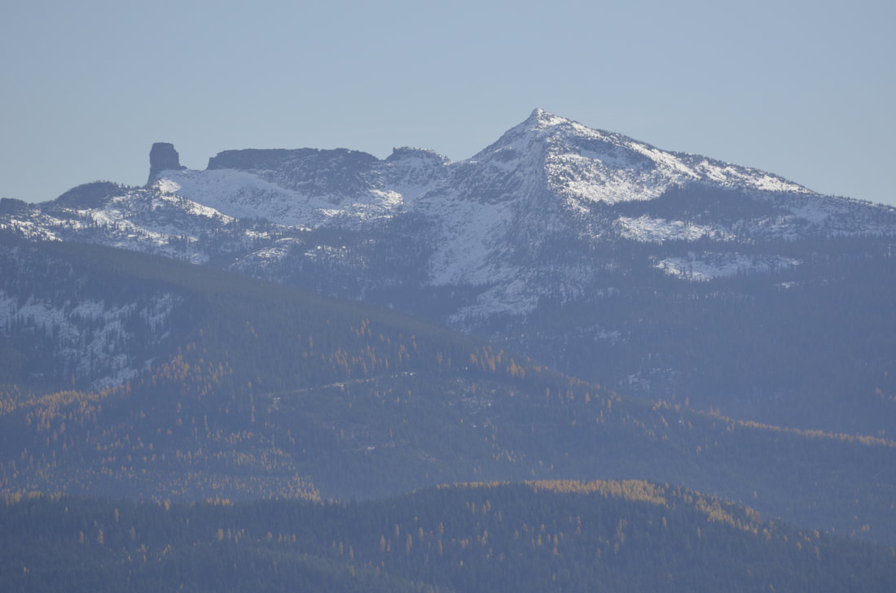
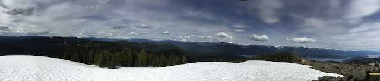
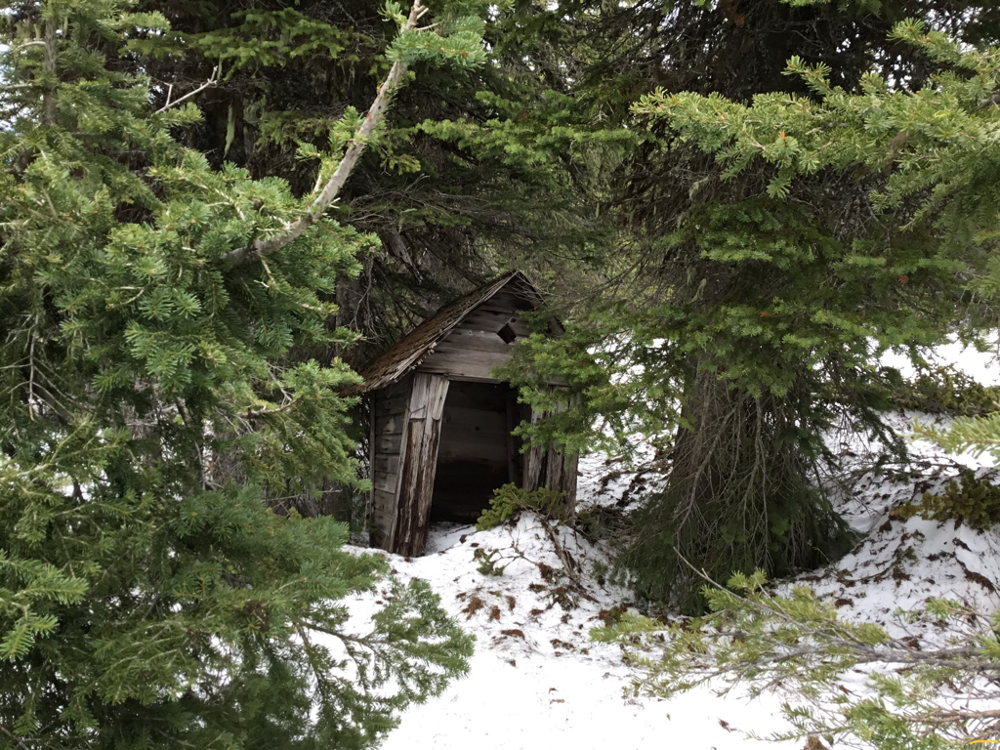

---
tags:
- Peaks & Mountains
- Moderately Difficult
- Day Hiking
- Backpacking
- Equestrian
stats:
- label: Event Type
  icon: hiking
  value: day hiking, backpacking, and equestrian.
- label: Distance
  icon: map-marker-distance
  value: 3.6 miles RT
- label: Elevation Gain
  icon: elevation-rise
  value: 1295’
- label: Difficulty
  icon: speedometer
  value: moderately difficult
- label: Maps
  icon: map
  value: Priest Lake NW, Upper Priest Lake
- label: GPS
  icon: crosshairs-gps
  value: 48°42’43" n 116°55’05"
- label: Ranger District
  icon: pine-tree
  value: Priest River R.D. 208.443.2512
- label: Bonner County Sheriff
  icon: shield-account
  value: CALL 911 FIRST or 208.263.8417
notes:
- label: Idaho Panhandle National Forests Alerts
  url: https://www.fs.usda.gov/alerts/ipnf/alerts-notices
---

# Blacktail Mountain

## Blacktail mountain 5495' trail #292

## Description

We have added the areas sheriff’s emergency phone numbers for each trip write up under the ranger district
info. if an emergency ocurrs, evaluate your circumstances and call only if needed. The trail starts down
road about .1 miles from the pullout and fire ring. Looks for a memorial sign on a tree, on the uphill side.
Trail #292 starts out moderately steep, up thru a thick forest with several benches that allow a bit of rest
before climbing again. The higher you get on this trail, the more open spaces occur. At about 1.6 miles, you
have an option to stay on the USFS trail, or walk up a ridge where a fire burned years ago. This route is
warmer on cold days, where the USFS trail is in the trees on hot sunny days. Closer to the summit, the trees
thin, and a meadows or two allows for views and wildflowers. Huckleberries flank the trail on the upper
slopes. As you get closer the the summit, the views west open up. Within 10 or 15 minutes, the trail turns
to light rock hopping, then you are on top. And the views are spectacular. Off to the E and SE, the full
length of the American Selkirks is your view.

And what a view it is. The old lookout tower is long gone, but the fire finder, or alidade, still stands.
The alidade is a round platter in which the map of the area was on. It rotated like a compass, to allow the
staffer to pin point the fires direction. When the fire lookout person spotted a fire, they called in the
angle from their location. Other lookouts would do the same, and eventually the exact location was fixed.
Altho there isn’t a map left, it is a very cool tool to look at. Like all fire lookouts, there was always an
outhouse. A little NE of the summit, is a dilapidated outhouse. It’s leaning and not useable, but is a very
photogenic artifact. The trail may be a little steep, but it’s only 3.6 miles RT. Take your kids with you.
It’s a great learning experience, and offers great views.

## Directions

From Priest River, drive north on Hwy 57 past Nordman where it merges with FR #302 at about 37 miles. After
about 3 miles on 302 the pavement ends. Turn right (North) onto Tango Creek Road F.R. #638. At about a mile,
there’s a "Y" in the road, bear left, staying on 638 up to the saddle in about 4.2 miles where you can park.
If you get to a sharp right turn, you've gone .1 miles too far. The parking area is on the right as the road
drops towards the hairpin turn.

There are two 638. its a loop road. Drive past the first 638 to a road sign says #638 to the right.

Be aware, the last mile of 638 is rough to the saddle. The actual trail #292 is .1 of a mile west, down the
road from the parking area. it is not by the saddle or parking area.

---

## Cool things close by

Upper Priest Lake, Beaver Creek Launch on the north end of Lower Priest Lake, Granite Falls& LaSota Falls,
and the Roosevelt Grove of Ancient Cedars, and the Salmo-Priest Wilderness across the boarder in Washington.

## Hazards

The trail is semi steep, and the top section of the trail is rocky. The last mile of Road 638, is rocky and
rough. Please use caution.

## R & P

Stagger Inn, and Burger Express.

trailforks widget start[Blacktail Mountain](https://www.trailforks.com/trails/blacktail-mountain/) on
[Trailforks.com](https://www.trailforks.com/)

trailforks widget end

## Photo gallery

### Picture (Image missing)

## As the trail breaks out of the forest, priest lake lies below you

### Picture (Image missing) Details

## The southern  end of lower priest lake

### Picture (Image missing) Details (2)

## Cairns about half way up the scree slope

### Picture (Image missing) Details (3)

## Baritoo and fourmile islands in the late morning sun. Image by chris herath

### Picture (Image missing) Details (4)

## An image of the lookout from the old days

Built in 1932, this gabled-roofed L-4 cab atop a 10' tower was abruptly destroyed in 1941. There was also a
patrol point 1/2 mile northwest.

### Picture (Image missing) Details (5)

## A horse pack team delivering supplies to the lookout

## A telephoto shoot of mount roothaan & chimney rock image by chris herath

### Picture (Image missing) Details (6)

## A telephoto shoot of harrison peak to the north image by chris herath

When you drop your pack and turn east, the view is outstanding. the entire american selkirks is before you

### Picture (Image missing) Details (7)

## Chris taking a nap next to the alidade (map stand) on the summit

---

### Picture (Image missing) Details (8)

## If only this outhouse could talk

## An outhouse with a view

### Picture (Image missing) Details (9)

## The last view before you descend thru the forest

We walk to the summits, not only "because it’s there", but to see where else we want to go play next.
chic 1.2.2025
