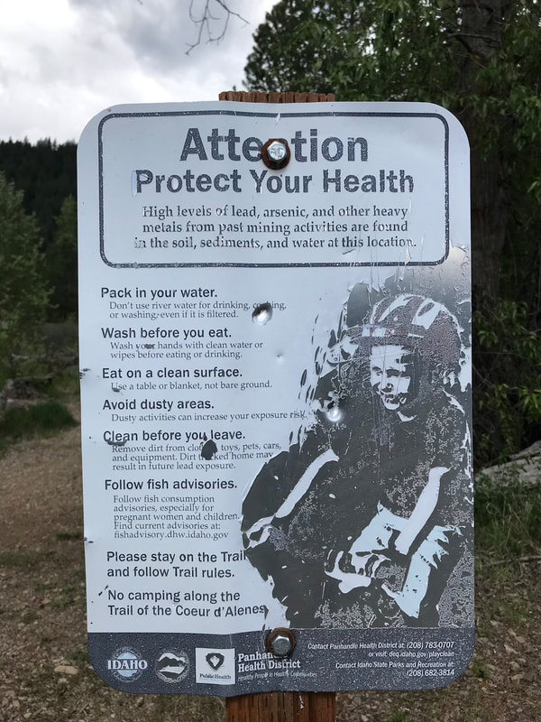

---
tags:
- Paddling & Rivers
stats:
- label: Paddle Distance
  icon: map-marker-distance
  value: kayaking, canoeing, SUP
- label: Elevation
  icon: terrain
  value: 2128’
- label: Length and Acreage
  icon: vector-square
  value: 25 miles & 49.81 square miles
- label: Launch GPS
  icon: crosshairs-gps
  value: 47°41’10" n 116°48’19" w
- label: Kootenai County Sheriff
  icon: shield-account
  value: 208.446.1300
---

# Blackwell Island Launch

## Description

We have added the areas sheriff’s emergency phone numbers for each trip write up under the ranger district info. if an emergency ocurrs, evaluate your circumstances and call only if needed.
The Blackwell Island launch has two launch lanes and plenty of parking.
If paddling on the main body of the river during heavy boat use isn’t your thing, there is channel where the launch is. This channel allows you to access Cougar Bay and Lake CDA without power boats.

## Attractions

Cougar Bay, Casco Bay, The Nature Conservancy’s Cougar Bay and it’s hiking trail.
Cougar Bay is the home to many Osprey and there young. Bring your binoculars to watch them up close.
Cougar Bay is very shallow and fishing is really good there.

## Directions

Drive I-90 east to the CDA’s first exit, Northwest Boulevard. Head SW down Northwest Blvd for about a mile, and take the Hwy 95 exit. At the stop sign, turn right (west) over the Spokane River, and take the first right (NW) into the launch past the bridge.

## Cool things close by

NIC’s W. River Road and beach, CDA’s City Beach, Tubbs Hill, Sanders Beach, Cougar Bay, Casio Bay, and Kidd Island.

## R & P

Moon Time, Franklins Hoagies, Mexican Food Factory, and the Trail’s End Brewery

---

## Plan your trip

[Click for Current NOAA Weather Conditions](https://www.nws.noaa.gov/wtf/udaf/MapClick.php?lel=4000&uel=9000&polygon=49.016%2C-114.180%2C48.994%2C-114.381%2C48.890%2C-114.341%2C48.924%2C-114.151%2C&area=63)

## Photo gallery

## Please everyone...heed this health alert

