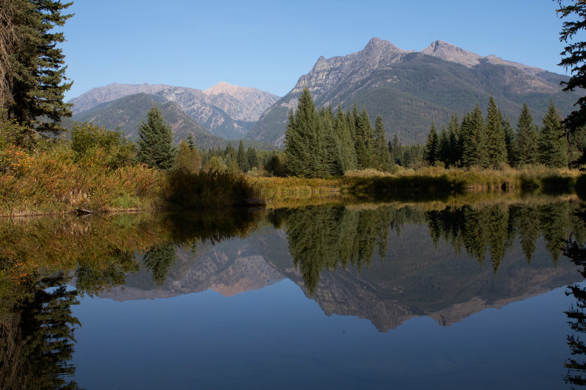

<!-- more -->

This photo is from the Mirror Pond Viewpoint on the Bull River Road, Hwy 54, with Ibex and Snowshoe peaks in
the background only 2 hours and 15 minutes of easy highway driving from my house in the East Spokane Valley.
I love this place. It is a mini Glacier National Park with out all the people. On the other side of the
ridge is Granite Lake with a 4,000 foot head wall up to A Peak with several water falls coming off of it
which are most spectacular in the spring.

[Trevor Wanderlusting](https://www.trevorwanderlust.com/) [link](https://www.trevorwanderlust.com/)

7/6/2024 05:20:27 pm

Great reeading your post

Reply
