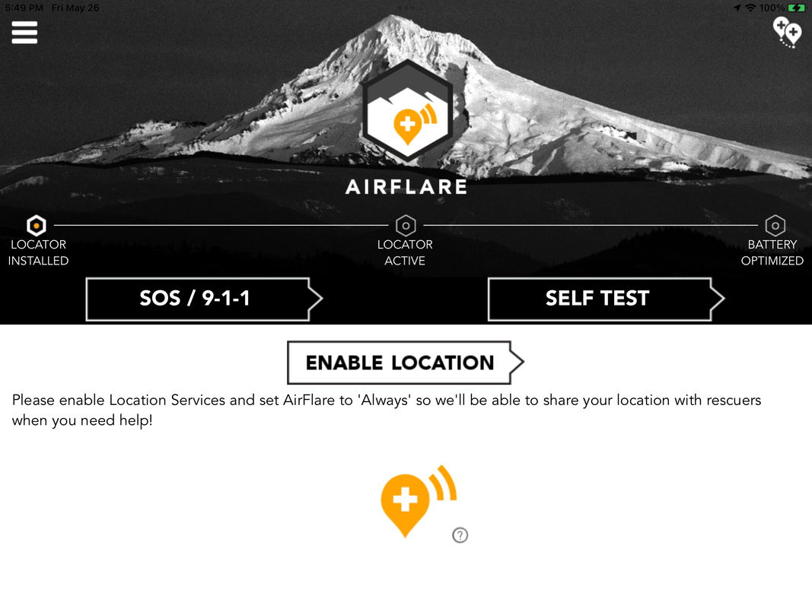

<!-- more -->

Airflare.
​
The AirFlare app is an inexpensive app that allow yourself to be found if lost or merely misplaced.
Because it is an app for your phone, there's no weight to carry.
It has the ability to show rescue personnel where you are in case of an emergency.
if you are a skier, it can locate you even if you are buried in snow. It can look thru forests to locate a lost hiker, and so much more.
It can use as little as one cell tower to send a text, and has the capability to find and communicate with a lost hiking partner within less than half a mile from you.

Log onto
[<https://airflare.com](https://airflare.com>/)   To learn more.
This website offers all of us peace of mind and an avenue for us to initiate our oun rescue, and more.
For a mere $4.99 PER YEAR, after a free trail, you can turn your cellphone into a rescue devise and a way to communicate with others you are hiking with.
This system uses technologies that allow you to text rescuers with as little as one cell tower, or in some cases satellite connections.
If a hiking partner looses the group, you can communicate with them, but only within about .5 of a mile.
That’s better than no communication abilities at all.
Besides the price of this subscription being so low, it is an app for your phones that doesn’t weight a single ounce.
Once you have downloaded the app, there is a tutorial to teach you all you need to know.
It’s easy to understand and use.
PLEASE, allow yourself to be seen when an emergency occurs.
Ski resorts, like Silver Mt., Schweitzer, Brundage, Tamarack, and more utilize this method of rescue service.
Our goal at InlandNWRoutes.com, is to supply you with the freshest knowledge of the trails in our region, forest alerts, and what you need to know & take with you into Nature, and how to be safe.
We don’t charge you for this information, because we feel it is our responsibility to supply up to date and correct info at no charge.
By introducing the two above websites, we feel we are offering our readers a way to learn and be safe in the mountains.
If you have any questions, comments, criticisms, or praise, please let us know.
Your input is important to us.
Thank You for being our readers, and we hope you all have a great year in the mountains.Be safe, and always error on the side of caution,
David
Chic
