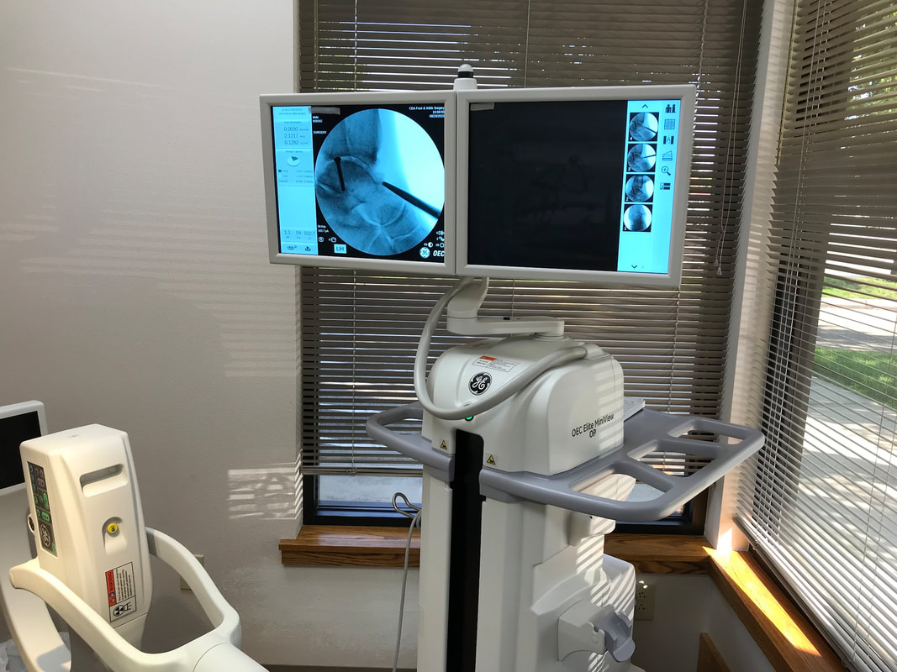

In July 2023, I realized that I needed ankle surgery.

I went to a sports medicine business in CDA, and was not please.

So I made an appointment with CDA Foot & Ankle Clinic.
I had been there decades ago for orthotics, so I thought I’d try them again.

What I noticed first, was the incredible staff.
They all were extremely knowledgeable and kind in the treatment of their patients.
Then it came to surgery day.
I was a tad bit nervous, but my anxieties were brought under control.
The attending nurse was very efficient and calmed me down.
Then Doctor Orlando Nunez came in ready to start the procedure.
Dr. Nunez was calm, and explained what was about to happen.
Unlike any other doctors office I’ve ever visited, Dr. Nunez utilizes a GE OEC ELITE MINIVIEW X-RAY machine to see what he needs to know about the area being worked on.

<!-- more -->

This x-ray machine has an articulated arm (L) that my foot was in.
What’s so cool about this x-ray machine, was it was a live feed.
As he moved my foot around to examine my Talus, I got to watch the the screen and see what he was seeing, live.
Otherwise, it isn’t just a normal x-ray picture. It was a moving x-ray.
He captured stills to be able refer to as he worked on my foot.

The previous doctor said my surgery could take weeks before I could touch my foot to the ground, and months to fully recover.

As my surgery wrapped up, I ask for my crutches.
Dr. Nunez stopped me and said with the new stabilizing boot, I could walk out of the office without the need for crutches.

I was amazed.

So the take away here is simple.
If you need any kind of foot or ankle work done, make an appointment with the CDA Foot & Ankle Clinic.
You won’t be disappointed.

[https://www.cdafootankle.com/home/.  208.666.0605](https://www.cdafootankle.com/home/)
InlandNWRoutes.com

Chic Burge    David Crafton
