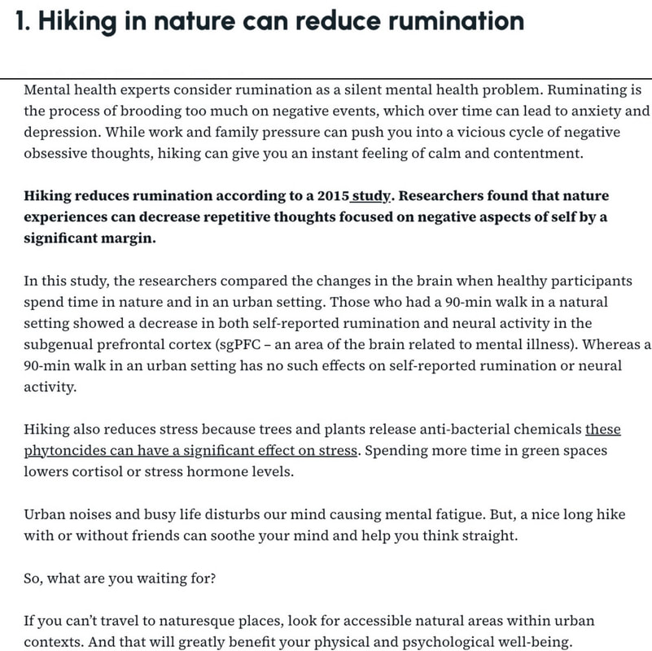
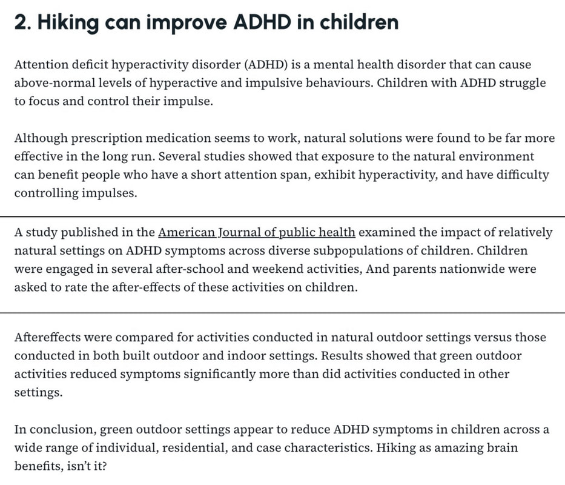
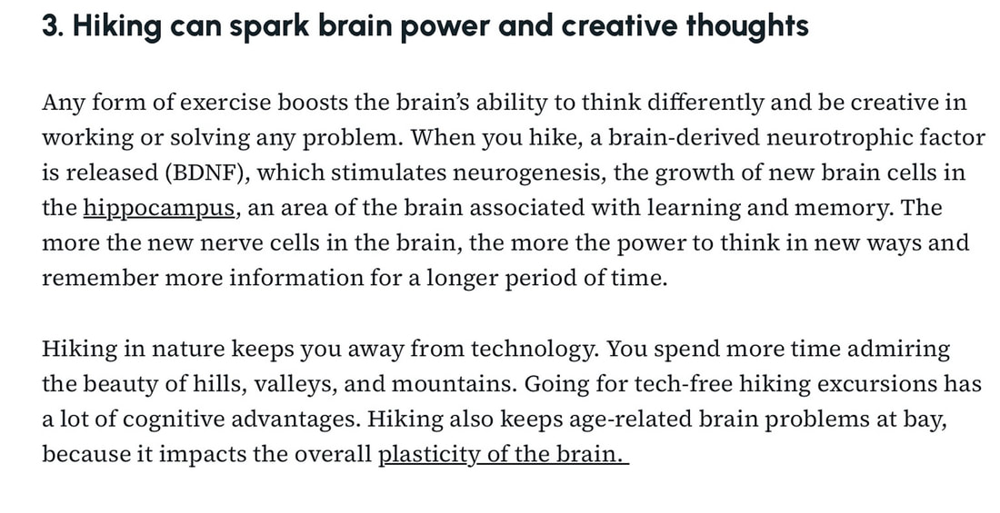
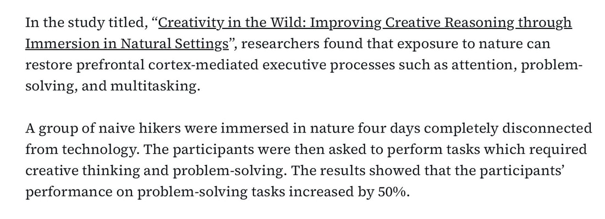
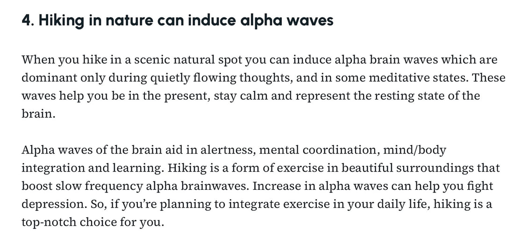
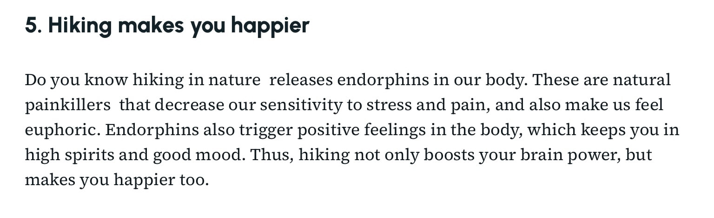
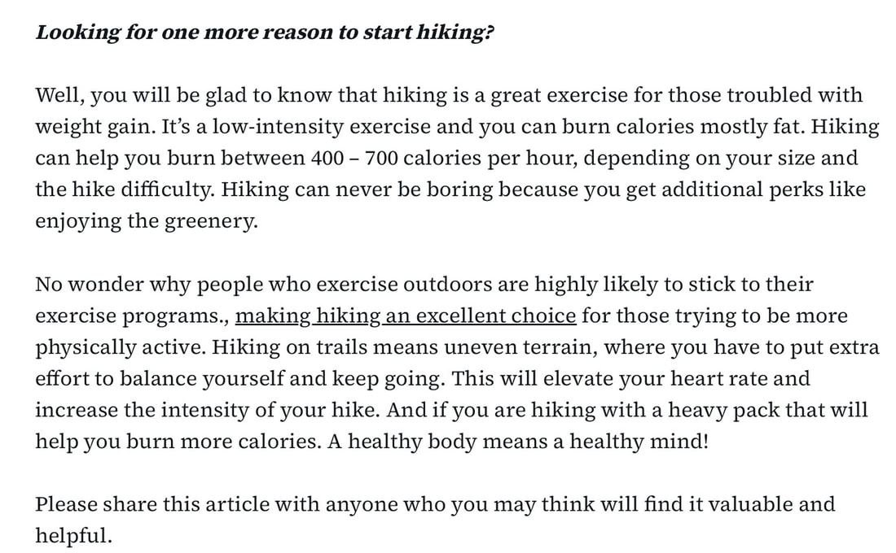

The below is research that I found on how hiking helps our well being.

Enjoy and get yourself ready for next Spring.

<!-- more -->

David and I would like to thank you for using our website, and hope you find that the trails hold such joy
and inspiration, that you will want to experience them for your self and your well being.

Chic David

<https://www.inlandnwroutes.com/>
