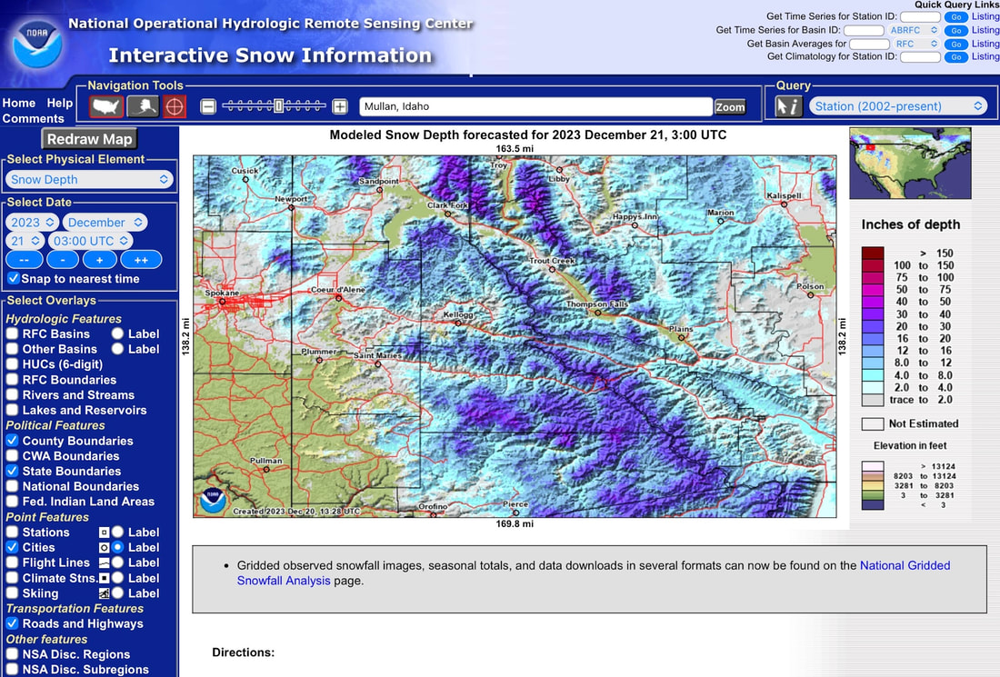

While doing some research for this website, I stumbled upon the NOAA OPERATIONAL HYDROLOGIC REMOTE SENSING

CENTER.

This NOAA website shows the snow depth of any area you are interested in skiing or hiking at.

I haven’t done a lot of research on this website yet, but it promises to have more additional features to
explore.

For backcountry skiers, this website has a great deal of value.
Now we can see the depth of snow at a given area, to make planning much easier and accurate.

If you use this NOAA website this winter in planning a trip, please let me know what features you used and how
accurate
you found this information.

I can be reached directly at info@inlandnwroutes.com

Thank You for reading our local website on places all over our region to play in Nature.

Chic Burge          David Crafton

InlandNWRoutes.com

Interactive snow information

<https://www.nohrsc.noaa.gov/interactive/html/map.html?recenter=Zoom&ql=station&zoom=&loc=Mullan%2C+Idaho&var=ssm_depth&dy=2023&dm=12&dd=21&dh=3&snap=1&o11=1&o9=1&o13=1&lbl=m&o7=1&mode=pan&extents=us&min_x=-117.9&min_y=46.541666666662&max_x=-114.34166666667&max_y=48.541666666662&coord_x=-116.120833333335&coord_y=47.541666666662&zbox_n=&zbox_s=&zbox_e=&zbox_w=&metric=0&bgvar=dem&shdvar=shading&width=800&height=450&nw=800&nh=450&h_o=0&font=0&js=1&uc=0>

<!-- more -->

