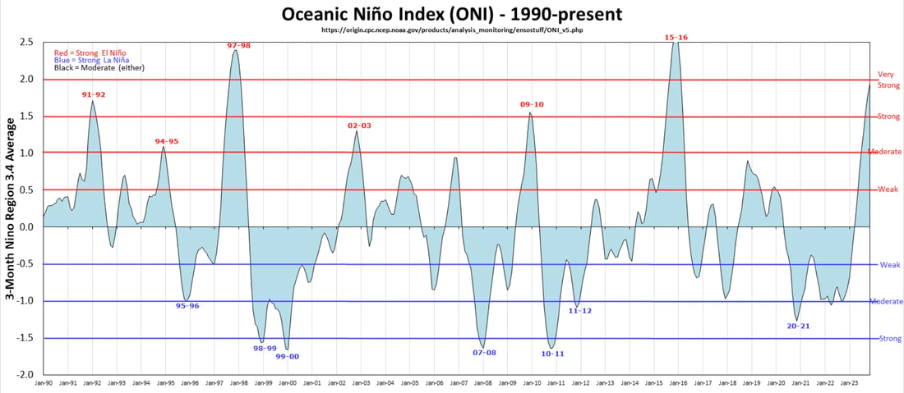

El niño and winter sports

As you all know, we are always at the mercy of the weather.
Whether we have La Niño or El Niño, we just have to deal with what we are dealt.
This chart shows the years and intensity of both.

<!-- more -->

On average, we have about the same number of La Niños as we do El Niño.
But what you want to look at is the degree of intensity in both.

Now with climate change, are we going to have more El Niño weather patterns?
Of course we can’t predict the weather that far out, but we can learn to deal with weather, by adapting to the
conditions, and doing the sports we love, in those conditions, if it’s safe.

If you are as down as I am, about not being able to ski the fluff,
go for a walk.

Log onto NOAA.gov, and examine the illustrations and words to get an idea of where you might want to go.
After you’ve looked and read the above, scroll down and click on the Hourly Weather Graph.
Study this chart to get accurate times and amounts of precipitation, sky cover, wind speeds & direction, and
temperatures thruout the day.
After getting use to seeing this  information, you can plan your day, down to the hour.

We have a whole section on weather, that will show you what to expect in detail.
<https://www.inlandnwroutes.com/weather-thunderstorms-and-lightning.html>

Some places to hike,
because...
Skiing sucks right now

Below are some suggestions of cool places to hike.

Northrup Canyon & Steamboat Rock
<https://www.inlandnwroutes.com/northrup-canyon.html>
<https://www.inlandnwroutes.com/steamboat-rock.html>

Escure Ranch, Rock Creek & Towell Falls
<https://www.inlandnwroutes.com/escure-ranch.html>

Navigation Trail, Lower to Upper Priest Lakes
<https://www.inlandnwroutes.com/navigation-trail-291.html>

Revett Lake and/or Blossom Lakes
<https://www.inlandnwroutes.com/revett-lake.html>
<https://www.inlandnwroutes.com/blossom-lake.html>

Any of the following Spokane County Conservation Properties
<https://www.inlandnwroutes.com/spokane-county-conservation-futures.html>

Ross Creek Cedars
<https://www.inlandnwroutes.com/ross-creek-cedars1.html>

Don’t be down. But rather get up and go play.
The advantages are numerous.
No ticks
Very low rattlesnake sightings
No crowds
None of the above, have avalanche dangers
And most of all….new sights.

If you have technical questions about any hike on our website,
I encourage you to email me.
My email is on the bottom of every page.
Do keep in mind, I may be away doing "research". (Hiking)

Thank You for reading our website.

Chic       David

InlandNWRoutes.com
