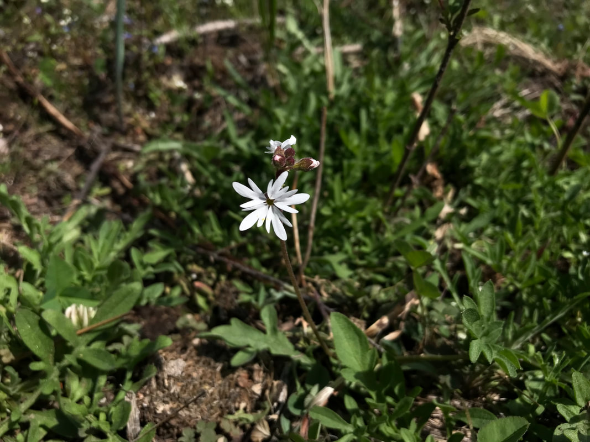

## praire stars

<!-- more -->

spring 2024 wildflower season

When skiing is slushy, or come to an end, I drive west into the Washington Channeled Scablands.

March and April are wildflower months in The Scabs.

Below are hikes in The Scabs that are sure to impress you.

Hog canyon
<https://www.inlandnwroutes.com/hog-canyon--falls.html>

Escure ranch & towell falls
<https://www.inlandnwroutes.com/escure-ranch.html>

Northrup canyon
<https://www.inlandnwroutes.com/northrup-canyon.html>
These two hikes can be done in one day
Steamboat rock
<https://www.inlandnwroutes.com/steamboat-rock.html>

Fishtrap lake
<https://www.inlandnwroutes.com/fishtrap-lake.html>

Juniper dunes wilderness
<https://www.inlandnwroutes.com/juniper-dunes-wilderness.html>

Sun lakes s.p. & dry falls
<https://www.inlandnwroutes.com/sun-lakes-s-p-dry-falls-area.html>

Keep in mind, the wildflowers only last a short time in the Spring heat.
By the end of April, might be too late for flowers.

To make sure your trip will be sunny and nice, log onto….
Weather.gov.
Skip the "DETAILED FORECAST" words. They don’t tell the whole story.
Then scroll down until you see the HOURLY WEATHER FORECAST.
Click on the graph and study the data supplied.
Basically it spells out the days hour by hour.
I have notice over the years that the timing of a storm or sunshine is more accurate than the quantity of possible precipitation.

It would be wise to call the area you wish to visit, to see when prime wildflowers are present.
You can find the managing agencies phone numbers in each hikes write up.

Enjoy the Spring by taking a walk, and seeing for yourself.
​

Chic          David

InlandNWRoutes.com
