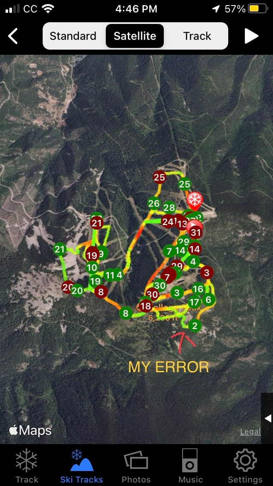

a way to see where you are at, if unclear.

In early March 2024, while skiing SOB at Silver Mt., I skied out of bounds because of the luscious fluff. (Powder)
When I realized what I had done, I stopped and pulled out my phone.
I accessed the app…Ski Tracker.
This app is used by skiers, snowshoers, and more to track their day’s activities. I use it to record my ski day’s journey.
One of the features is Apple Map.
It shows you your days skiing stats.m
What I did was start the app, ski hiked up a ways, and consulted the map.
It showed me exactly where I was, and where the trail I missed was, in relation to me.
This gave me the info I needed to get up to the ski trail in the shortest and easiest way.

Because it was the last run of the day, and I was 444verts below the trail, I was very concerned.
I texted my ski buddy to notify the Ski Patrol, and started my traverse up to the trail.
When I got to the chair lift, I borrowed their radio, and let the Ski Patrol know I was out and okay.

Ski Tracker Lite, is a free app that can do all I described above.
If you download it, you can put it in a snowshoe mode, that will track you, and give you info on your day’s hike.

The app shows you your distance walked, elevation gain or loss, length of time you were out, highest angle walked up and down, speed you were walking, and altitude.

<!-- more -->

What this app did for me, was set my mind at ease, and show me that my error wasn’t terminal.
With lots of effort, I ski climbed, without skins, up to the trail, and back to the Mountain House.

This app can be a life saver, and it’s free.
Download….ski tracker lite, and know you have an avenue to see where you are at, when needed.

Airflare
  [<https://airflare.com](https://airflare.com>/)

Also, since I’m on the topic of getting unlost, there is another rescue app that I have downloaded to my phone.
When there is an emergency, push the SOS button and it sends authorities your exact co-ordinance. If you move, push the SOS button to show your new location.

Now the cool part
The AirFlare app only costs $4.99 per YEAR. Most of the area ski hills utilize AirFlare. Check it out.

But like any rescue, it takes hours to form the search party, and eventually get to you.
Be patient and make yourself or your victim as comfortable as possible. And keep the victim warm and hydrated if it’s safe to do so.

Have way toooo much fun, and be safe, and PLEASE be prepared.

Thank You for reading our website.

Chic       David
