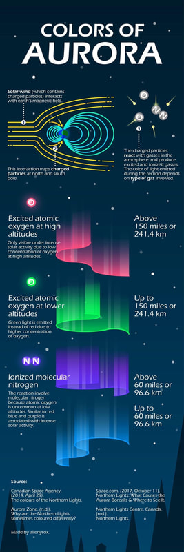

Since we are experiencing some great northern light, i thot id show our readers where the colors originate from and more.

enjoy

Ps....In the mid 80's, I was the President of the Spokane Astronomical Society, as well as the guest speaker for our grade schools convocations and in the field Star Parties.

Pss....once, back in 2001, I was rowing Swiftcurrent Lake, and camping along its shorelines.
As I paddled I noticed a lot of large critters making noise all along the shoreline.
I decided not to sleep on a beach that night, so I set up my cot in the rowboat, and crashed.
The critter noise got real loud, so I thru back my boom tarp (think sailboat), and to my amazement, the entire sky from horizon to horizon, was fire engine red.
Now I'm not saying a strip or two. I mean the whole sky was bright red. Because there was a breeze, none of my images turned out. Drats!

**What are the northern lights?**The northern lights, commonly referred to as the aurora borealis, are the result of interactions between the sun and earth's outer atmosphere. they are one of the most spectacular light shows to watch as vivid colors glow in the sky. in the southern hemisphere, it is called the aurora australis.**What causes the auroras?**

Most auroras occur in response to energetic particles from a solar storm, which cause the gases of the thin upper atmosphere to glow. they take place at heights between 50 to 100 miles above the earth. the aurora can last anywhere between a few minutes to several hours. auroras are most common in polar regions. the various colors, of which green and red predominate, are the results of various light emissions from oxygen and nitrogen gases being energized by the solar particles.

**What are crepuscular rays?**Crepuscular rays are a bands of sunlight shining through breaks in clouds on the horizon.

<!-- more -->

