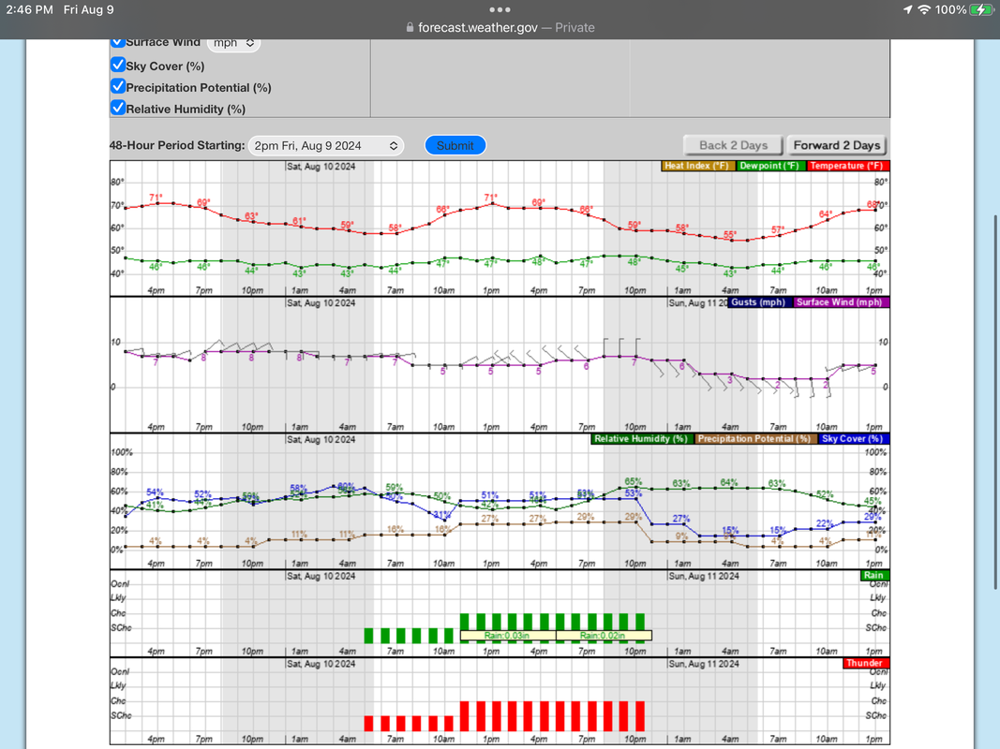

Hourly weather forecast

<!-- more -->

Hi Readers,
I’m sure at one time or another, we have all been foiled by bad weather.
Below are some ways to predict if your outing will be successful.
[<https://www.weather.gov](https://www.weather.gov>/)
This is the site I use every time I am planning an outing. Especially the 3-4 days prior to the trip.

Once on this website, enter the place you are planning to go to, in the top left…"Local Forecast by City,
State, Zip
code", or destination.
This will bring up a page that has the description of the upcoming week.

These words are general descriptions of those days, but do not tell you the whole story.

Scroll down to the green map with a darker green cursor.
You can expand the map to see a more detailed area to get your forecast.
By tapping on the lake, peak, or general area, it will show you the specific forecast for that spot.

Now scroll down the HOME PAGE to the HOURLY WEATHER FORECAST, graph.
This graph shows you all the specifics for two days at a time.

The first row shows you the forecast Temperature, DewPoint, and the Heat Index, or windchill factor.

The second row shows Gusts and Surface winds.
Notice next to the numbers, an arrow that points in the direction the winds may be coming from. The notches on
the end
of these arrows indicates the general speed the winds will be blowing. The more notches, the faster the winds.

In the third row is the Relative Humidity (%).

The next info is the Precipitation Potential (%).

The next is the percentage of Sky Cover (%).

The fourth is the Rain potential. The green bars are a visual details.

But notice the very left column.
They are from bottom to top….SChc…meaning slight chance
Next is Chc….meaning a chance of rain.
Next is Lkly…meaning likely chance of rain.
The top is Ocnl….meaning occasional chance of rain.
The bottom row is for Thunder in the summer or Snow & Sleet in the winter.
The bars have numbers attached which details the amount of Thunder or Snow predicted. If there are no numbers,
it
indicates that the potential is unknown at the time.
By tapping the Forward 2 Days, at the top of the Hourly Weather Forecast, the graphs will move forward two
days.

It may take some time to figure out what this graph shows you.
By moving forward or backward, you can see the trend of the forecast.
I often screenshot these pages every day so I can determine the weather patterns leading up to my outing.

Armed with this info, you can tell if your destination will be hot, rainy, cold, windy, etc., but most
importantly the
percentage of rain or snow predicted.

The more you know in your planning stage, the more likely your outing will be successful.

For further information on all things weather, check out our RESOURCE section….
<https://www.inlandnwroutes.com/weather-thunderstorms-and-lightning.html>
Our goal is to bring you, our readers, the most up to date information and knowledge available.
Thank You for reading and using our local website.

Chic          David

InlandNWRoutes.com
