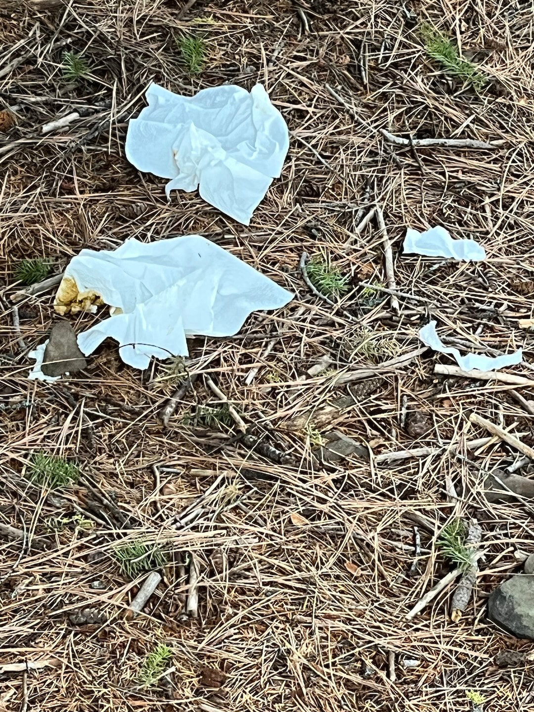

<!-- more -->

## An unacceptable  behavior in the mountains or for that matter, anywhere

Today I got a text from a friend that was upset about others stupid behavior while on a hike.

"I had to get out of the house so we went and got a cuppa coffee and then decided to take a drive out to
Ponderosa State
Park. We walked out to an overlook and this was what was there. What is wrong with people? I don’t get it."

My response back to him is below

I’ve been picking up others trash most of my life.
I used to get pissed, but litters are relentless and never ending.
So I just pick up trash and feel good about it.
Every time I’m at any trailhead, I clean them up. And while hiking, I usually have a grocery bag hanging off
my pack,
with trail trash in it.
It does little good in life to get pissed because others are slobs.
But picking up their trash makes me feel like I made a difference.
You may not know this about me…but I was asked to adopt Stevens Lakes and Lone Lake in 1991.
I accepted on the spot and have done it ever since.

In all of my packs, are 6 or more grocery bags.
They hold the trash I clean up, but this year, I learned that they can prevent whole forests from burning.
Picking up trash is one thing, but knowing that there was three times this year, that I just may have saved
our forest,
and one of my favorite places to play, I feel good about doing what I do.
Basically, I have gone up to Stevens or Lone Lakes, on average every three weeks, weather permitting and non
snow times,
to clean up campsites and trailheads.
But it’s also very selfish of me…when I do go up, the exercise I get, is worth the effort.

Get pissed. I don’t blame you.
But move towards feeling good about making a difference for the next  hikers.
A plastic grocery bag holds about 1.5 gallons of water. And they have built in spigots.
But they only last for 3-4 trips before they rip apart.
That’s why I carry a lot of them.
The smoldering fire I tried to extinguish at Upper Glidden Lake, didn’t get dead out. My bag fell apart.
So on my way past Wallace, I stopped at the Shoshone County Sheriffs, to alert them. The girl at the office
recognized
me from Silver Mt. and said she would contact the Idaho Department of BAD ROADS, Aka Lands.
They dispatched a crew that went up and made sure the campsites fire pits were dead out.
Grocery bags only weight only 6 grams, put 6-8 in your pack.
I also carry 4 nitro gloves to pick up wet stuff.

Once during a trail work party, we came along a spot on the shore of Lower Stevens Lake, where a girl peed in
the lake
several times, over several days, and left 10+ large Kleenex tissues on the shore.

I made one bag into a glove, that’s why I carry gloves now, and picked it all up. The others on the trail crew
were
grossed out, but I was happy it’s was dealt with.

The moral of this BLOG is....Be a trail hero. Carry a bunch of grocery bags and help Mother Nature.
Whether you pick up trash or other stuff, it will make you proud that you made it nice for all of us.

Often when I'm in the mountains, I come across others that pick up others trash.
To those who do that...THANK YOU VERY MUCH.
Mother Nature is smiling at you.

Thank You for reading our local website.
And thanks for picking up your, and zothers trash.

Chic              David

InlandNWRoutes.com

If by chance any of you have a topic that our readers would be interested in, please email me.
My email can be found at the bottom of every page on our website.  c.
