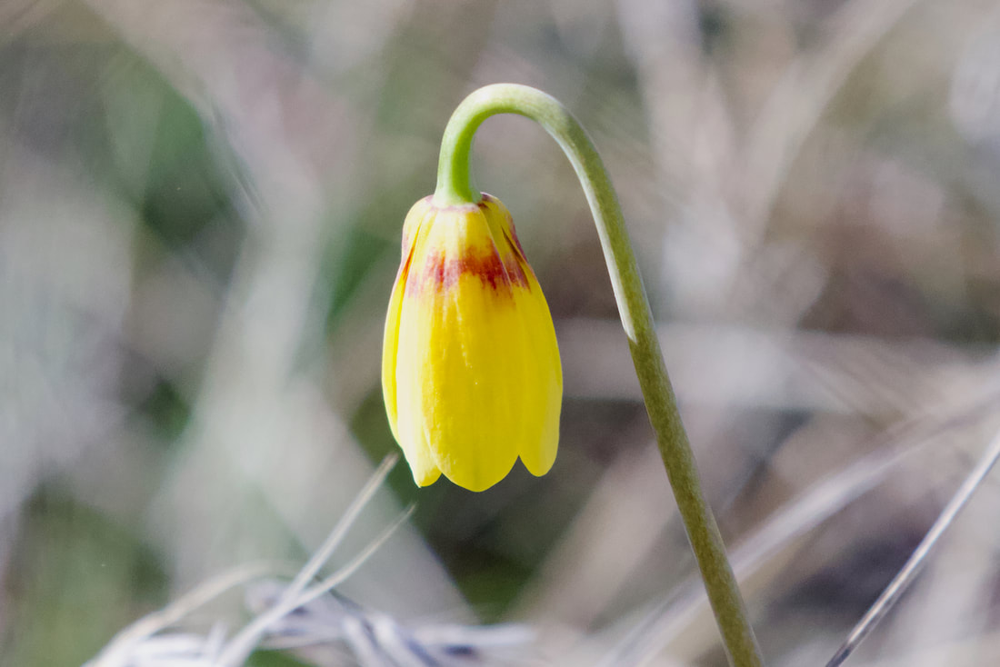

It's always fun to find your first flower when the snow melts.

<!-- more -->

To find the first flowers you have to go to the sage brush country. We found these near Crab Creek west of Othello, WA.
