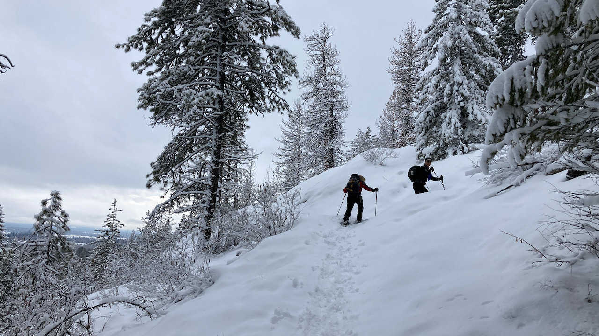
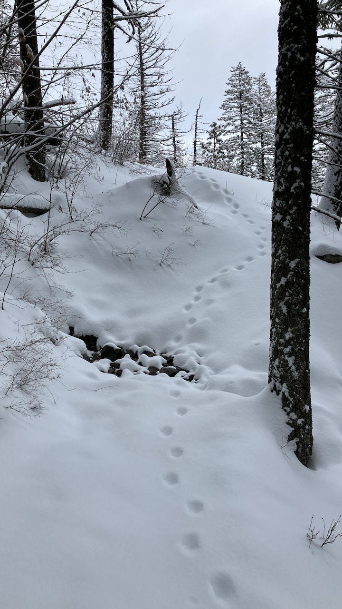
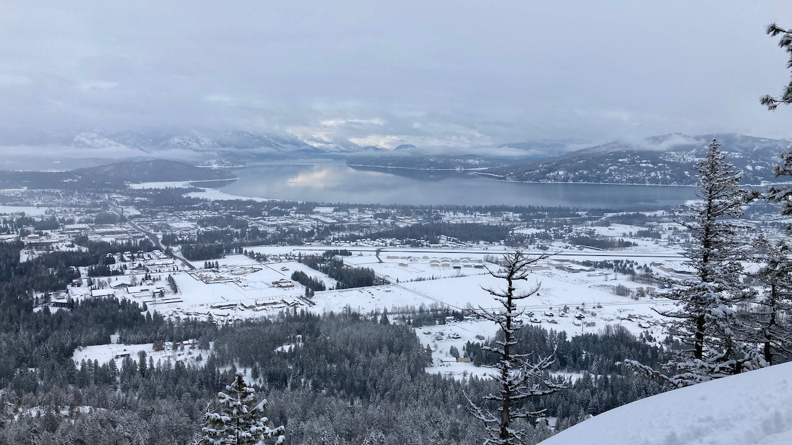

<!-- more -->

This is a local favorite for good reason. It gives you 2,000+ elevation gain in seven plus miles RT and offers some of the best views of Lake Pend Oreille looking east with the Scotchman Peaks as a back drop.

We broke trail after a snow storm the previous day. Something to be aware of if you are in a similar situation is the fact that there are no diamond trail markers so if you have not been on the trail before it is a little challenging to follow when it is covered in several inches of snow. I'm thinking the locals like that.

Another thing to be aware of is the fact that this is where the locals like to take their dogs for a walk off leash.
