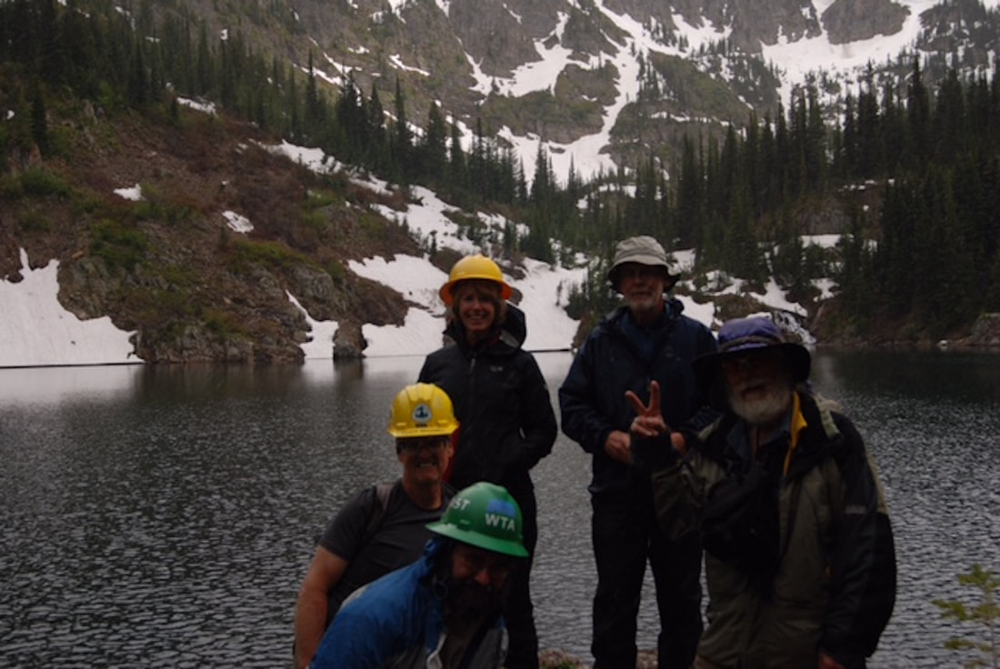

Why everyone should carry a map & compass  
The biggest reason to always have a map & compass and the knowledge to use them, is….batteries die.  
If you rely only on your phone or  GPS unit to get you around in the forest, you may be putting yourself and others at risk.  
Besides, a map & compass weighs a fraction of even a GPS unit,  
And they do not require batteries.  
When safety is paramount, you will learn that having the knowledge and equipment to get you thru the night is your best/only option.   
When I lead hikes for the Spokane Mountaineers, I make copies of the USFS Forest Map and Topo map, on the other side , showing details of our route(s), both driving and hiking.  
Each person gets a copy.   
And to further this suggestion..EACH person should carry the 13 ESSENTIALS, in their own pack.  
Your pack should also include food, first aid kit, water, rain gear and any other items you feel are a *necessities* to you.  
Keep your 13 ESSENTIALS it light and restock as you use any of the items.  
As fall temperatures drop, we all must carry clothing for all weather conditions. Don’t forget stocking caps and warm gloves.  
To check if you are prepared, put on what you normally wear on a hike. About an hour before bed, go stand outside. Stay still, and see how you feel in an hour.   
Then come to a realization that you have 6+ hours until sunrise.  
Take a look at TRAIL HEROS..in our GALLERY  
 <https://www.inlandnwroutes.com/trail-heros.html>  
Please plan ahead, and have too much fun.  
  
  
InlandNWRoutes.com  
  
Chic Burge     David Crafton

<!-- more -->

The below image is from a trail work party to Lone Lake.  
The day started out with some sun, but as you can see, the day turned wet and cold.

This

---

In a recent spokesman-review an article illustrates why every hiker needs to carry a map & compass, and know how to use them. Two hunters recently got misplaced and their cell phones were dieing.   Fortunately, they were found, but miles away from where their car was. Had they had a map & compass, they could have know where the road was. ​check out blog #9 for info on a very inexpensive phone, rescue app.  $4.99 a year. ​chic

##
