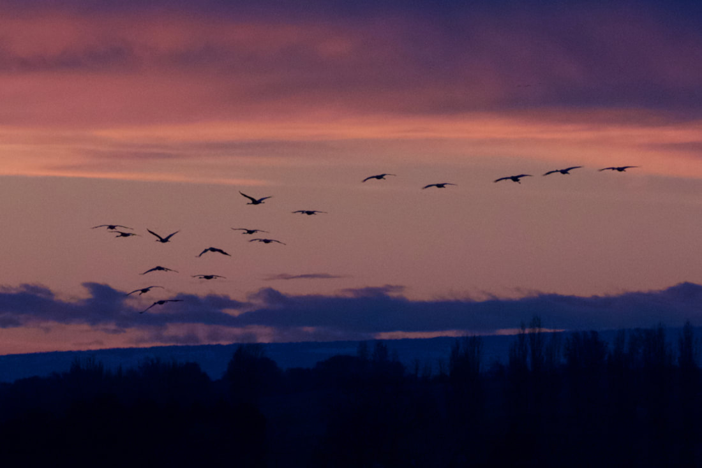
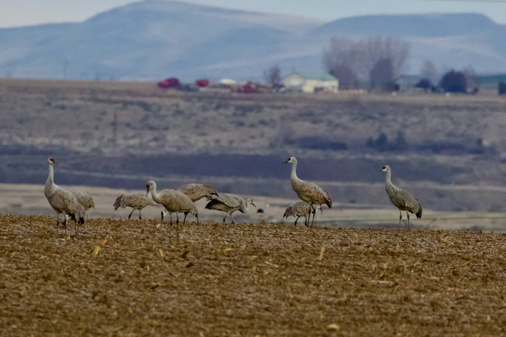
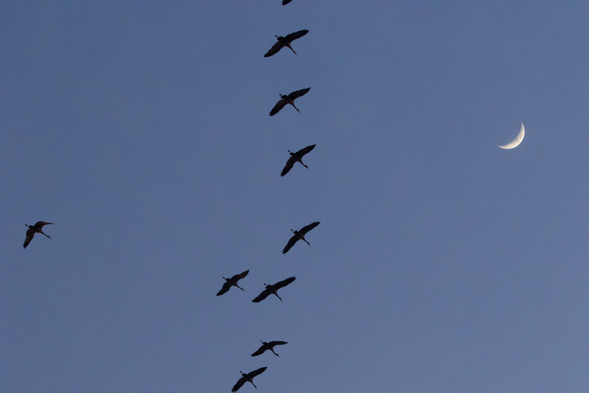
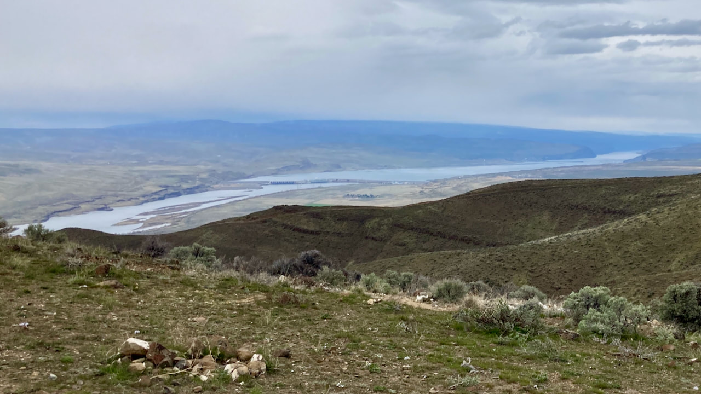
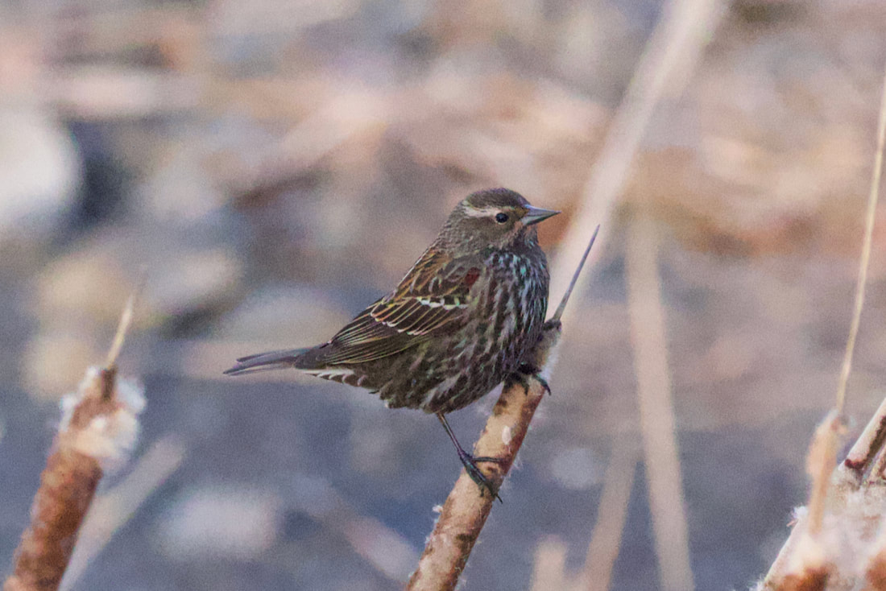
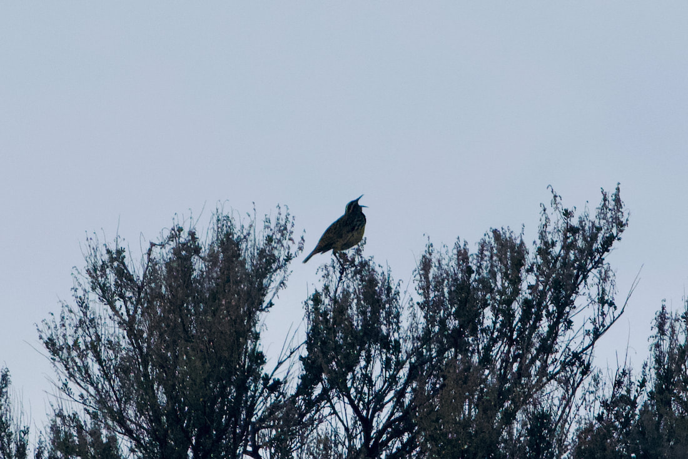
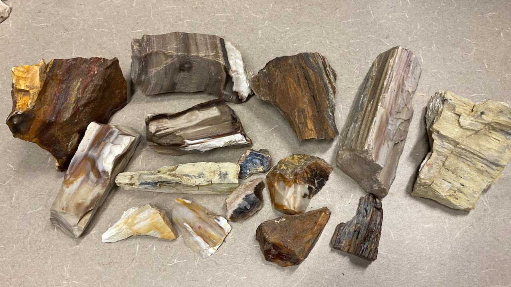
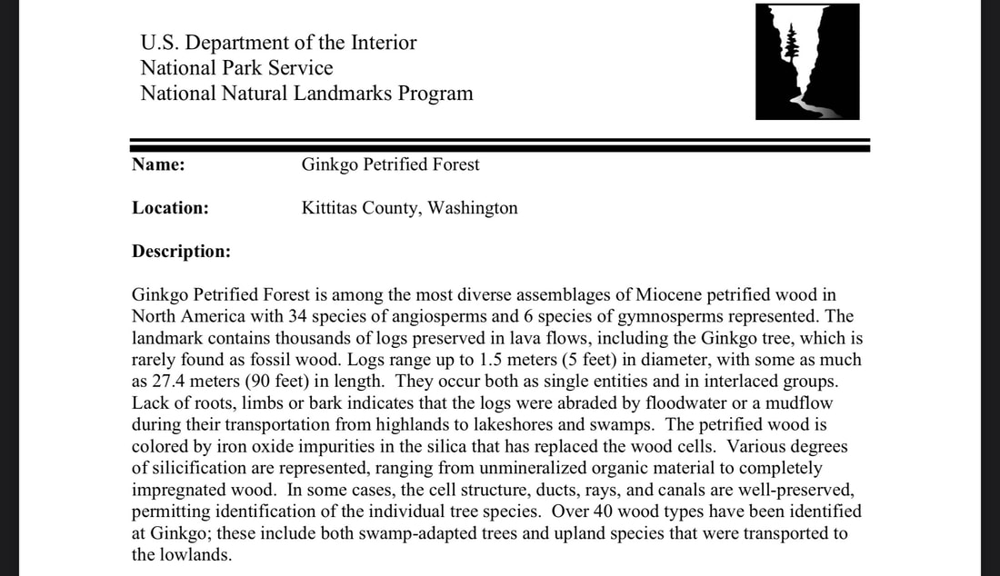
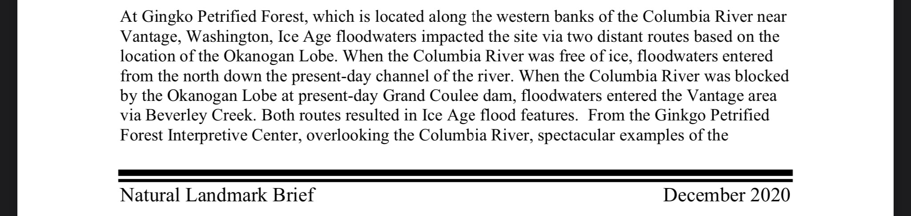
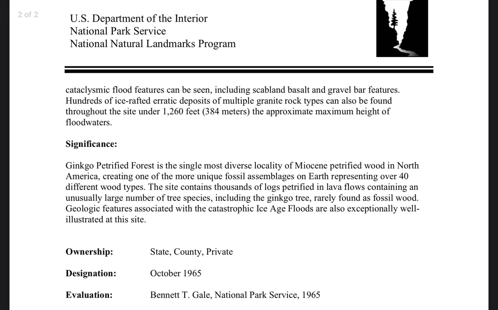

The Othello Sandhill Crane Festival is about a lot more than just cranes. If you love nature and are interested in birds, geology, plants, etc. this is a great way to meet like minded people while attending seminars and tours which are lead by some very interesting people who have been studying these topics for most of their lives. The daily schedule is packed with several tours our talks going on in parallel every hour four several days. It was tough to decide which ones to do because you could not do it all.

Othello is a unique location with most of the area being farm land for grains, fruit and onions. It is in the middle of no where but it is surrounded by some really cool country. Potholes State Park, Vantage, Hanford Reach, Saddle Mountains, Columbia National Wildlife Refuge and Ginko State Park and West Crab Creek are all less than an hour away.

This year's festival was the first one that I have attended. For the last couple years I have birded in the area in the spring on my own because the festival was not on because of Covid . I saw and taught myself a lot of good stuff but going to the seminars and the tours at the festival opened up my eyes to how much more there is. I was more than impressed with how well it was planned, the effort put into it and the quality of the guides and presenters. Most people probably go for the cranes but I was most impressed with the knowledge of the people who were there to share it.

**The Cranes**
The first thing we did was take a tour to view the cranes. We were loaded on school buses and driven around with a biologist. They have negotiated with some of the locals farmers to cut their corn stalks off just above the last row of corn leaving some in the field for the birds. I believe it is around 800 acres around the area. They know where those farms are and I didn't so I saw a significantly larger number of birds in one hour than I had in two years prior.

The guides knew where they went to roost too so that evening we went on a guided tour at sunset and the cranes flew in one by one in small flocks landing on the opposite side of the lake from us with the sunset in the back ground and the moon above. It was remarkable.

**Birding**
They offered several guided birding trips and the first one we chose was 1.5 hours long in one of the two main local parks. It was a stark contrast to the landscape around us. It is densely populated with large mature evergreen trees surrounded by desert and irrigated farm land. It turns out owls roost in evergreens and eat the mice in the fields. It was led by a guy named Micheal who was raised in Africa as a young child and would spend his time after school in the bush and was interested in the birds along with the rest of his friends. He said when he moved here at the age of eight he was surprised to find out the kids here were not interested in the birds and wildlife. After the tour it was an easy decision to decide on which tour to do for the next day. Micheal was leading on all day birding tour along West Crab Creek.

Luckily the tour was not full for the next day and we signed up. That guy knew were individual birds would be and delivered on a Plover in a field and a couple Great Horned Owls. He could glance at a bird and know what it was.

We went to an owl roost and found some pellets on the ground. Mike tore them apart and could identify the individual mouse bones inside

**Petrified Wood**
While hiking up the alluvial fan on the north side of the Saddle Mountains to find a spot to eat lunch we noticed that there was some light colored rocks randomly in the mix of dark basalt Darcy picked up a piece and determined it was petrified wood. The mountains are on the opposite side of the Columbia River where Gingko State Park is. That layer in the rock is on both sides of the river and the river cut through it. One side is state park and the other BLM. They both have agatized wood.

The following week I went to the BLM office to ask where I could find some petrified wood and if it was okay to take home rocks and minerals from BLM land. They handed me a map with some areas on Saddle Mountain where you can mine up to 25 pounds a day.

We went back the following weekend and drove to the top of West Saddle Mountain. It turns out the mines are in the ORV park so expect to see some motorcycles. The road is rough. We did not take the Prius and it would not have made it but any car or truck with decent clearance should be fine.

The views from the top are some of the biggest I have ever seen. To the south you overlook the Hanford Reach and White Bluffs along with the only free flowing section of the Columbia River that I have ever seen. Across the river is Rattlesnake mountain and the Hanford Site where they enriched uranium for nuclear bombs. To the west again looking across the Columbia is the Cascade mountains and looking further north you can see the Vantage bridge and the Gorge.

In certain areas people have been digging seemly randomly all over. I really could not determine what the best strategy was but after digging in the dirt for an hour or so we started finding small pieces of petrified wood with the largest being slightly bigger than a bar of soap. After a few hours we had approximately 30 pounds between the two of us.

<https://www.othellosandhillcranefestival.org/2022-brochure>

<!-- more -->

Sandhill Cranes coming in to roost. They like to hang out in shallow water to protect them from predators.

---

## Cranes feeding in a corn field

---

---

## From the top of West Saddle Mountain looking north at the Gorge and the Vantage bridge

---

## If you look closely you can see a small red wing patch. Female Red-winged Blackbird

---

## Can you hear the Meadow Lark singing?

---

## Petrified Wood

Many thanks to the national park service.

Petrified Wood

A rainbow of quartz
NPS/Lauren Carter
Petrified wood found in the park and the surrounding region is made up of almost solid quartz. Each piece is like a giant crystal, often sparkling in the sunlight as if covered by glitter. The rainbow of colors is produced by impurities in the quartz, such as iron, carbon, and manganese.
Over 200 million years ago, the logs washed into an ancient river system and were buried quick enough and deep enough by massive amounts of sediment and debris also carried in the water, that oxygen was cut off and decay slowed to a process that would now take centuries.
Minerals, including silica dissolved from volcanic ash, absorbed into the porous wood over hundreds and thousands of years crystallized within the cellular structure, replacing the organic material as it broke down over time. Sometimes crushing or decay left cracks in the logs. Here large jewel-like crystals of clear quartz, purple amethyst, yellow citrine, and smoky quartz formed.
The park is host to numerous types of plant fossils including complete logs, upright stumps, delicate ferns and gymnosperm leaves, and pollen spores. Most of the petrified trees have been given the scientific name Araucarioxylon arizonicum.

Petrified wood segments cause people to wonder "who cut the wood?"
NPS/VIP Kristen Henderson
Who Cut the Wood?
Petrified trees today lie strewn across clay hills and within cliff faces; each log broken into large segments. The quartz within the petrified wood is hard and brittle, fracturing easily when subjected to stress. During the gradual uplifting of the Colorado Plateau, starting about 60 million years ago, the still buried petrified trees were under so much stress they broke like glass rods. The crystal nature of the quartz created clean fractures, evenly spaced along the tree trunk, giving the appearance today of logs cut with a chainsaw.
Go to our [Frequently Asked Questions](https://www.nps.gov/pefo/faqs.htm) page for more information about petrified wood!
Last updated: March 16, 2018

