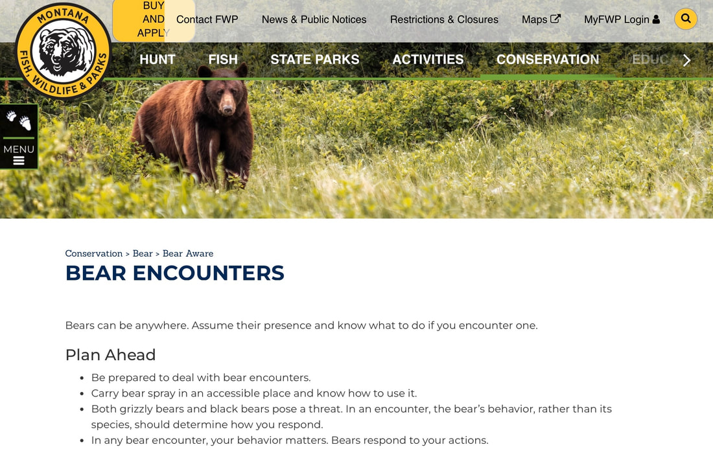
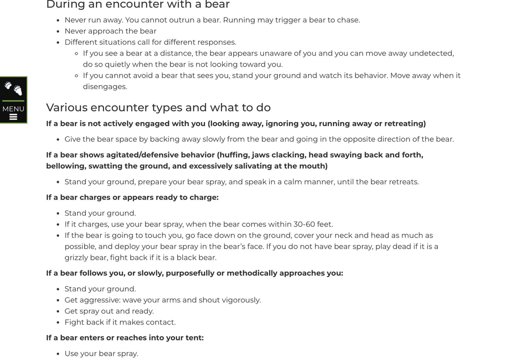
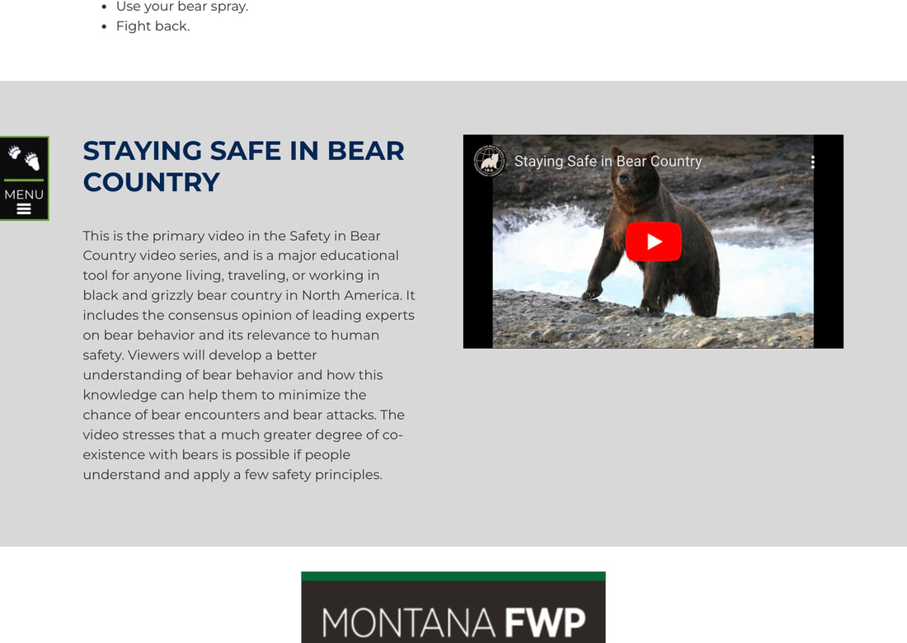

Below is the latest information on bears and how to handle an encounter, from the  
                                                           Montana Fish, Wildlife & Parks (MFWP)  
Please log onto the following url's and learn what you need to know.  
<https://fwp.mt.gov/conservation/wildlife-management/bear/be-bear-aware/bear-encounters?emci=0a07ed16-e54c-ee11-a3f1-00224832eb73&emdi=d4ffadba-004d-ee11-a3f1-00224832eb73&ceid=1038022>  
  
​<https://www.youtube.com/watch?time_continue=25&v=s-zkGuh42l4&embeds_referring_euri=https%3A%2F%2Ffwp.mt.gov%2F&source_ve_path=MTM5MTE3LDIzODUx&feature=emb_title>  
  
Then go to our RESOURCE section and read a similar article from Canada.  
  
The more you know, the safer you can be    
[<https://www.inlandnwroutes.com/wildlife.html>  
  
  
​](https://www.inlandnwroutes.com/wildlife.html)InlandNWRoutes.com  
  
​Chic Burge         David Crafton

<!-- more -->

