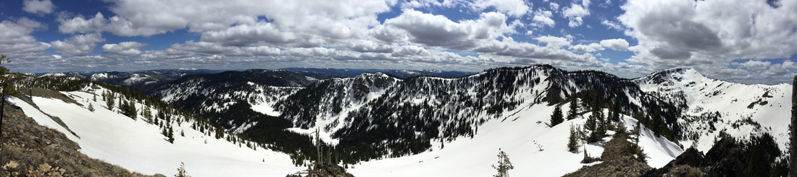

time to treat your winter outer layers..dwr.  
We buy outer gear to keep ourselves warm and dry.  
With skiing, sshoeing, alpine climbing, or just winter hiking into a high country lake coming soon, it’s time to wash and treat our gear.  
This method is for technical gear only.  
DO NOT TREAT wool, fleece, down, or some synthetics with this method.  
              items needed  
Arm & Hammer powder detergent  
Durable Water Repellent  Revivex Gearaid.com  
Before washing, secure all zippers, snaps, Velcro fasteners.  
Use one of the the A&H scoopfuls to wash in.  
After that cycle is done, re-wash with water only.  
DWR  
This product applies differently than aerosols sprays.  
Hang the garment on a hanger outside, and apply an even coating of the DWR spray.  Re-apply another light coat on shoulders, top of arms, chest, thighs, seat, all high activity areas.  
Then you can either…….  
Toss it in your dryer on medium heat, for 30+ minutes.  
Or hang to dry for no less then 24 hours.  
If need be, you can re-apply a coating, and dry as above.  
Try to protect your outer layers by making sure they are cleaned after each use.  
Only apply DWR to clean gear.  
Half way thru the season or as necessary, you can re-apply the DWR to a clean garment. But make sure you use a dryer to set the spray.  
Another thing I have been practicing, and teaching people, is your technical outer gear is one of your life line.  
On demand, your gear must perform as needed.  
So I never wear my outdoor sport clothing for ANYTHING BUT MY SPORTS ACTIVITIES.  
It would be a drag if you were on a winter hike, and your outer layers did not keep you warm or dry.  
Use them only when you are doing your outdoor sports.  
And only when they are properly cleaned and waterproofed.  
  
  
Gearaid is where I order my DWR from.  
Buy more than you think you need. Re-treatment happens.  
<https://www.gearaid.com/products/revivex-durable-repellent?variant=42149201117370>  
Winter is a great time to see Nature’s beauty.  
You don’t have to go to a high country lake, choose a local area that has been conserved just for walking.  
Spokane County Conservation Futures  
<https://www.spokanecounty.org/1592/Conservation-Futures>  
  
  
Spokane County is very fortunate to have a program called….  
Spokane County Conservation Futures Tax.  
For every 1,000$ of assessed value, a 6.5 cent tax is collected.  
All this is used by the commission to buy properties all over Spokane County.  
They can only have a parking area, pit toilet, and descent trails.  
If there are unsafe structures, they can remove them.  
But that’s all.  
Hiking, some mountain biking, equestrian, and human powered snow sports are allowed.  
It’s a program that The Spokane Mountaineers, we’re heavily involved in, to make it happen.  
Now there are 17 properties to visit, with more being developed.  
Enjoy!  
  
​Chic Burge             David Crafton  
  
  
InlandNWRoutes.com  
  
  
  
The State Line Trail                                                                                                                                     Stevens Peak 👇 area

<!-- more -->

