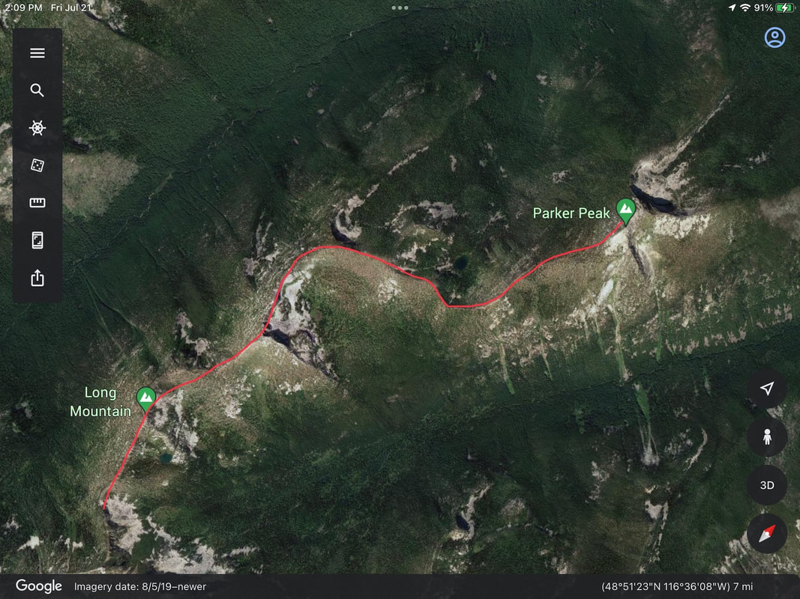
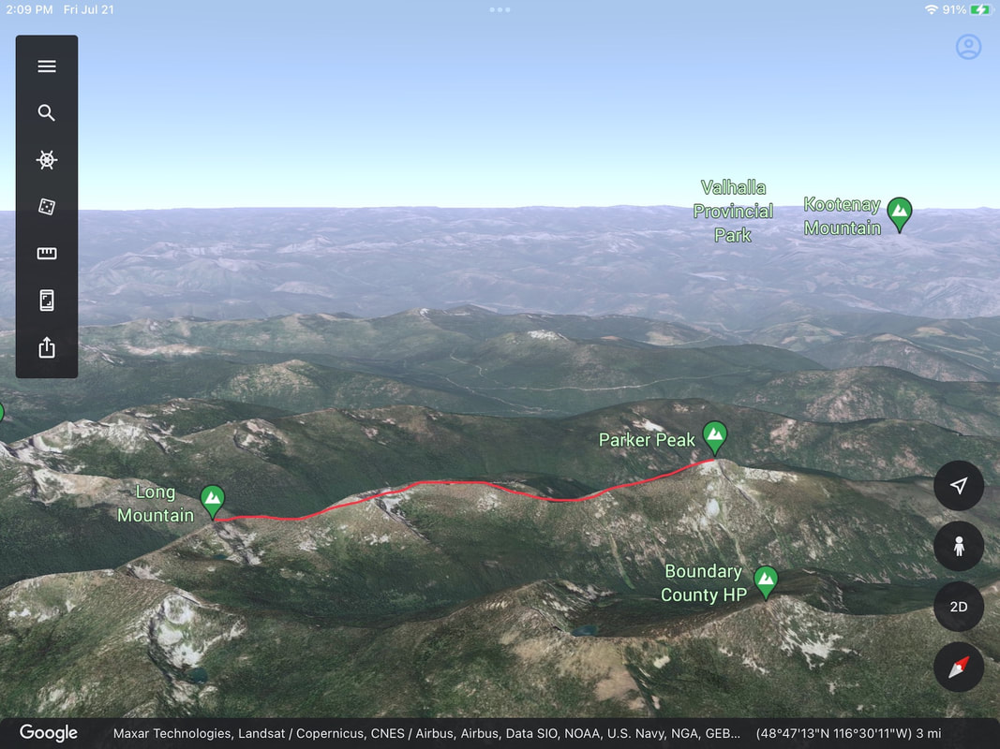

First let me state…if you go into Nature with only a phone, you are in danger.
Be absolutely sure you carry a power stick.
If you find yourself lost, only turn your phone on for 10 minutes on the hour. Or you can put your phone on "low power mode."
This way you can be assured you will have a battery when you need it.
Batteries die. 
When that happens, you could miss info, like critical turns, faint routes, and your way.
When I hike, I take screenshots of the DISTANCE & ELEVATION GAIN, DIRECTIONS, DESCRIPTION, and OPTIONS, from my own website, as well as Google Earth images
All of the above, is my safety net.
I rely on Forest Maps, and Topo maps of the specific area visited, and a compass.
But back to phones.
I take overhead Google Earth images of the route, and horizontal images of the ridges. Then I "mark up" the image with my proposed route.

<!-- more -->

These show me what I need to know.
And as I’m walking the route, I can use the images to determine where I am and how far it is to a feature.
Also for the phones, is an app that turns your phone into a rescue devise.
Log onto AirFlare.com.
Because AirFlare is an app, it weights nothing, and can send emergency coordinates to rescuers. 
If a partner is misplaced in the woods, AirFlare can communicate up to a quarter of a mile with them.
AirFlare can operate on as little as one bar on your reception scale.
But that isn’t the best part.
It only costs $4.99 a year.
Look into it. It could save you someday.
But please remember, it takes a lot of time for the Sheriff to put together a rescue crew and get to you.
By this I mean…if you are in a remote area, it may take them 3 to 6 hours, or more just to reach you.
Check out the 13 ESSENTIALS drop down  menu for info every hiker must have with them.

InlandNWRoutes.com
​
Chic Burge.          David Crafton
