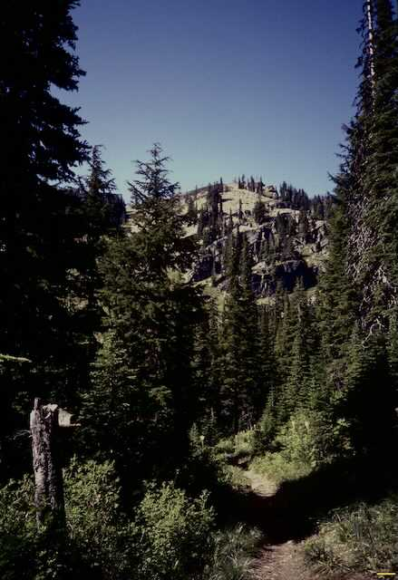
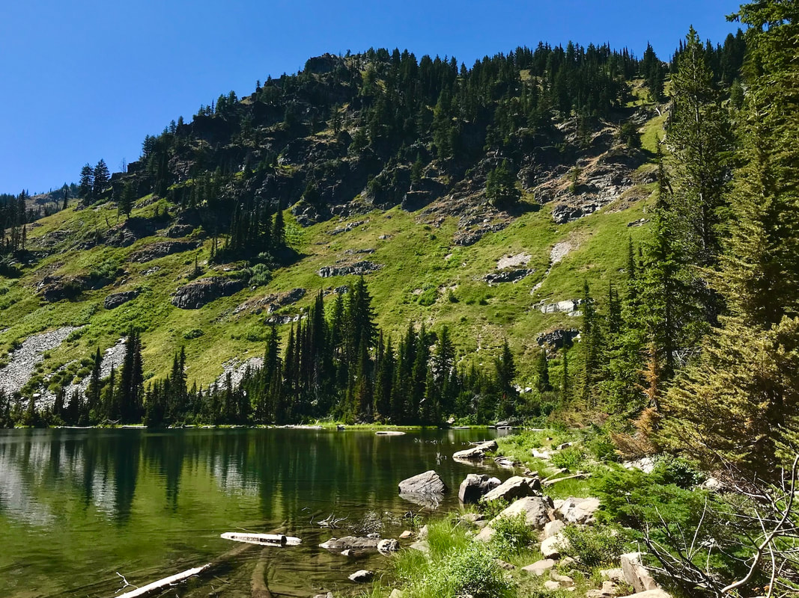
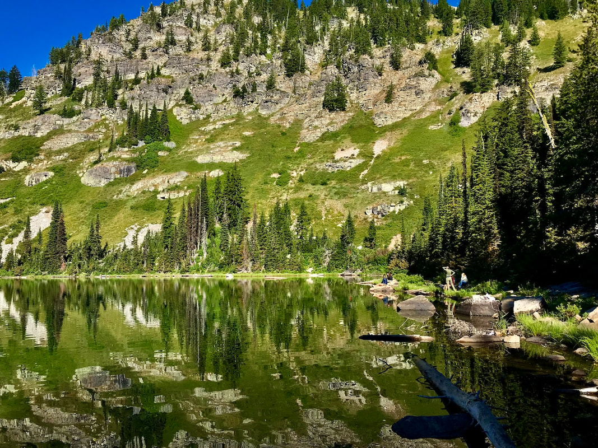
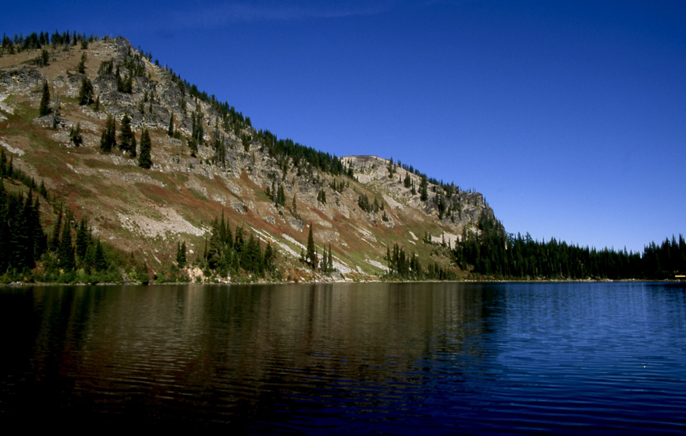
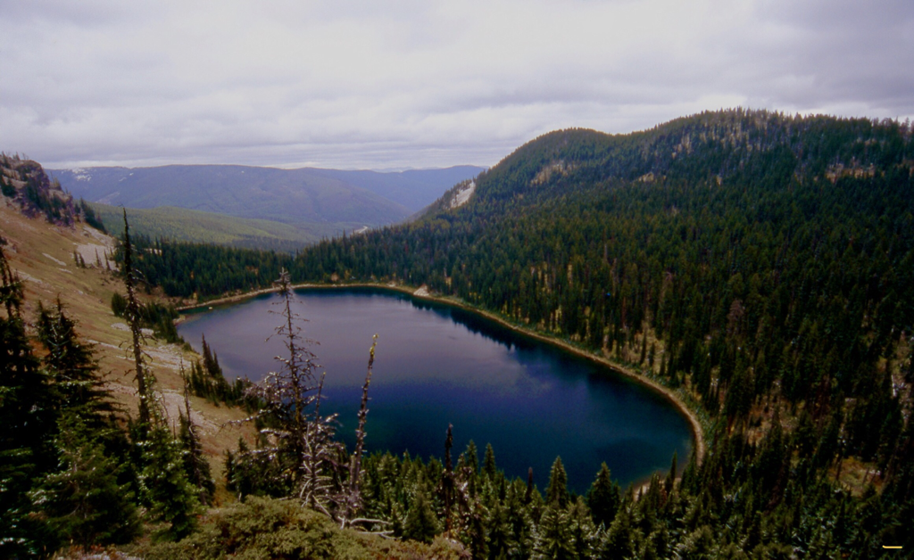
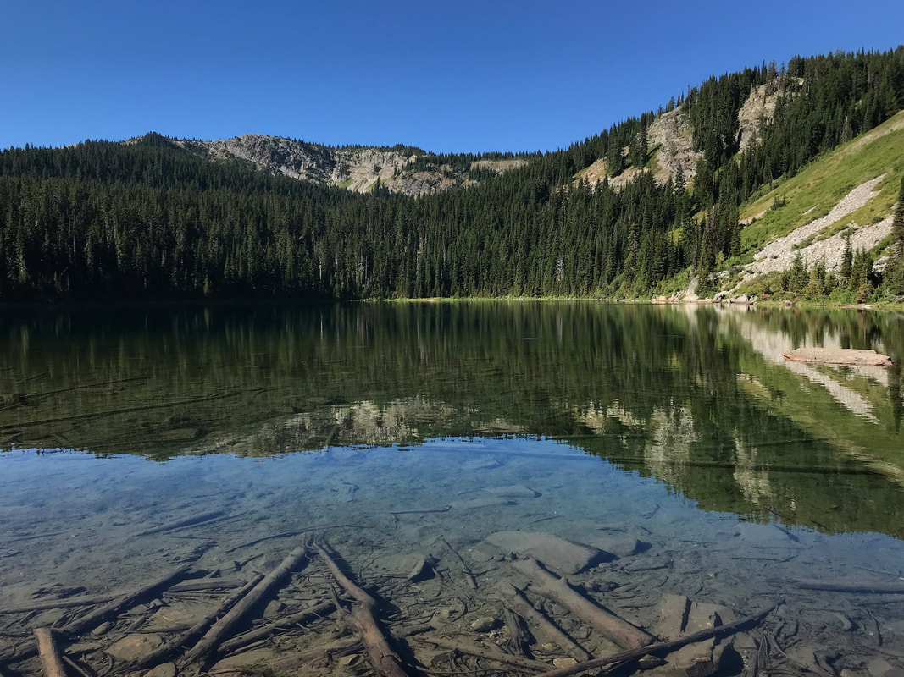
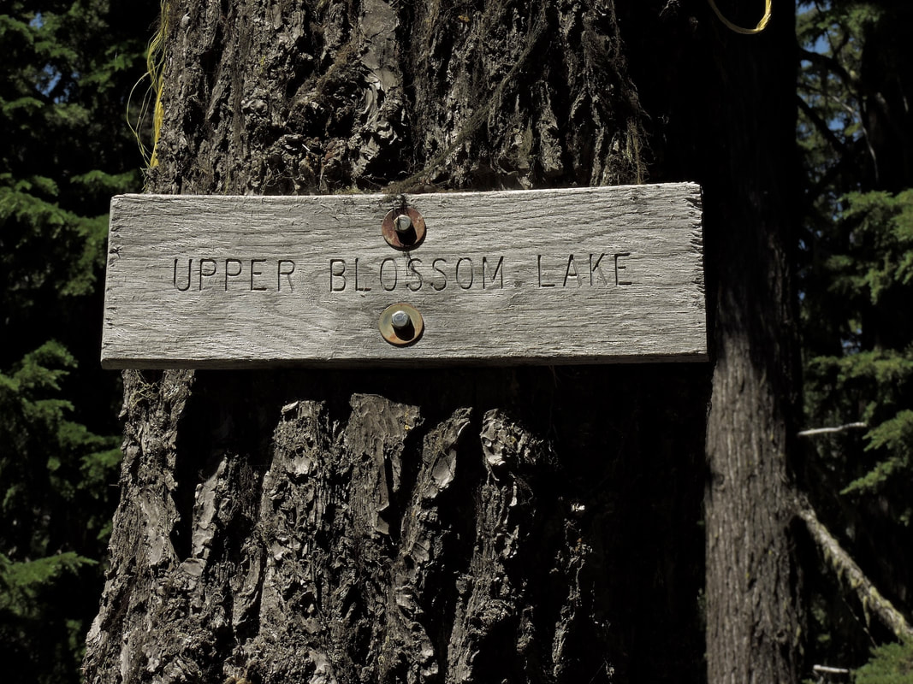
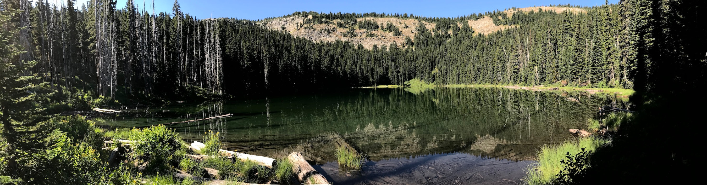
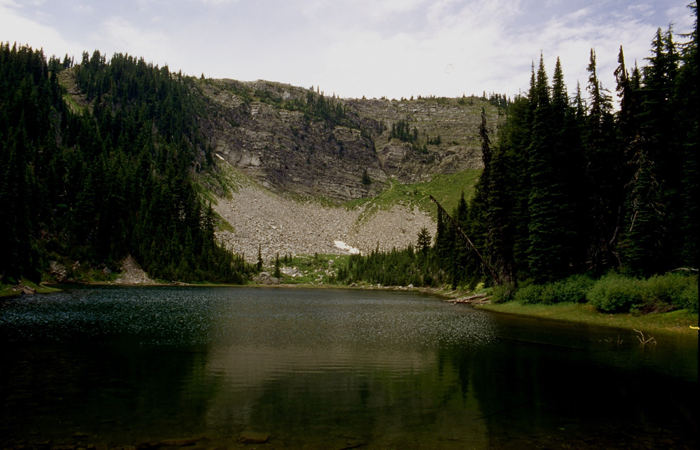
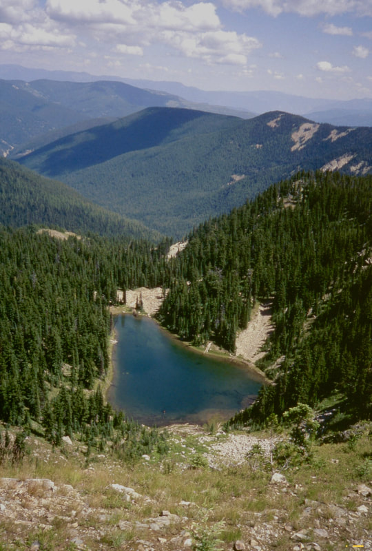

---
tags:
- Lakes
- Easy to Moderately Easy
- Day Hiking
- Backpacking
- Camping
- Scrambling
stats:
- label: Event Type
  icon: hiking
  value: day hiking, backpacking, camping, scrambling
- label: Distance
  icon: map-marker-distance
  value: 6 miles RT to lower lake, 8 miles RT to upper lake, 10 miles RT to Pear Lake
- label: Elevation Gain
  icon: elevation-rise
  value: the numbers are approximations for this hike
- label: Difficulty
  icon: speedometer
  value: Easy to Moderately Easy
- label: Maps
  icon: map
  value: IPNF, LOLO N.F., Thompson Pass
- label: GPS
  icon: crosshairs-gps
  value: 47°55’15"n 115°74’47"w
- label: Mineral County Sheriff
  icon: shield-account
  value: 406.822.3555. 1st choice
- label: CdA River Ranger District
  icon: pine-tree
  value: 208.752.1221
- label: Shoshone County Sheriff
  icon: shield-account
  value: CALL 911 FIRST or 208.556.1114
notes:
- TRAILHEAD 4840verts. to L.B.L.(5669v) or 829vets. TH. to U.B.L. (5897v) 0r 1050verts.
  TH. to Pear Lake(5899v) or 1341verts
- 'Plains-thompson falls ranger district: 406.826.3821'
- Because blossom lakes are right on the idaho/montana boarder, i have included the
  info below.
---

# Blossom Lake

*Lower & upper blossom lakes, id-mt boarder This page was rewritten and published on 8.2.2024*

## Description

We have added the areas sheriff’s emergency phone numbers for each trip write up under the ranger district info. if an emergency ocurrs, evaluate your circumstances and call only if needed.

For some reason the lolo n.f. and the i.p.n.f. do not list these and other trails on either website along the idaho/montana borders.
So there is not an official distance or elevation gain/loss available.
​all other numbers are strictly usfs unless noted.
​The trail starts at Thompson Pass (4840V)Parking Area on a fairly level trail for about .5 of a mile.
​From here the trail starts a gradual climb to the high point at 5775'. The rest of the trail descends slowly to the lake. The trail goes thru a rocky area just before it reaches the L.B.L.
Along the way look for an old diversion trench dug by Chinese laborers to supply water to mining operations. But was never used.

## Option #1

From the lower lake, you can walk back to the trail and continue about a mile to a junction. Bear right over to the Upper Blossom Lake. The walk over to U.B.L. is thru a nice easy forest. There is a small campsite next to the exit creek. 
Retrace your steps back to the junction.

## Option #2

From the U.B.L., walk back to the main trail, and turn right at the junction, up to Pear Lake.
​Look for a wood sign.
It’s about a mile to Pear Lake, but the trail ungulates on its ascent.
Pear Lake sits below a 500' cliff that is very picturesque, and the whole lake is very sensitive.
​Please use clean camping techniques, and dispose of human and dog waist AT LEAST 200 FEET FROM ANY WATER SOURCE, TRAIL OR CAMPSITE.

## Option #3

From Lower Blossom Lake go to the back right (west) end of the lake, and scramble the scree slope up to the low notch on the ridge. In front of you will be Revett Lake and the trail back to the cars. I prefer to follow the scree slope to the NE to the lake.
This extension is all toll about a 9 mile loop. There is no trail between the two lakes.
​Good route finding skills are a must.

## Option #4

## Directions

Drive I-90 east to the Kingston exit # 43, and turn left (north) over the freeway and up FR #9, also known as the Coeur d'Alene River Road. Drive north for about 21 miles and bear right (east) at Pritchard, continue for about 16 miles to Thompson Pass at the Idaho Montana boarder. Off to the right at the summit of the road, you will see a parking area. The trailhead is near the south corner of the parking area.

## Hazards

All the trails from the trailhead to Pear Lake are in great shape.
​But always use caution.

## Cool things close by

Revett Lake, the Coeur d"Alene River Trail #20, Granite Peak, and The Idaho Centennial Trail.

## R & p

The Snake Pit, the Sprag Pole Bar & Museum.

*Picture (Image missing)*

## Photo gallery

## The trail to blossom near the lower lake

---

## Lower blossom lake in mid summer

---

## The cliffs at lower blossom lake

---

## Lower blossom lake from west end

---

## Lower blossom lake from the ridge between blossom & revett lakes

---

## Lower blossom lake, showing the upper valley that holds the upper blossom lake

## Look for this trail sign at the junction

## Upper blossom lake

## Pear lake wth trail #7 ridge line

---

## Pear lake below trail #7 ridge
