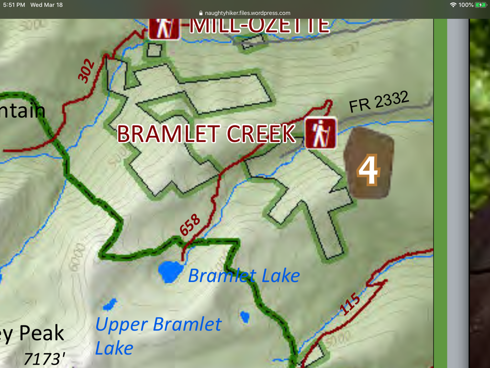

---
tags:
  - Lakes
  - Easy
  - Day Hiking
  - Backpacking
stats:
  - label: Event Type
    icon: hiking
    value: Day hiking, backpacking
  - label: Distance
    icon: map-marker-distance
    value: 3 miles RT
  - label: Elevation
    icon: terrain
    value: 800 verts
  - label: Acres
    icon: vector-square
    value: '9.4'
  - label: Difficulty
    icon: speedometer
    value: Easy
  - label: Maps
    icon: map
    value: Howard Lake
  - label: GPS
    icon: crosshairs-gps
    value: Lower 48°01’47" N 115°33’09" W Upper 48°01’37" N 115°33’44" W
  - label: Ranger District
    icon: pine-tree
    value: Libby Ranger District
  - label: Lincoln County Sheriff
    icon: shield-account
    value: CALL 911 FIRST or 406.293.4112
notes:
  - label: Kootenai National Forest Alerts
    url: https://www.fs.usda.gov/alerts/kootenai/alerts-notices
---

# Bramlet Lake

## Description

We have added the area's sheriff’s emergency phone numbers for each trip write-up under the ranger district info. If an emergency occurs, evaluate your circumstances and call only if needed. Although the old road is now overgrown, it is maintained as a trail all the way to the lake's outlet. The lower lake is tree lined but has a primitive campsite.

## Options

### Option 1

The upper lake is only about 0.5 miles from the lower lake, with 422’ of gain. But getting to the upper lake requires bushwhacking and route-finding skills.

### Option 2

If you are into off-trail hiking, Carney Peak (7173’) towers above the upper lake. From Carney Peak there is a very primitive trail that leads SE to Lost Buck Pass and the Upper & Lower Geiger Lakes. If you don’t want to hike to the top of Carney Peak, look for Carney Pass.

## Directions

At about 17 miles from Libby on Hwy 2, turn right (west) onto West Fisher Creek Road #231. Follow 231 for about 6 miles and turn right onto F.R. #2332 for 3 miles, passing the Lake Creek Campground, to the trailhead.

## Hazards

There are no stream crossings along the trail, so take the water you need until you get to the lower lake. From the lower lake to the upper lake, there is no defined trail, so use a compass to make your hike easier.

## Cool Things Close By

Upper & Lower Geiger Lakes & Lost Buck Pass, Wanless Lake, Leigh Lake, and Cabinet Divide Trail.

## Restaurants & Pubs

Henry’s in Libby, Pizza Hut, Clark Fork Pantry & Squeeze Inn in Clark Fork. Jalapeños, Burger Express, Mr. Sub, Eichardt's all in Sandpoint.

## Plan Your Trip

[Click for Current NOAA Weather Conditions](https://www.nws.noaa.gov/wtf/udaf/MapClick.php?lel=4000&uel=9000&polygon=49.016%2C-114.180%2C48.994%2C-114.381%2C48.890%2C-114.341%2C48.924%2C-114.151%2C&area=63)

## Photo Gallery

_Bramlet Lake._

_No additional images available. If you would like to contribute images and words, please contact Chic._
