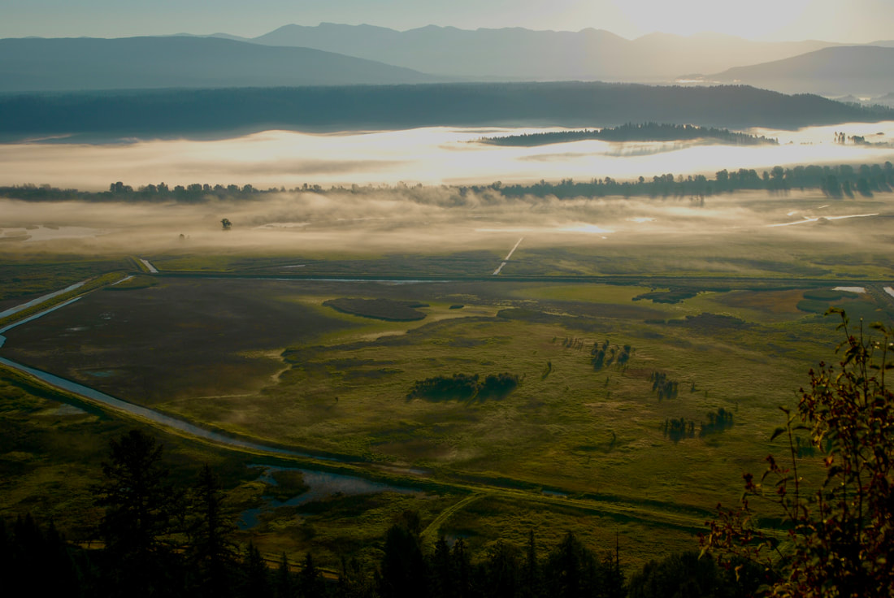
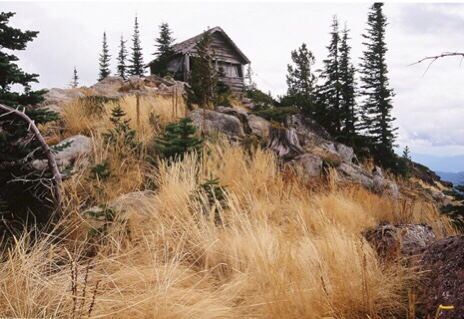
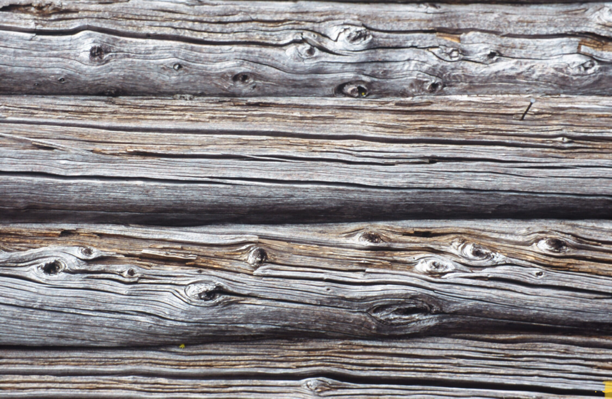
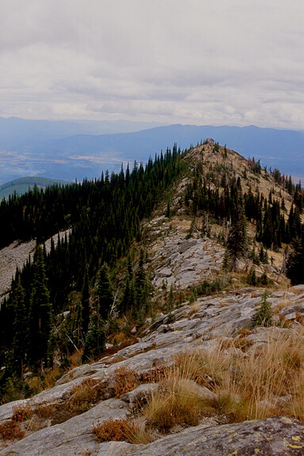
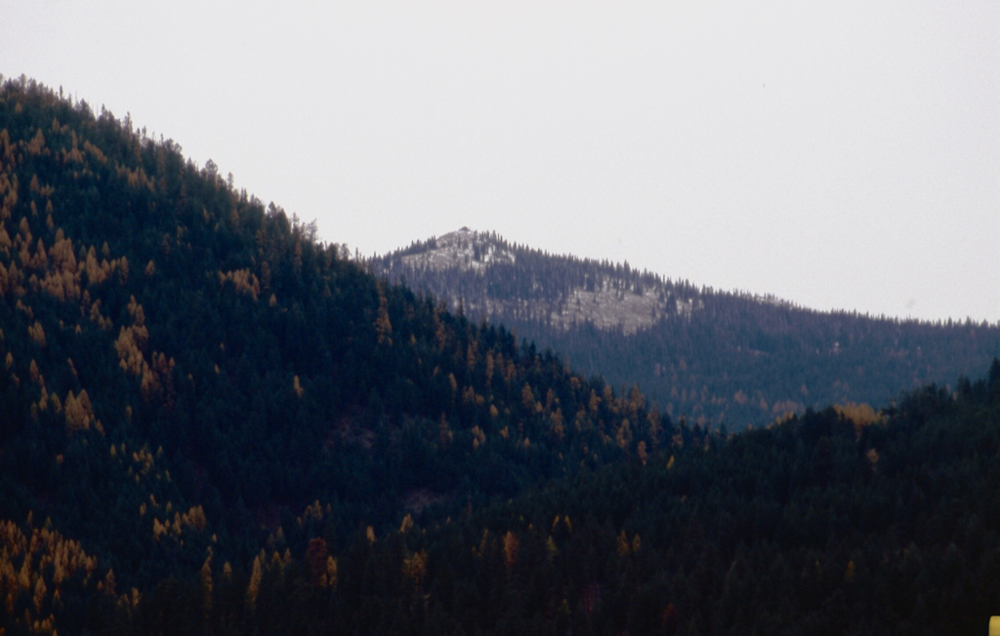
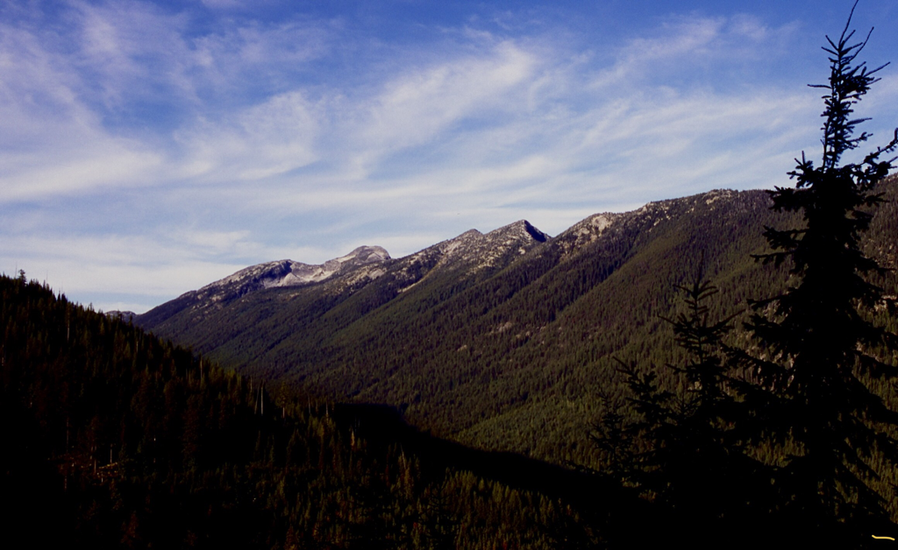

---
tags:
- Peaks & Mountains
- Moderate
- Hiking
- Backpacking
- Ridge Walking
stats:
- label: Event Type
  icon: hiking
  value: Hiking, backpacking, ridge walking
- label: Distance
  icon: map-marker-distance
  value: 5.2 miles RT with more up Cascade Ridge to the west
- label: Elevation Gain
  icon: elevation-rise
  value: 1724 verts
- label: Difficulty
  icon: speedometer
  value: Moderate
- label: Maps
  icon: map
  value: IPNF-Kaniksu N.F., Farnham, Moravia, Pyramid Peak
- label: GPS
  icon: crosshairs-gps
  value: 48° 43’ 56.1"n 116° 28’ 22.5"w
- label: Ranger District
  icon: pine-tree
  value: Bonners Ferry R.D. 208.267.5561
- label: Boundary County Sheriff
  icon: shield-account
  value: CALL 911 FIRST or 208.267.3151
notes:
- Idaho panhandle national forest/alerts
- <https://www.fs.usda.gov/alerts/ipnf/alerts-notices>
---

# Burton Peak 6844 Trail 9

## Description

We have added the areas sheriff’s emergency phone numbers for each trip write up under the ranger district
info. if an emergency ocurrs, evaluate your circumstances and call only if needed. The trail starts out in a
forest of old growth Larch, younger Lodgepole Pine and Douglas Fir. As you climb higher, the views of the
Myrtle Creek drainage is to the SW. After the switchbacks the trail leads you back to the ridge where the
trail opens up. As the trail opens up, there are views of the old lookout cabin high above. In the fall, the
grasses that grow around the trail turn yellow and frame the path to the old lookout cabin above. Once at
the cabin, walk around it and check out the different weathering of the wood on all 4 sides. If you are
looking for a good lunch spot out of the wind, continue further up the Cascade Ridge to the next summit. Off
to the right (north) and down off the summit is a bench for lunch, out of the wind.

## Options #1

From the old lookout cabin, there are two more summits further west up the Cascade Range. If the winds are
up, there is a place on the north side of the second summit on the ridge to eat. Further west is another
summit that is a good spot to view the Selkirks from the east.

## Directions

From the Kootenai National Wildlife Refuge, drive 1.3 miles to the Myrtle Creek Road #633, and turn left
(west) for 2 miles to the junction with FR #2411. Turn right for 6.3 miles to another junction . Turn left
(SW) onto FR
#2692 for 1.5
miles to the trailhead.

Along the roads up, pull over to each sharp switchback for incredible views of the Purcell Trench, the
Kootenai National Wildlife Refuge, and the Northwest Peaks Scenic Area, across the historic Purcell Trench.

## Hazards

None of note.

## Cool things close by

Kootenai National Wildlife Refuge, Myrtle Falls, Snow Creek Falls, the Myrtle Creek Preserve, and Bonners
Ferry, Idaho & the Purcell Trench.

## R & P

Jalapeños, Eichardts, Burger Express, Mr. Sub! All in Sandpoint

---

*Picture (Image missing)*

## Photo gallery

## The "auto tour road" next the the channel, from the road to burton peak

*Picture (Image missing)*

## The kootenai national wildlife refuge from the myrtle peak road

## The old lookout cabin on burton peak

---

## Weathered logs of the burton peak fire lookout cabin

## Burton peak from further up the cascade ridge a good spot to eat lunch

---

## Burton peak from the kootenai national wildlife refuge auto route

## Cascade ridge from pyramid peak trail

Live simply. Love carefully. Exist lightly. Speak well of others. Play often. chic 2012
