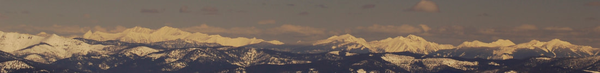
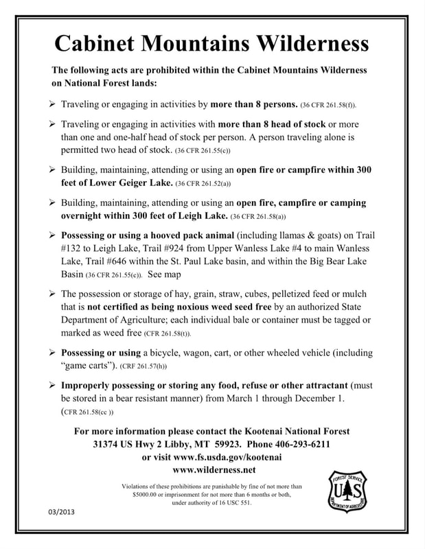
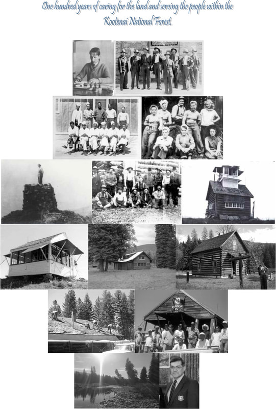
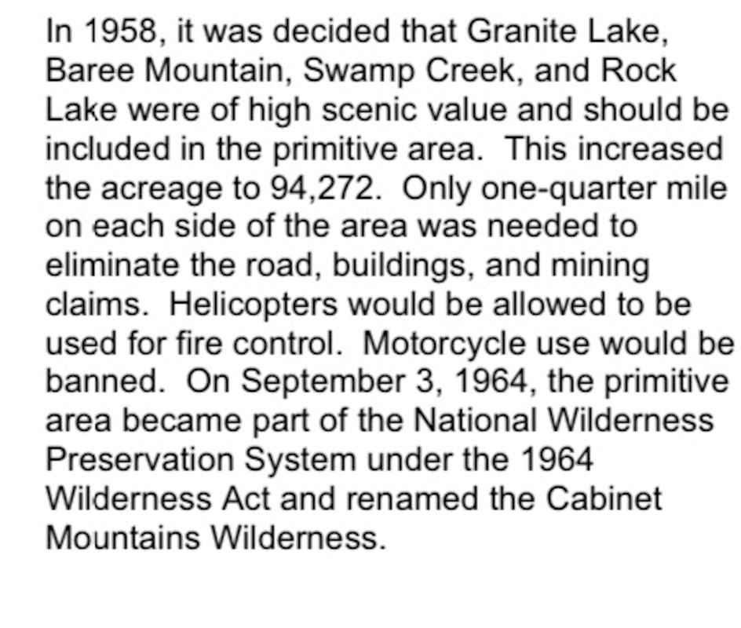

# Cabinet Mountains Wilderness

Check out this USFS website on the origin of Kootenai National Forest names

<https://www.fs.usda.gov/Internet/FSE_DOCUMENTS/stelprdb5280674.pdf>

## Cabinet mountain wilderness from kellogg peak, silver mt

The first thing you should know about the Cabinet Mountain Wilderness is that it is such a special place, that when the 1964 Wilderness Preservation Act was signed into law by President Lyndon B. Johnson, it was one of the 14 areas to be included in the act.

​Wilderness areas are our wildest public lands. As an American, they belong to you and are rare and unique. Only 3% of our country is protected as wilderness.

* Wilderness area

The Cabinet Mountains Wilderness occupies the higher reaches of the northern Cabinet Range southwest of Libby. A narrow line of snow capped peaks, glacial lakes, valleys cut by icy streams, and cascading waterfalls runs north to south for 40 serpentine, up-an-down miles. Two major north-south ridges divide the north Cabinets, sending Lake Creek north to the Kootenai River while spilling the Bull River south to the Clark Fork. A dramatic vertical mile separates lush stream bottoms from the rocky crest of centrally located Snowshoe Peak-the apex of the range at 8,738 feet. These pointed pinnacles challenge technical climbers in a primeval setting. Contiguous wildlands larger than the designated Wilderness core encircle the Wilderness on all sides. The east face runs the length of the range in a row of rugged canyons from which the Cabinets get their name.

Wildlife in this wild, wet land include wolverine, deer, elk, moose, black bear and a small but threatened grizzly population. Mountain goats in the Cabinet Mountains Wilderness here in Camp Creek and in the dramatic Goat Rocks, with bighorn sheep common near Ibex Peak. The southwest face, containing McKay and Swamp creeks, is important fall range for both mule deer and grizzlies. Mosaics of conifers and hardwoods from a 1910 burn provide forage for grizzly bears and wintering elk.

Some 90 percent of the Cabinet Wilderness visitors travel on foot, with the remainder riding horses or hiking with pack stock. The area's mostly short, steep trails combined with a lack of forage explain the low level of horseback riders in the Cabinets. Two-thirds pack into the high lakes to fish. Most of the 85 lakes in the Wilderness contain fish and, as such, are the focal points of use.

Generally, the thirty trails are well maintained. Most of the trails are less than 5 miles long, penetrating east of west and ending in subalpine basins. Most of the available campsites are close to fishable lakes. The most heavily used trails are in the northeast and southern portions. There are ample secluded locations especially on the west side.

Winter recreation in the Cabinets is on the rise. The considerable snow depths and spectacular scenery offer terrific choices for snowshoeing and ski touring. Access routes in the southern third of the Wilderness are generally more popular for winter travel and snow camping.

The Cabinet Mountains Wilderness is a 35 mile long range of glaciated peaks and valleys with two main ridges trending north and south. These two ridges are divided by two streams: Lake creek flowing north to the Kootenai River and Bull River flowing south to the Clark Fork River. Elevations range from a low of 2,880 feet to 8,738 feet atop Snowshoe Peak.
Designated a Primitive Area in 1935, the 94,272 acre area then became part of the National Wilderness Preservation Act of 1964, and is defined as, "an area where the earth and its community of life are untrammeled by man, where man himself is a visitor who does not remain…"
The Cabinets obtained their name from early French explorers who noted that the rock formations along the Clark Fork river looked like boxes or cabinets. Most of these rock formations are now under the Cabinet Gorge Reservoir but some are still visible.
Variety best describes the Cabinet Mountains Wilderness, ranging from the high, rocky peaks often snowcapped year-round, to groves of huge cedars in the canopied valleys. Hidden in the peaks and ridges are scores of deep blue lakes, feeding clear, cold streams that tumble to moose country below.
This Cabinet Mountains have had use through time. The Kootenai Indians used the area to hunt big game. The mountain goat was prized for its pelt and was a rich food source. Many plants adapted only to high altitudes were gathered for food and medicines. Beginning in the 1880’s the area was used by Euro Americans. The earliest and most extensive historic use has been mining activity. Mineralization was discovered in the southeast part of the wilderness and since has become known as the Snowshoe Fault. Mining at some scale has occurred along this fault sporadically since the early 1900’s.
Clean and pure are the simplest and most accurate ways to describe the water that comes out of the wilderness. Past studies have rated this water among the top 5% purest water in the lower 48 states. Bringing your own water or using a water purifier is still recommended.
The remnant of one alpine glacier still exists, Blackwell Glacier resides on the north slope of Snowshoe Peak. Other permanent snow fields can be found near Little Ibex lake and Elephant Peak. Patches of snow sheltered by mountainous ramparts are often found in the high country throughout the summer. [Brochur](https://www.fs.usda.gov/Internet/FSE_DOCUMENTS/stelprdb5420840.pdf)e

​The Cabinet Mountains Wilderness offers 94,272 acres of rugged, mountainous terrain in the Kootenai National Forest. More than 20 trails lead into the Wilderness Area giving access to running north/south in the center of the Kootenai National Forest. Primitive camping is allowed with no public facilities. Call the Kootenai National Forest District offices for camping and permit information.Ranges of high, craggy peaks mark the Forest with Snowshoe Peak in the Cabinet Mountains Wilderness at 8,738 feet, the highest point. Other high mountain peaks include A Peak-8634 ft, Bockman-8174 ft, Elephant-7938 ft, St. Paul-7714 ft, Treasure Mountain-7694 ft, Bald Eagle-7655 ft, and Mt. Snowy-7618 ft.

More than 20 trails leading into the Wilderness give access to dozens of high mountain lakes and streams. These trails pass through beautiful forested side slopes, huckleberry patches, and alpine meadows dotted with wildflowers.
Hikers and backpackers are encouraged to "Pack it In and Pack it Out" and practice minimal impact camping techniques, including proper food storage and waste disposal techniques. The Cabinets are home to many species of wildlife, including black and grizzly bears. Visitors are strongly advised to check in with the local Forest Service office for current trail conditions and advisories before venturing into the wilderness area. This is especially true during late summer fire season. Hikers should be familiar with the area they plan to be in, and have alternate routes in mind in case of emergencies or fires. Trail maps and guide books are available at sporting goods shops in town.

​Taking action to protect Montana’s water, wildlife and wildernessEarthworks, the [Rock Creek Alliance](http://rockcreekalliance.org/), and our other conservation partners have worked diligently to protect the Wilderness, its cold clean water and the wildlife that find refuge there. Recent accomplishments include:
In August 2019, a Montana District Court [struck down the permit to pollute](https://missoulian.com/news/local/enviro-groups-tout-big-win-in-montanore-mining-lawsuit/article_5af7a94a-8f77-54df-bf21-d8138bc54433.html) for the proposed Montanore Mine that would have allowed the mine to unnecessarily degrade important trout streams with harmful metals and other pollution.
In April 2019, a Montana District Court [denied the approval of a water use permit](https://www.dailyinterlake.com/local_news/20190416/judge_nixes_permit_for_rock_creek_mine_project) for the Rock Creek Mine that would have allowed the mine to permanently dewater pristine Wilderness rivers and streams that provide a stronghold for threatened bull trout.
In May 2017, the court overturned approval for the proposed Montanore Mine, finding that it would violate the Endangered Species Act, the Clean Water Act, the National Forest Management Act and the National Environmental Policy Act.
Despite these important victories, our defense of the Cabinets Mountains Wilderness is not over. The company has said it will continue to pursue these mining projects and continue to submit revised plans.
With your support, we will continue our efforts to protect this important ecosystem.

The kootenai national forest and wilderness
A significant portion of the Cabinet Mountain range lies within the jurisdiction of the Kootenai National Forest. The percentage of lands that is unroaded in the Kootenai National Forest is approximately 34%. By comparison, 80% of the lands in the Bitterroot National Forest are roadless, and in the Gallatin National Forest that amount is 86%. The Kootenai also has the smallest percentage of wilderness of any national forest in Montana with only 4% of the 2.2 million acres currently protected. By comparison, the Bitterroot National Forest is approximately 47% wilderness. There are 43 Inventoried Roadless Areas (IRAs) in the Kootenai, totaling almost 640,000 acres. Noteworthy are the East Face and West Face, and Galena IRAs. These wildlands are adjacent to the Cabinet Mountains Wilderness and would be critical additions to a wilderness that has been besieged by multiple mining proposals throughout its 45-year history.

​The cabinet mountains wildernessThe Cabinet Mountains Wilderness is located in the Kootenai National Forest, approximately 15 miles southwest of Libby, Montana in the northwestern corner of the state. This area contains some of the most beautiful sub-alpine scenery in western Montana. Elevations range from 3,000 feet to 8,738 feet atop Snowshoe Peak. Variety best describes the Cabinet Mountains Wilderness with its high, rocky peaks often snowcapped year-round crowning canopied valleys that harbor groves of huge cedars thriving in a temperate rainforest climate. Hidden in the peaks and ridges are scores of deep blue lakes, feeding clear, cold streams that tumble to moose country below.
When the Wilderness Act of 1964 was passed, the Cabinet Mountains Wilderness was one of the nations first ten wilderness areas to receive protection. Today, the Cabinet Mountains Wilderness remains the sole wilderness area in the Cabinet Mountains Range and in the 2.2 million-acre Kootenai National Forest. Unfortunately, this wilderness has been continuously plagued by the threat of hardrock mining. Two massive mining projects have been proposed that would operate beneath and adjacent to this wilderness. The Rock Creek and Montanore mines would include numerous surface intrusions and impacts, with support facilities rimming the border. Expanding the Cabinet Mountains Wilderness is absolutely essential. This wilderness is only 94,360 acres and needs to be enlarged to offset the ongoing mineral threats near its borders. Annexation of the East Face, West Face, and Galena Inventoried Roadless Areas also would add habitat for the dwindling populations of grizzly bear, lynx, wolverine, mountain goat, and other species that are threatened by industrialization and motorized recreation.

​Kootenai History and HeritageFor centuries, the Ktunaxa (Kootenai) tribe lived in the KNF and used the area to [hunt, fish, gather plans, and hold ceremonies](https://wildmontana.org/discover-the-wild/public-lands-101/national-parks). Approximately 5,000 members of the Confederated Salish and Kootenai tribes now live on or near the Flathead Reservation, which covers much of the southern end of the Flathead Valley.
Communities like Libby, Troy, Noxon, and Trout Creek have long relied on the timber and mining industries operating on surrounding public lands. Traditionally, the Kootenai was known as the timber basket of Montana. These days, however, timber production is down significantly. Now, both the land and the communities are in need of new solutions.
Montanans know that by working together, we can manage our forests, provide jobs for rural communities, and conserve and restore key wildlife habitat and blue ribbon headwaters. Over ten years ago, that’s exactly what the [Kootenai Forest Stakeholders Coalition](http://www.kootenaifuture.org/) set out to do. Business owners, local elected officials, and community members began working to find common ground forest management solutions that enrich the economies and quality of life of local communities that will provide jobs in the front country while protecting the solitude of the backcountry.
In late 2015, the Kootenai Forest Stakeholders struck a historic agreement that establishes guidelines for timber management, creates areas for motorized and non-motorized recreation, and proposes to designate 180,000 acres of additional new wilderness. The agreement prioritizes protection for wild roadless lands in the Yaak, Cabinet Mountains, and Scotchman Peaks. [See how this agreement would protect these special places in the Kootenai](http://www.kootenaifuture.org/wp-content/uploads/2016/08/MWA_Overview_small-Final_9_17.pdf).
More importantly, this agreement means that the communities of Lincoln and Sanders Counties are moving beyond past conflicts and working together to protect watersheds, secure big game habitat, and maintain a sense of solitude – and mystery – that makes the Kootenai so special.
MWA is doing what we do best – working every day with Montanans from all walks of life on a realistic, practical strategy for communities like Libby and Troy, while forever protecting pristine backcountry. It's time to put the past behind us and work together for a better future for the Kootenai National Forest. MWA, along with diverse citizens of the Kootenai, are doing just that.

The northeast buttress of A Peak (8,634'): the location of two routes established by Scott Coldiron and company between February 22 and March 7, 2015: Blackwell Falls (WI5 M4, 900') and Unprotected Four-Play (AI4+ M6 R, 2,000'). "Unprotected Four-Play is the leftmost couloir in the pic; Blackwell Falls buttress is in the foreground, with the route not shown," says Coldiron. [Photo] Scott ColdironOn February 22 Scott Coldiron and Christian Thompson from Spokane, Washington, and Sandpoint, Idaho, respectively, established, "to my knowledge, the biggest steep pure-ice route in this little region," says Coldiron of their line in northwestern Montana's Cabinet Mountains, calling it Blackwell Falls (WI5 M4, ca. 900'). Their route ascends two-thirds of a 1400-foot buttress beneath Blackwell Glacier adjacent to A Peak's (8,634') northeast face. After 300 feet of easy terrain, Blackwell Falls angles up for continuously steep WI5 and M4 climbing that Coldiron describes as "just plain fun." Though many lines in the area were out of condition due to recent atypically warm temperatures, the north-facing route was still fat and in great shape, according to Coldiron. Except for the final pitch, the route protected almost exclusively with ice screws. The climbers used V-threads, cams and nuts predominantly for belays, and placed no pitons.
ACCESS…Trails preserve the fragile country and provide visitors the best access. There are 94 miles of trails most are marked at major intersections, some form loops, and many offer panoramic views. Others end at lakes in beautiful alpine settings. You may pick your own route to a nearby peak or high basin, but beware of unstable rock formations that make technical climbing unsafe in most areas. Limits have been placed on the number of persons and stock when traveling in parties. Included is a list of all [prohibited acts](https://www.fs.usda.gov/Internet/FSE_DOCUMENTS/stelprdb5413129.pdf). You can learn more about wilderness by visiting [Wilderness.net](http://www.wilderness.net/)
Drones or UAS are considered "motorized equipment" and "mechanical transport" as such they cannot take off from, land in, or be operated from congressionally designated Wilderness Areas, please see <https://www.fs.usda.gov/managing-land/fire/aviation/uas/responsible-use>
ON THE TRAIL…Trail difficulty varies from easy stream bottoms, to the ups and downs of major ridges and steep switchbacks.
The north end offers interconnected trails for convenient loop hikes. The central area is entirely one way, in and out the same way. The heart of the wilderness is simply to rugged to put trails through, though many avid hikers will bushwhack over the Cabinet Divide. The south end offers some loop hikes. The primary access into the wilderness is from the Libby area.
Use of the trail registers provides information on the amount of visitors and the areas that they are using, which is helpful in managing the wilderness.
Snowstorms may occur as late as July and as early as September, so be prepared for the unexpected with extra food and clothing. Some areas provide opportunities for back-country skiing, but avalanche danger occurs in winter and spring, and you must exercise extreme care.
WILDLIFE…The list of resident animals is extensive and their homes varied – from the high rocks of the mountain goat, mountain sheep, pika to the canyon bottoms of the beaver, wood rat, and beautiful Western Tanager, other animals include wolverines, deer, elk, moose, wolf, mountain lions, grizzlies and black bears.
Use proper food storage techniques, keep a clean, odorless camp, and avoid close confrontations.
Cutthroat, rainbow, and brook trout have been introduced and are now found in many lakes, streams, and beaver ponds.
STOCK USE…To avoid tying to trees, use temporary stakes or rope hitch racks and keep stock away from lakes, streams and campsites. Natural forage is scarce and hay may contain weed seed, so use only certified weed-seed free feeds. Remember, leave as little evidence of your visit as possible.
CAMPING…Make camps away from lakeshores or from areas where others may also be seeking solitude. Use any existing fire rings and use only dead wood that can be gathered on the ground and broken by hand. Keep fires small and remember to always use extreme caution with fire. Campfires can cause lasting impacts to the environment. A better choice would be a light-weight stove and a lantern.
WILDERNESS SCENES…Wilderness scenes vary from ridge top panoramas, reflective lakes, wildlife, colorful plants and rushing water. They can be recorded with a camera or brush. Binoculars will enhance landscapes or wildlife that is not approachable. Pack your field guides to help you identify the species!
FOOD & WASTE…This area as well as the entire forest is under a food storage and sanitation order. This means that all human, pet and livestock food and refuse must be stored in a bear resistant manner. Camping or sleeping areas shall be established at least 1/2 mile from a known carcass. All carcasses will be stored no less than 1/2 mile from a camping area or within 200 yards of a National Forest System Trail. Burnable attractants (such as food leftovers, or bacon grease) shall not be buried, discarded, or burned in an open fire.
Human waste decomposes rather quickly in the top 6-8 inches of soil, and a small garden trowel can be used to dig an 8-10 inch diameter hole. Construct these latrines at least 200 feet from camp and water sources, and use only unscented toilet paper. Replace the sod when done.
Practice the [Leave No Trace](http://lnt.org/learn/7-principles) Techniques to leave the wilderness as it is today for future generations of tomorrow.
Have a safe and memorable visit!
​

*Picture (Image missing)*

For a complete history of the kootenai national forest, click the below link<https://www.fs.usda.gov/Internet/FSE_DOCUMENTS/stelprdb5280687.pdf>

Wilderness is a land of no abuse. One that is left as is. Fore if wilderness is abused,  it shall never be as it's been from the beginning of time. Only Nature's acts, should bring change. Man can visit. But only footprints should remain. This will ensure that in a hundred lifetimes, our ancestors will see beauty preserved for all. There is no greater gift to give or receive.                               ​chic.   12.4.11
