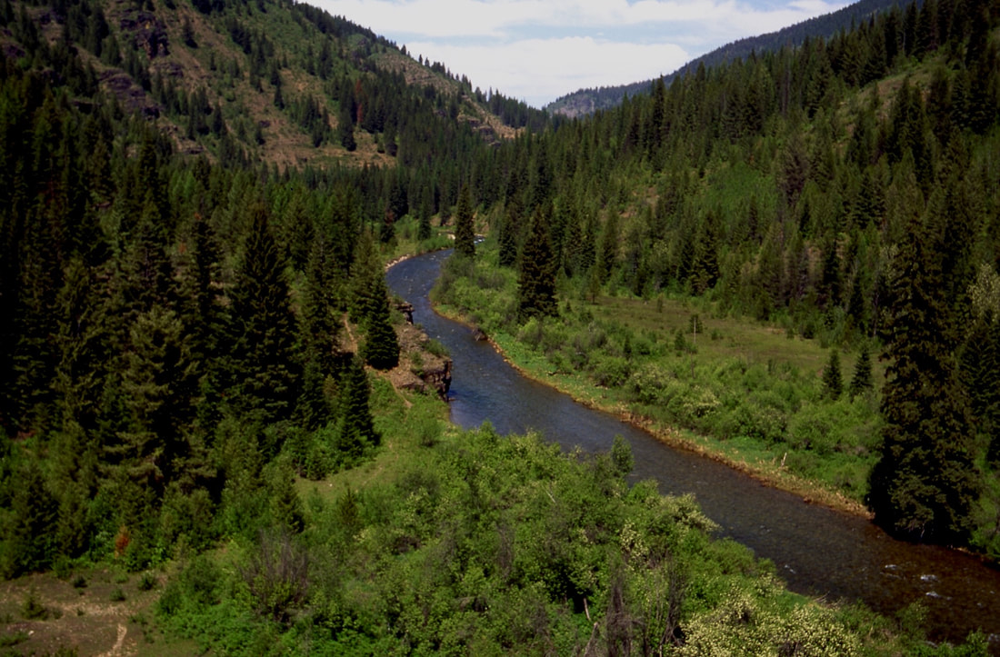
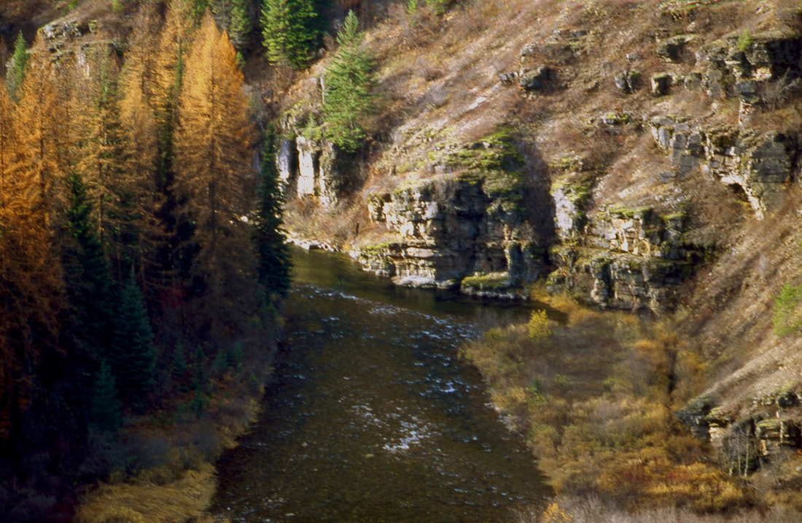

---
tags:

- Paddling & Rivers

- Day Hike

- Backpacking

- Fishing

stats:

- label: Event Type
  icon: kayaking
  value: Day Hike, backpacking, fishing

- label: Distance
  icon: map-marker-distance
  value: 30.6 miles RT

- label: Elevation
  icon: terrain
  value: Although there is 2,000 verts, it’s within 527 actual verts. See chart below

- label: Difficulty
  icon: speedometer
  value: Moderate with lots of miles

- label: Maps
  icon: map
  value: IPNF, LOLO N.F., Cathedral Peak, Jordan Creek

- label: GPS
  icon: crosshairs-gps
  value: 47°52’58" n 116°07’52" w

- label: Ranger District
  icon: pine-tree
  value: Plains/Thompson Falls 406.826.3821

- label: CdA River Ranger District
  icon: pine-tree
  value: 208.446.1300

- label: Kootenai County Sheriff
  icon: shield-account
  value: CALL 911 FIRST or 208.556.1114
notes:

- Idaho panhandle national forest/alerts

- <https://www.fs.usda.gov/alerts/ipnf/alerts-notices>
---

# Cda River Tr 20

*COEUR d’ALENE RIVER TRAIL #20*

## Description

Altho its only has an elevation gain of 527’ from the trailhead at F.R. 208 near Spion Kop Rock to the north trailhead at Martin Creek, the below graph shows that all those lines on the graph make it about 2000’ of gain. This trail is one of the most spectacular in the CDA River corridor.
It does have a lot of use, but most people don’t do the 15 mile long trail.
Its an unusual trail that offers great catch and release fishing.

## Directions

From Coeur d'Alene, Idaho drive east on I-90 taking the Kingston Exit #43. After exiting, travel north on Forest Highway 9 (FH9) 23 miles to Forest Road #208 (FR208). Continue on FR208 for 25 miles to the lower trailhead.

From Wallace , drive north for 16.3 miles over Dobson Pass on FR 456 to the junction with FH#9.

Travel east 1.8 miles on FH #9 to FR #208.

Follow FR 208 north for 1.6 miles to Shoshone Creek FR 412.
Travel north on FR 412 for 22 miles to the upper trailhead

## Hazards

A lot of ups and downs on a National Recreation Trail.

## Cool things close by

Spion Kop Rock & Mountain, Cathedral Peak, Magee Historical Site, Independence Creek National Recreation Trail, and Little Guard Lookout rental.
Shadow, Fern and Centennial Falls, Little Guard Lookout Rental

## R & P

Pizza Factory, 1313 Club, Brooks Hotel & Restaurant, City Limits Brew Pub, Fainting Goat, Smoke House BBQ & Saloon, Wallace Brewing Co., Radio Brewing, the Snake Pit, and Moon Time.

## Photo gallery

*Picture (Image missing)*

## Near the west trailhead

---

*Picture (Image missing)*

## Up steam from the west trailhead

## FROM A HIGH POINT ALONG THE COEUR d’ALENE RIVER
