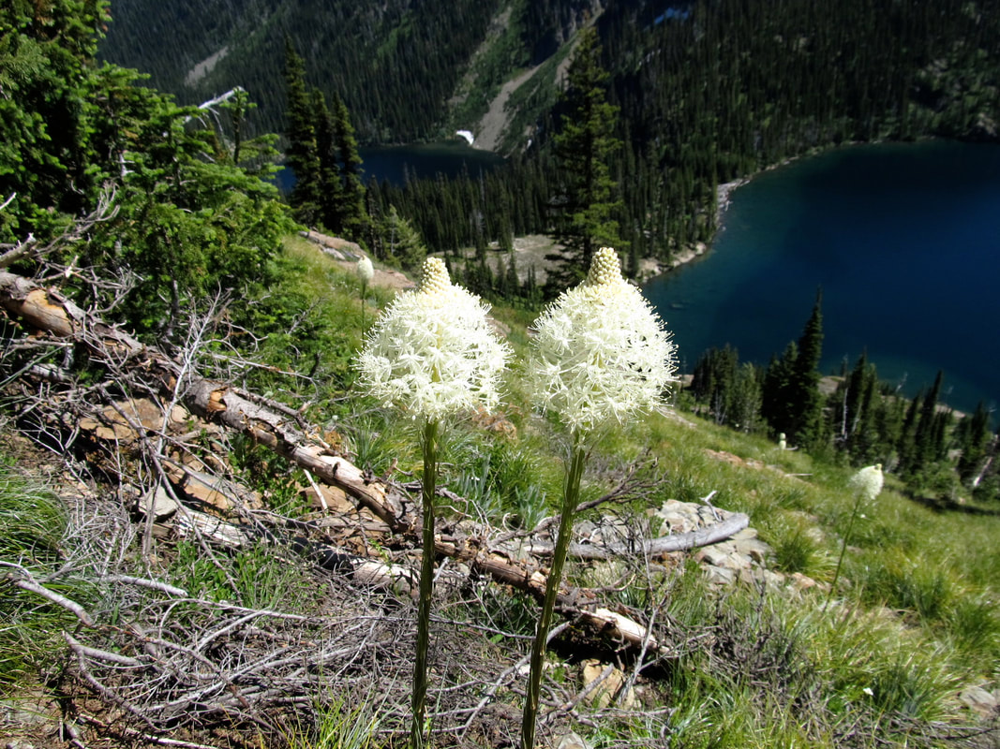
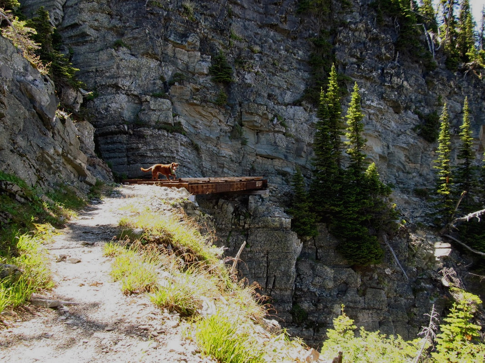
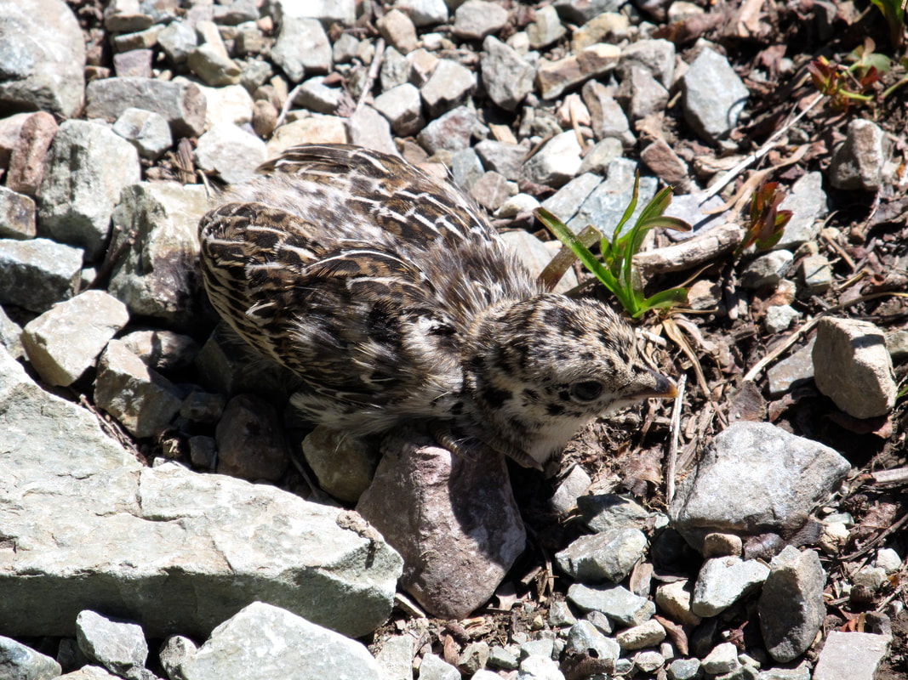

---
tags:
- Lakes
- Difficult
- Hiking
- Backpacking
- Fishing
- Camping
- Swimming
stats:
- label: Event Type
  icon: hiking
  value: Hiking, backpacking, fishing, camping and swimming
- label: Distance
  icon: map-marker-distance
  value: 12 miles RT
- label: Elevation Gain
  icon: elevation-rise
  value: 3108’ to upper lake
- label: Acres
  icon: vector-square
  value: (lower) 65…..(upper) 19.4
- label: Difficulty
  icon: speedometer
  value: Difficult
- label: Maps
  icon: map
  value: Kootenai National Forest, Scenery Mt., Treasure Mountain
- label: GPS
  icon: crosshairs-gps
  value: Upper 48°22’25"N 115°44’58"W. Lower 48°22’45"N 115°44’27"W
- label: Ranger District
  icon: pine-tree
  value: Libby R.D. 406.293.7773
- label: Lincoln County Sheriff
  icon: shield-account
  value: 911 or 406.293.4112
notes:
- Kootenai national forest/alerts
- <https://www.fs.usda.gov/alerts/kootenai/alerts-notices>
---

# Cedar Lake 5914

## lower 5520’ & upper cedar 5888’ lakes & dome mountain 7552’

## Description

We have added the areas sheriff’s emergency phone numbers for each trip write up under the ranger district
info. if an emergency ocurrs, evaluate your circumstances and call only if needed. The Cedar Lakes trail
starts from the north end of the wilderness off Highway 2, just west of Libby. Most of the trail skirts
Cedar Creek to the lower lake. When the creek is close, wonder over and look at the creek bed. In places the
bed rock is jet black with bright red rock inlay. Many small cascades offer great photo ops. The lower lake
(5520') is smaller than the upper lake 5888'), but offers just as many spectacular views. The upper lake is
about 400' above, and is flanked by the enormous Dome Mountain 7552'. This mountain's face rivals Leigh
Lake's Snowshoe face in size and immensity.

## Option #1

Dome Mountain towers above the upper lake at 1672', but is not visible from the lower lake. From Dome
Mountain hike SSW above Parmenter Lake and Minor Lake to Sugarloaf Mountain. From Sugarloaf, hike north on
Trail #317 to the junction with Trail # 140. In about 2 miles Trail #140 will come back to Lower Cedar Lake
and down to the cars.

## Option #2

Scenery Mountain Loop From the lower lake hike Trail #383 for 2.5 miles to Wm Grambauer Mountain 6793'. From
here head east on Ridge Trail # 319 for 2 miles to Scenery Mountain 6875' and it's fire lookout tower.

From Scenery Mt., hike east on Trail #649 down 3.3 miles to a junction with Trail #141. Turn left (east) to
the Cedar Lakes trailhead.

## Directions

From Libby, head west on Highway 2 for about 3 miles and turn left (south) up Road # 402. Look for milepost

## 27.7

---

## Hazards

The trail is steep with 3108 feet of gain. There was a fire in the area, so shade is a premium along this
trail. Because the area is so scenic, start early to enjoy all there is to see. There are huckleberries for
miles up the trail all the way to the camp. I found the first bear while brushing my teeth and headed to
bed. The second one was in the hucks next to the trail on the way back out. You really should consider
gaining the ridge above the lake but be extremely careful crossing the manway. If you slip or trip and fall,
it would be game over.

## Cool things close by

Kootenai River & Falls, Ross Creek Cedars, Dome & Sugarloaf loop backpack, and Libby, Montana

## R & P

Kaiju Bar & Grill. Henry’s in Libby near Roseaurs, Clark Fork Pantry & Squeeze In in Clark Fork. Eicharts,
Mr Sub & Jalapeños in Sandpoint In Libby, try the Shed south of town on Hwy 2

### Picture (Image missing)

## Photo gallery

---

### Picture (Image missing) Details

## Upper cedar lake

---

## Bear grass above the lakes

---

## Named the manway because a boy could not walk across it

---

### Picture (Image missing) Details (2)

## It is close to a thousand feet down with no guard rail

---

## If i hold really still you cannot see me

---

### Picture (Image missing) Details (3)

## From the top looking down the valley to the upper and lower lakes
