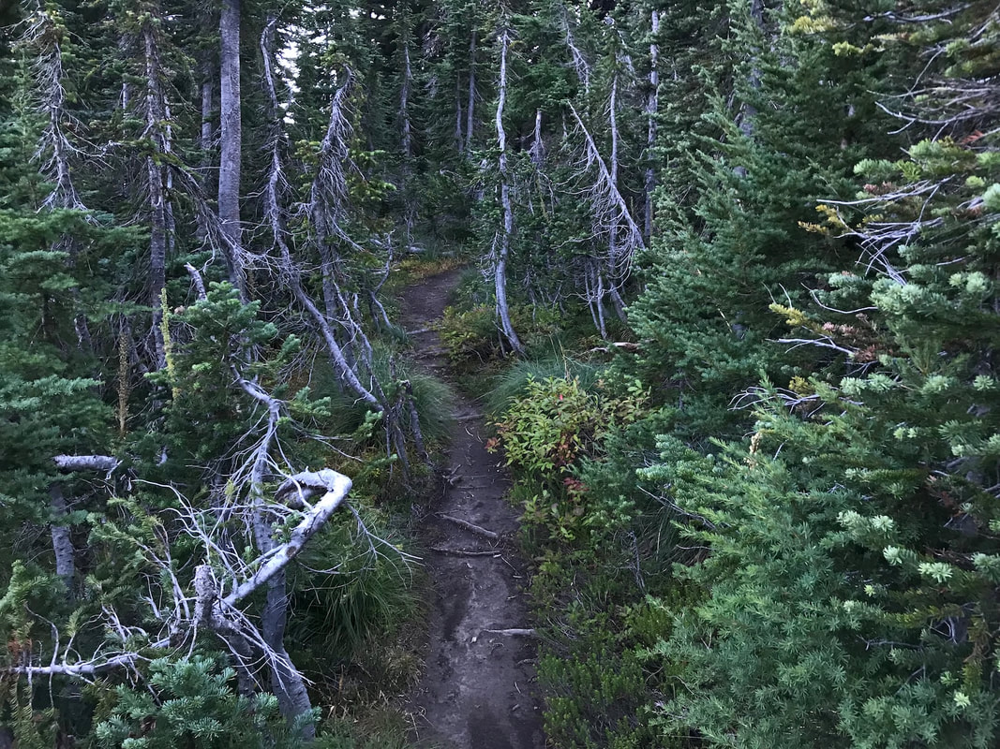
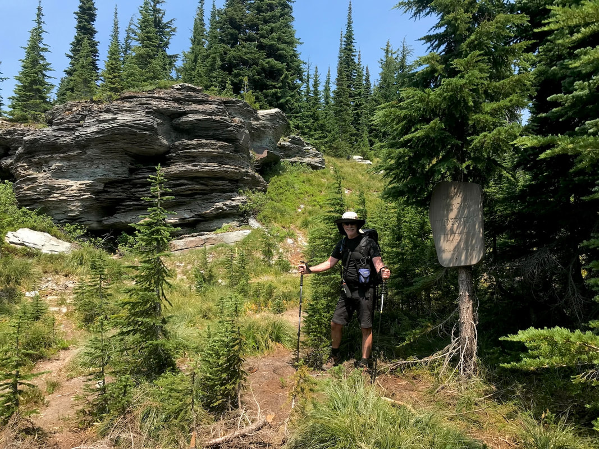
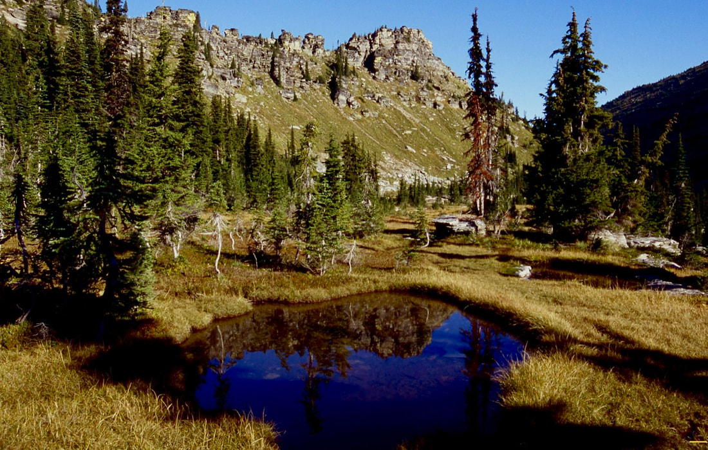
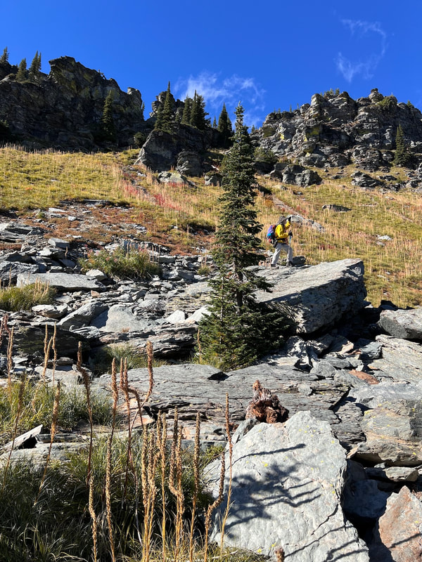
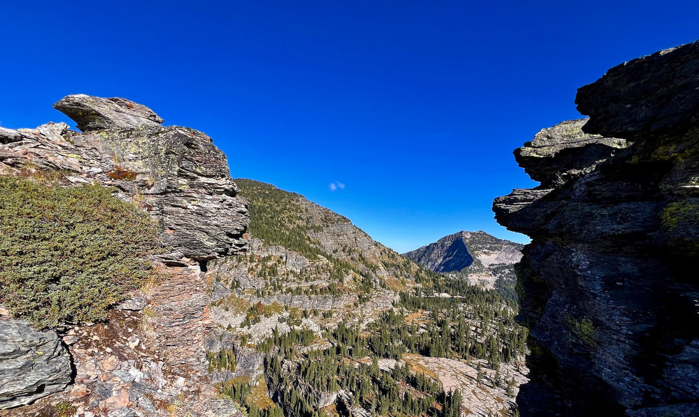
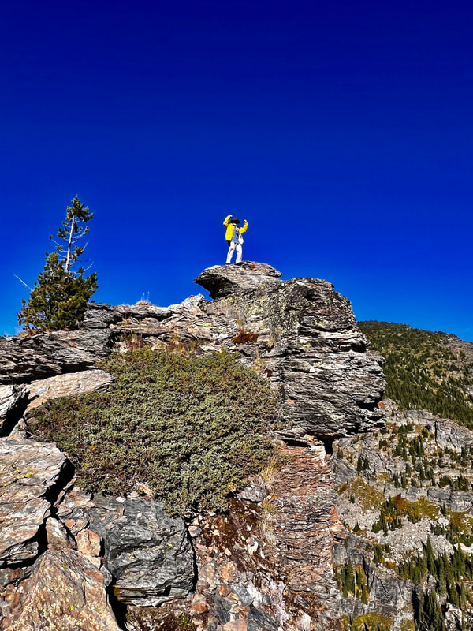
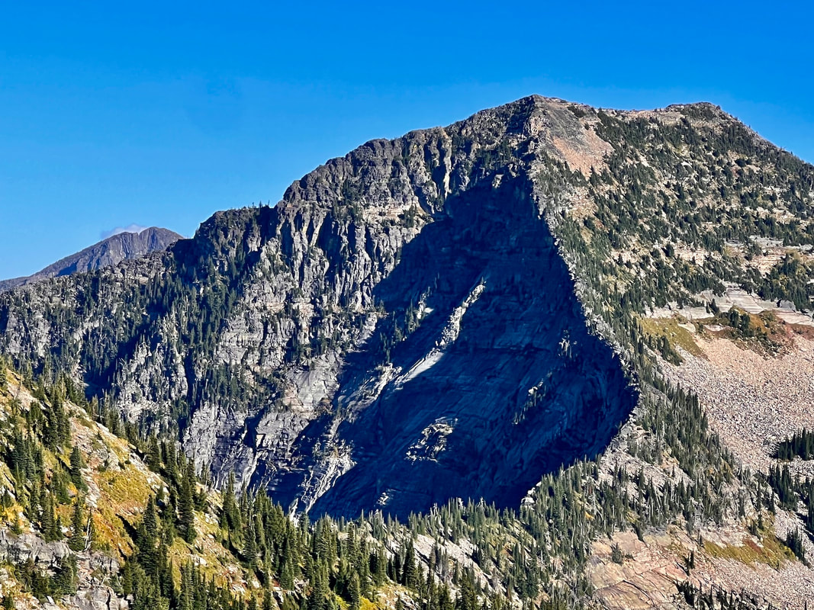
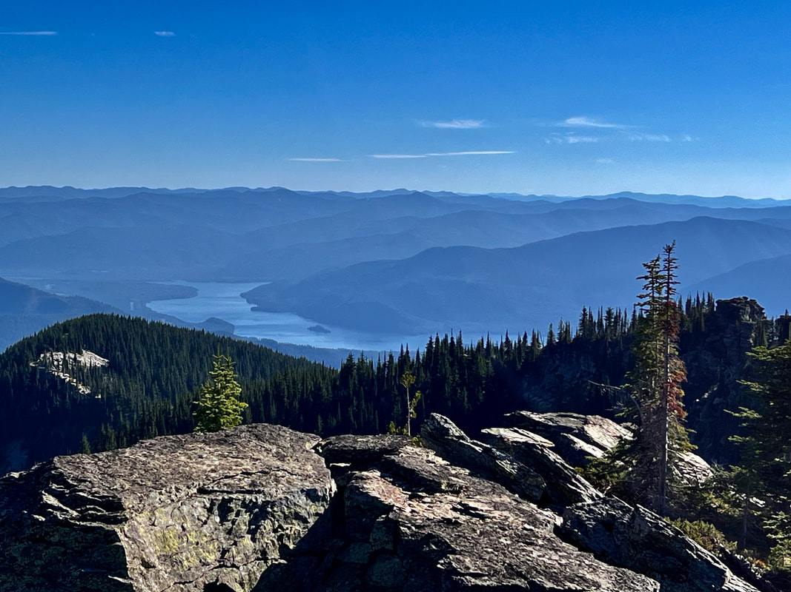

---
tags:
- Peaks & Mountains
- Day Hike
- Backpacking
- Climbing
- Scrambling
- Wildlife Viewing
- Photography
stats:
- label: Event Type
  icon: hiking
  value: Day hike, backpacking, climbing, scrambling, wildlife viewing, and photography
- label: Distance
  icon: map-marker-distance
  value: about .5 of a mile
- label: Elevation
  icon: terrain
  value: Almost 650verts
- label: Difficulty
  icon: speedometer
  value: Easy to get to, moderate to scale
- label: Maps
  icon: map
  value: Kootenai National Forest, Elephant Peak topo
- label: GPS
  icon: crosshairs-gps
  value: 48° 04’ 26' n" 115° ?41’12" w
- label: Ranger District
  icon: pine-tree
  value: cabinet r.d. 406.827.3533
- label: Sanders County Sheriff
  icon: shield-account
  value: call 911 first or 406.827.3584
notes:
- Kootenai national forest/alerts
- <https://www.fs.usda.gov/alerts/kootenai/alerts-notices>
---

# Chicago Peak

!!! warning "Before you go"

A warning about the road to the cliff lake, St paul peak and rock peak road. After visiting the area
wednesday 8.4.22, I want to tell you about the road. From f.r. 150, f.r. 2741 up to the trailhead, Is
extremely rough' and cars wont make it to the trailhead. The walk up the road to the trailhead Is about 2.4
miles. and will save your vehicles from damage. Please use caution

*Chicago peak 7018'*

## Description

Chicago Peak is located on an easy trail to Cliff Lake, and is only .5 miles from the trailhead. As you come
to the area next to Chicago Peak, walk to your right to the cliffs beneath and above the overlook. In the
near distance is Cliff Lake, and above the lake is St. Paul Peak 7714'. Off to the ESE is Rock Peak 7583'
Continue along the bench that skirts Chicago Peak to its north end. The north end of the peak is higher than
most of the rest of the peak. Look for a gully to the right side of peak, that is your ascent route. A WORD
OF WARNING.....it's pretty easy to climb using the abundant Bear Grass and many Sub-Alpine trees. But the
descent is more difficult and can be dangerous. i descended the slope, facing uphill, so i could use the
bear grass as hand holds. Once on the upper ridge, walk north around the rocks to the summit rock. The views
all around are more than worth the effort to get there. Please use extreme caution going up and especially
coming down.

## Option #1

Cliff lake After you have visited Chicago Peak, take a walk east to Cliff Lake. There are several campsites
around the lake, and if you don't see a lot of Mountain Goats, you made too much noise.

## Option #2

St. paul peak 7714' From the NE corner of the lake, walk upward around the NE flank, and pick your route to
the top of St. Paul Peak 7714'. The views here are outstanding to say the least. To the north, the massive
of Snowshoe Peak 8738' and A Peak 8634' fill your view. To the south is Rock Peak 7583', Ojibway Peak 7303',
and off to the ENE is Elephant Peak 7938' . use caution descending st. paul peak

## Option #3

Rock peak 7583' This route is not for beginners. its very steep and good route finding skills are a must.
From Cliff Lake, walk around the end of the lake, and notice the low elevation "Ridgeline" that drops down
and over to the base of Rock Peak. This serious scramble heads SE and ascends steeply towards the north
summit. Up near the top of the ascent, look for a route that you are comfortable with. You may want to head
SE and skirt the loose scree. Once on top, the views all around are amazing. Rock Lake is 2629verts below
you, and looks like a narrow pond between two very steep peaks.

Use caution descending rock peak.

---

## Directions

From Sandpoint, drive east on SH #200 towards Clark Fork and into Montana. Pass SH #56 road and two miles
past Noxon, Montana, near milepost 17, turn left (east) onto the Rock Creek Road # 150. After about 400 feet
take the

right fork for

about 8 miles to the Chicago Peak Road #2741.

You will pass the Engle Peak turnoff, the Rock Lake turnoff, then come to FR #2741. Turn right for about 7.1
miles.

but be aware… this road is not maintained for cars or low clearance vehicles, and is very rough. An Outback
could make it, but you will wish you hadn’t. At this turn, you may not be able to get any higher due to
rocky and rough road beds. You can park here and hike the 7.1 miles, to the trailhead. My suggestion is…
ONLY DRIVE FR #2741 AT YOUR OWN RISK.

The creators of this website can not be held responsible for any damage to your vehicle. you have been
warned.

---

## Cool things close by

Engle Peak, Rock Lake, Star Peak, Pillick Ridge, and Wanless Lake

## Hazards

The road to the trailhead, after the FR#2741, eats cars. The towing fee could easily reach 1000$.

None to Cliff Lake. Sure footedness and lots of experience should be used going up and down, to reach St
Paul Peak. Summiting Rock Peak, take strength, endurance, experience. Do not attempt, unless you are well
experienced in near vertical rock hopping.

## R & P

Kaiju Bar & Grill 419 W 9th, Henry’s & Pizza Hut, in Libby, Clark Fork Pantry, Eicharts, Mr Sub & Jalapeños
in Sandpoint

---

*Picture (Image missing)*

## Photo gallery

---

*Picture (Image missing)*

One of the joys of visiting the cliff lake area, Is the views from along forest road #2741 To the west is
the

proposed

scotchman peak wilderness

This is the trail to the bench that chicago peak is next to. These trees are very special. they are a form
of sub-alpine firs, that are called krummholz. A krummholz knee high, can be over 100 years old. These
krummholz are well over 6' tall and can are ancient. refer to <https://www.treespnw.com/>

## Chris posing next to the cabinet mountain wilderness boundary sign

## As you walk out over the bench, walk to your right for exceptional views

*Picture (Image missing)*

## This image shows the bench that chicago peak sits on. cliff lake is below

## Our ascent route is directly above me  image by chris

*Picture (Image missing)*

## This image shows the steepness of the ascent. st. paul peak is on the right

The rock above left is the high point of chicago peak Rock peak is off in the distance image by chris

## Chic on the summit of chicago peak image by chris

*Picture (Image missing)*

## Copper lake sits below chicago peak image by chris

## This image shows the low ridge line from st. paul lake to rock peak image by chris

## The clark fork river from the summit of chicago peak image by chris

*Picture (Image missing)*

From the summit of chicago peak, look north to see the high point of the cabinet mountain wilderness From
left

is ibex

peak, on the right snowshoe peak (tallest) and a peak to its left image by chris

*Picture (Image missing)*

From the summit of these peaks, the proposed scotchman peaks wilderness stretches out to the west

*Picture (Image missing)*

## This is the ascent route to st. paul peak

*Picture (Image missing)*

## This is the view of the snowshoe area to the north, is from the summit of st. paul peak

*Picture (Image missing)*

Chris captured this image of rock lake from the north summit of rock peak Rock lake is in the genter of this

image.

directly above rock lake is ojibway 7303'

---

---

Our view is influenced by our perspective. Our perspective is dictated by our outlook. Our outlook

is enhanced by our view. chic. 8.14.2014

---

---

---

---
