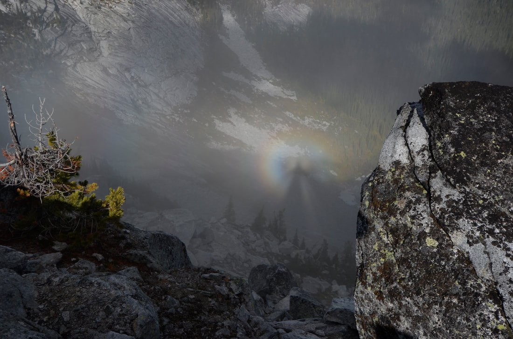
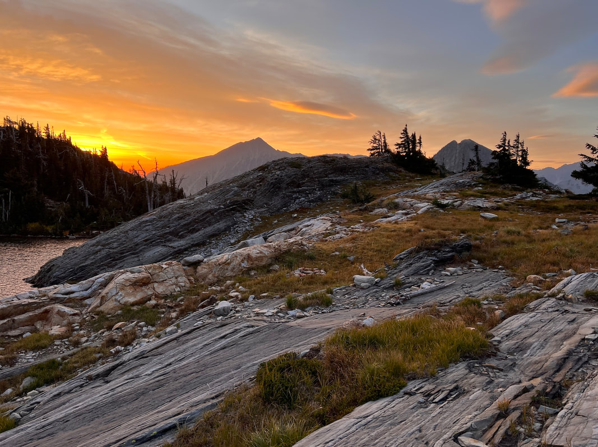

# Chris Herath

---

## Chris herath

Chris is a semi retired architect who lives in otis orchard, with his wife shea and daughters tia and sarah.
I first met chris in 1980 and have been skiing and hiking together ever since.
Chris led our 2005 trip to patagonia. see...
<https://www.inlandnwroutes.com/patagonia.html>

---

## Click on the image to enlarge

## This is a "broken spectre"  a shadow cast on an underlying cloud

*Picture (Image missing)*

## WESTERN TRILLIUM (Trillium ovatum)    AKA-WAKING ROBIN

*Picture (Image missing)*

## Lions head from the west climbers trail

*Picture (Image missing)*

## Horseshoe pond  popposed scotchman peaks wilderness, mt (pspw)

*Picture (Image missing)*

## The outhouse at star peak proposed scotchman peaks wilderness, mt

*Picture (Image missing)*

## A view along the route to billiard table mountain  (pspw)

## 1 of 3 libby lakes at sunset cabinet mountain wilderness, mt

*Picture (Image missing)*

## Rock lake and rock peak up near libby lakes  cmw

*Picture (Image missing)*

A rare image of the blackwell glacier next to snowshoe peak 8738' This is the closest glacier to spokane
