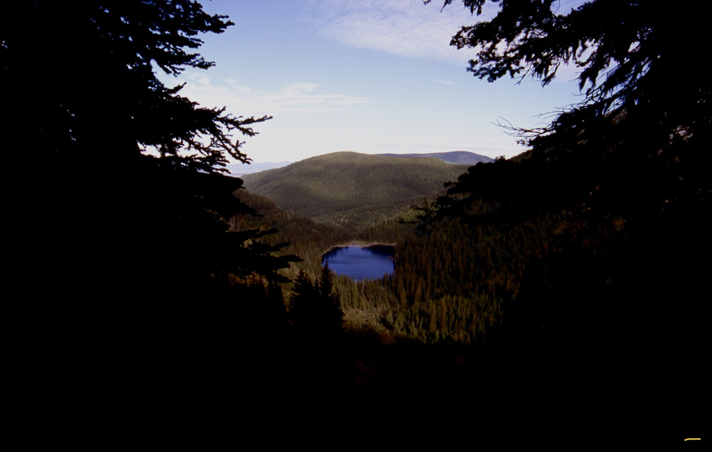
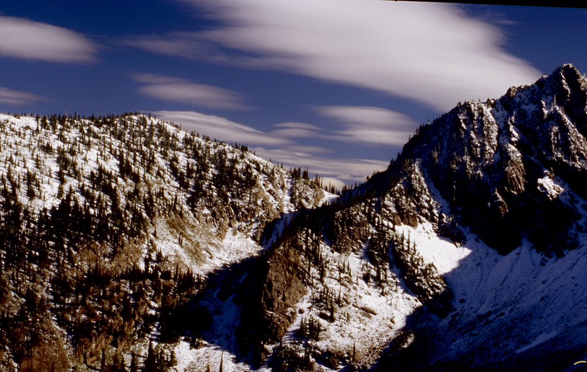
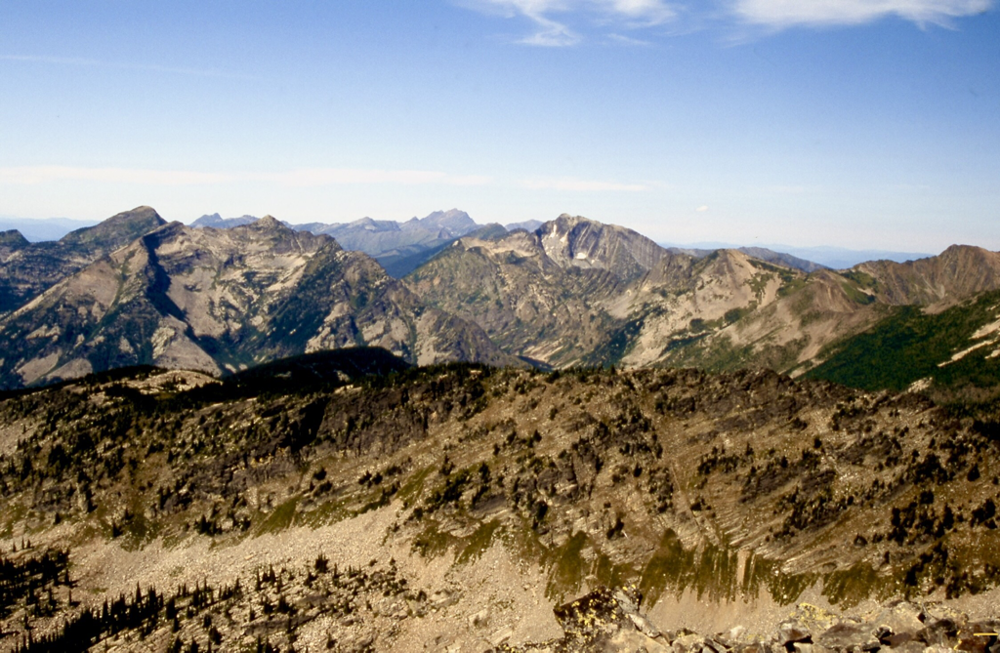
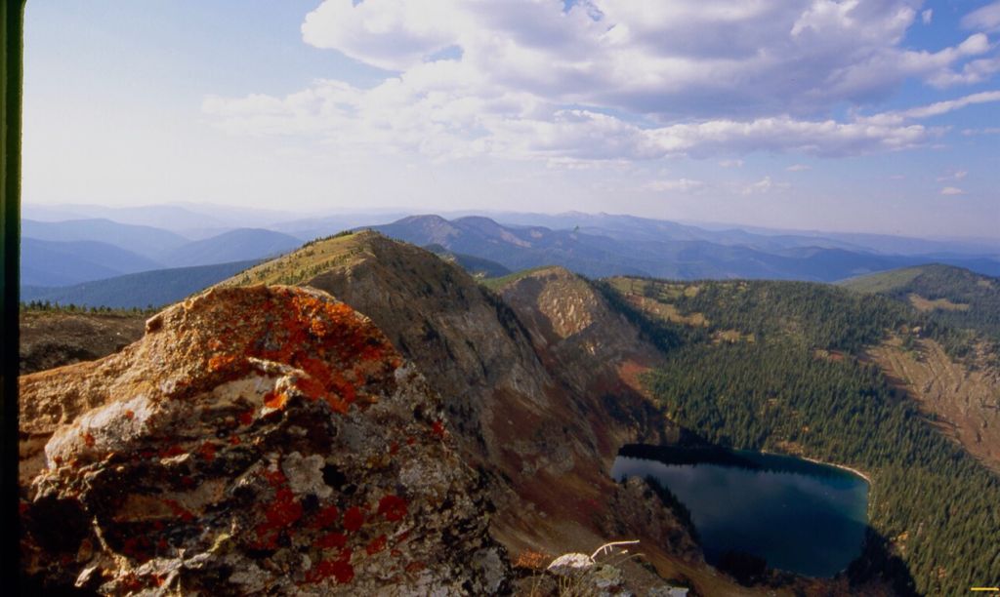
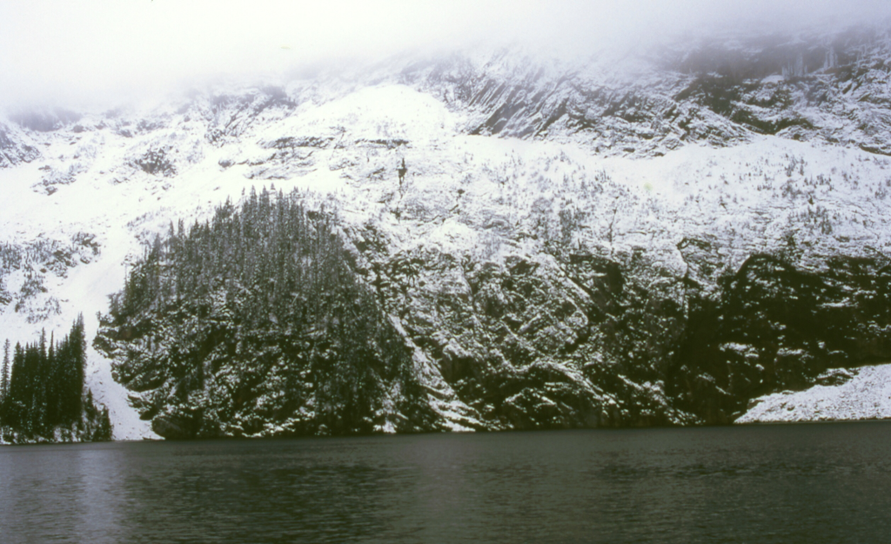
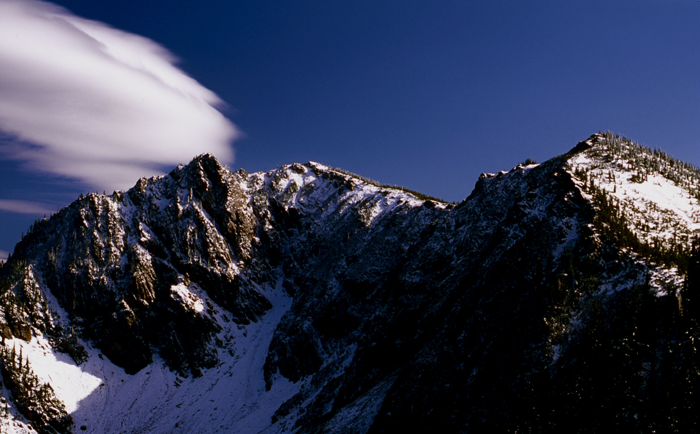
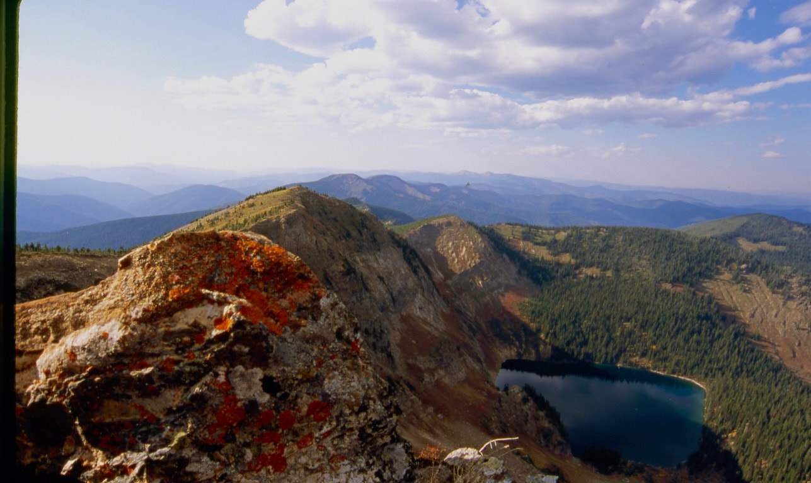

---
tags:
- Lakes
- Day Hiking
- Backpacking
- Scrambling
- Camping
stats:
- label: Event Type
  icon: hiking
  value: Day hiking, backpacking, scrambling, camping
- label: Distance
  icon: map-marker-distance
  value: 2.4 miles RT to Cliff Lake
- label: Elevation Gain
  icon: elevation-rise
  value: From McDonald Lake (TH) to Cliff Lake is 533 verts; Cliff Lake to Eagle Cliff
    Peak is 1629 verts
- label: Difficulty
  icon: speedometer
  value: Easy to Cliff Lake, Strenuous to Eagle Cliff Peak
- label: Maps
  icon: map
  value: Lolo N.F., Torino Peak topo
- label: GPS
  icon: crosshairs-gps
  value: "Trailhead 47\xB008\u201953\" N 115\xB010\u201924\" W"
- label: Ranger District
  icon: pine-tree
  value: Superior Ranger District 406.822.4233
- label: Mineral County Sheriff
  icon: shield-account
  value: CALL 911 FIRST or 406.822.3555
notes:
- label: Lolo National Forest Alerts
  url: https://www.fs.usda.gov/alerts/lolo/alerts-notices
---

# Cliff Lake & Eagle Cliff Peak

## Description

We have added the area's sheriff’s emergency phone numbers for each trip write-up under the ranger district
info. If an emergency occurs, evaluate your circumstances and call only if needed. Whether before or after
the hike, be sure to check out the falls below the parking area. Trail #100 follows alongside Diamond Lake
for one mile to Cliff Lake.

About half way up is a footbridge and a nice cascade to photograph. As you catch the first views of Cliff
Lake and Eagle Cliff Peak, you will be amazed at its sheer mountain face. If you go here in the fall, you
will enjoy the bright yellow colors of the Tamaracks on the road to the trailhead.

- **Cliff Lake GPS:** 47°08’28" N 115°01’12" W
- **Eagle Cliff Peak GPS:** 47°06’46" N 115°11’09" W

## Options

### Option 1

After spending some time enjoying the lake, hike south to a gap to the SE of the peak. The peak is about
1629’ above the lake on a steep "trail" that you should not miss. The views from atop Eagle Cliff are worth
the climb.

## Directions

From Interstate 90, take the Dry Creek exit #43 and turn south on the Dry Creek Frontage Road 69. Follow
Road 69 to the junction of Dry Creek Road 342. Turn west onto Dry Creek Road and drive 9.5 miles to the
junction of Diamond Lake Road 7843. Turn south and drive 4.1 miles to Diamond Lake. There is ample parking
in this area. Trail #100 starts on the west side of the bridge.

## Hazards

The route to Eagle Cliff Peak is very steep, but way too fun.

## Cool Things Close By

Heart Lake, Little Joe Slide, Ward & Eagle Peaks.

## Restaurants & Pubs

Pizza Factory, 1313 Club, and Muchacho’s Tacos in Wallace. Radio Brewing in Kellogg.

## Photo Gallery

_McDonald Lake from near Cliff Lake._

_Eagle Cliff Peak._

_The route to Eagle Cliff Peak is up center gully & right ridge line._

_Looking east from Eagle Cliff summit._

_Looking north from Eagle Cliff Peak with Cliff Lake below._

---

---
tags:

- Lakes
- Day Hiking
- Backpacking
- Scrambling stats:
- label: Event Type icon: hiking value: Day hiking, backpacking, scrambling
- label: Distance icon: map-marker-distance value: 2.4 miles RT to Cliff Lake. 4.4 RT to Eagle Cliff Peak
- label: Elevation icon: terrain value: to Cliff Lake 533 verts. To Eagle Cliff Peak it is 1629 verts
- label: Acres icon: vector-square value: diamond 17.2…..cliff 42
- label: Difficulty icon: speedometer value: Easy to Cliff Lake, & Moderately difficult to Eagle Cliff.
- label: Maps icon: map value: Lolo N.F., Torino Peak topo
- label: GPS icon: crosshairs-gps value: Trailhead 47°08’53" N 115°10’24" W
- label: Ranger District icon: pine-tree value: SUPERIOR R.D. CALL 911 FIRST or 406.822.4233 notes:
- Cliff Lake. 47°08’28" N 115°01’19" W
- Eagle Cliff Peak. 47°07’46" N 115°11’09" W
- Lolo national forest/alerts
- label: Lolo National Forest Alerts

## url: https://www.fs.usda.gov/alerts/lolo/alerts-notices

## Cliff Lake  Eagle Cliff Peak1

## Diamond lake, cliff lake, & eagle cliff peak 7543'

## Description (2)

Whether before or after the hike, be sure to check out the falls below the parking area. There is an
outhouse here. Trail #100 follows along side Diamond Lake for one mile to Cliff Lake.

About half way up is a foot bridge and a nice cascade to photograph. As you catch the the first views of
Cliff Lake and Eagle Cliff Peak, you will be amazed at its sheer mountain face. If you go here in the fall,
you will be amazed at the colors of the Tamaracks on the road to the trailhead.

## Option #1

After spending some time enjoying the lake, hike south to a gap to the SE of the peak. The peak is about
1629’ above the lake on a steep "route" that you should not be miss. The views from atop Eagle Cliff Peak
are stunning.

## Directions (2)

From Interstate 90 take the Dry Creek exit #43 turn south on the Dry Creek Frontage Road 69. Follow Road 69
to the junction of Dry Creek Road 342. Turn west onto the Dry Creek Road and drive 9.5 miles to the junction
of Diamond Lake Road 7843. Turn south and drive 4.1 miles to Diamond Lake. There is ample parking in this
area. Trail #100 starts on the west side of the bridge.

## Hazards (2)

The route to Eagle Cliff Peak is very steep.

## Cool things close by (2)

Heart Lake, Little Joe Slide, Ward & Eagle Peaks.

## R & P

Pizza Factory & the 1313 Club in Wallace. Radio Brewing in Kellogg. The Snake Pit up the CDA River

---

## Photo gallery (2)

---

## Diamond lake from the trail near cliff lake

---

## Eagle cliff lake in mid spring

---

## Eagle cliff peak 7543’ on the left

---

## The route to eagle cliff summit is center in the shade, Then right up the ridge. its a fun up

---

## The view from eagle cliff peak looking north

---
