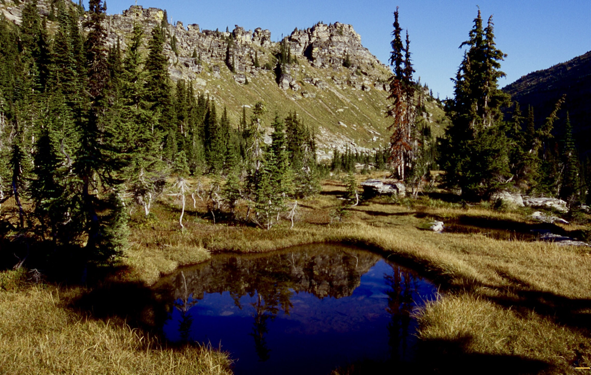
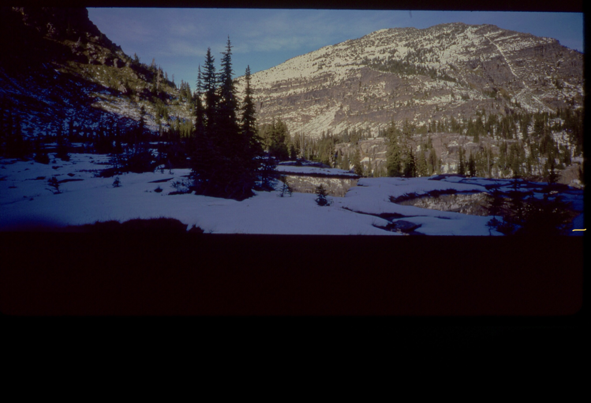
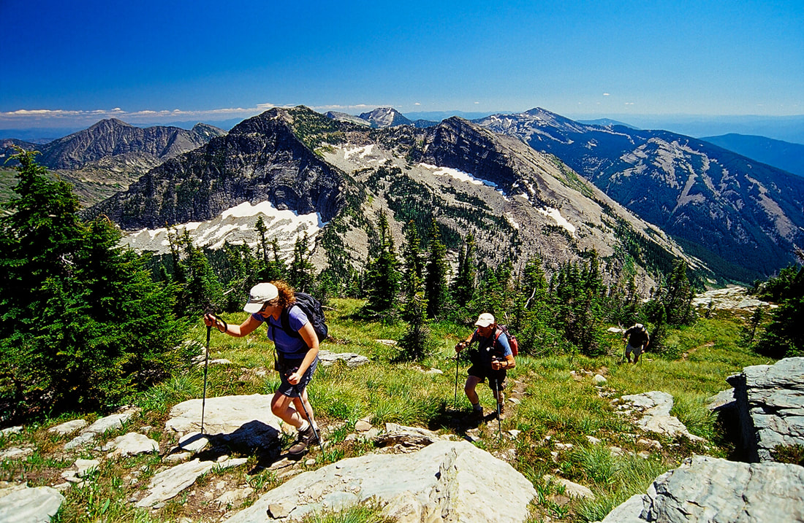
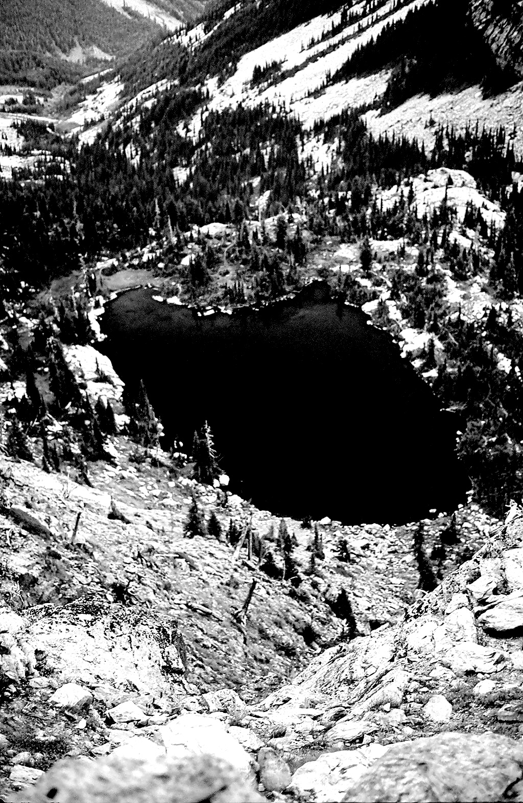
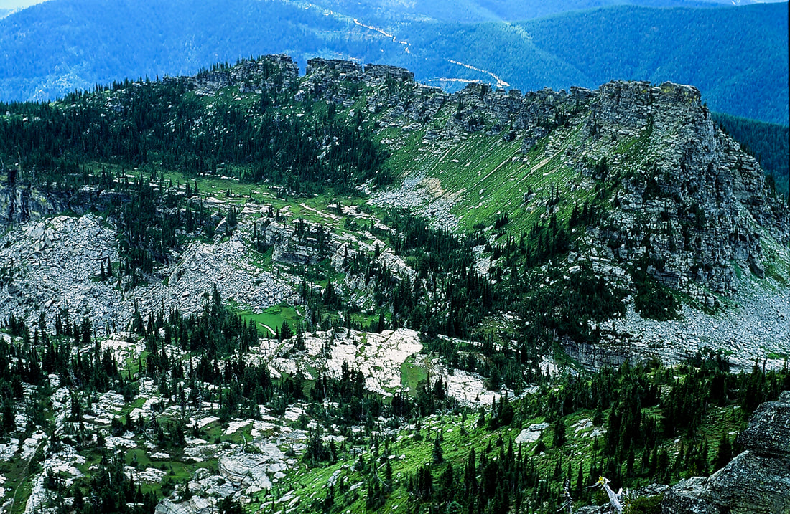
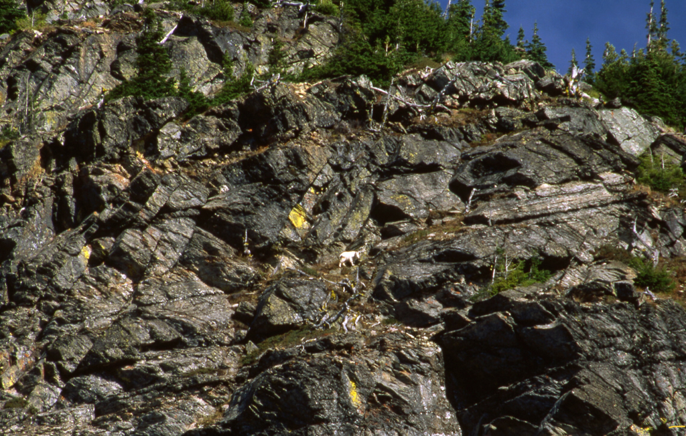
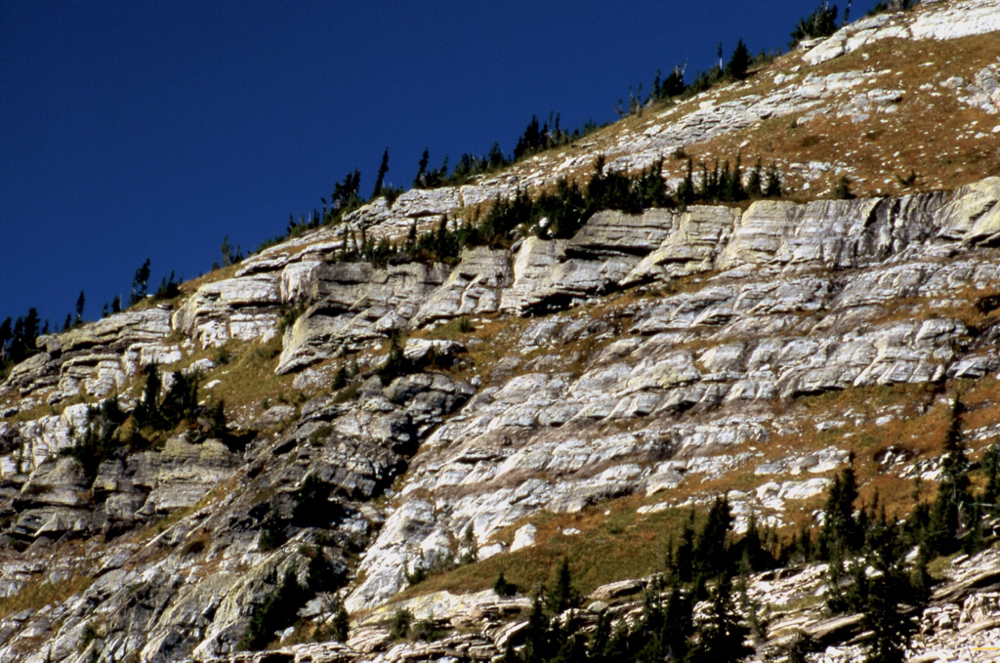
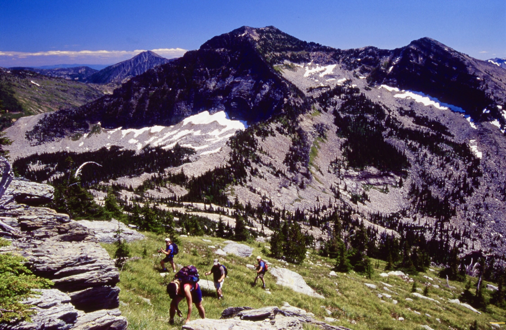
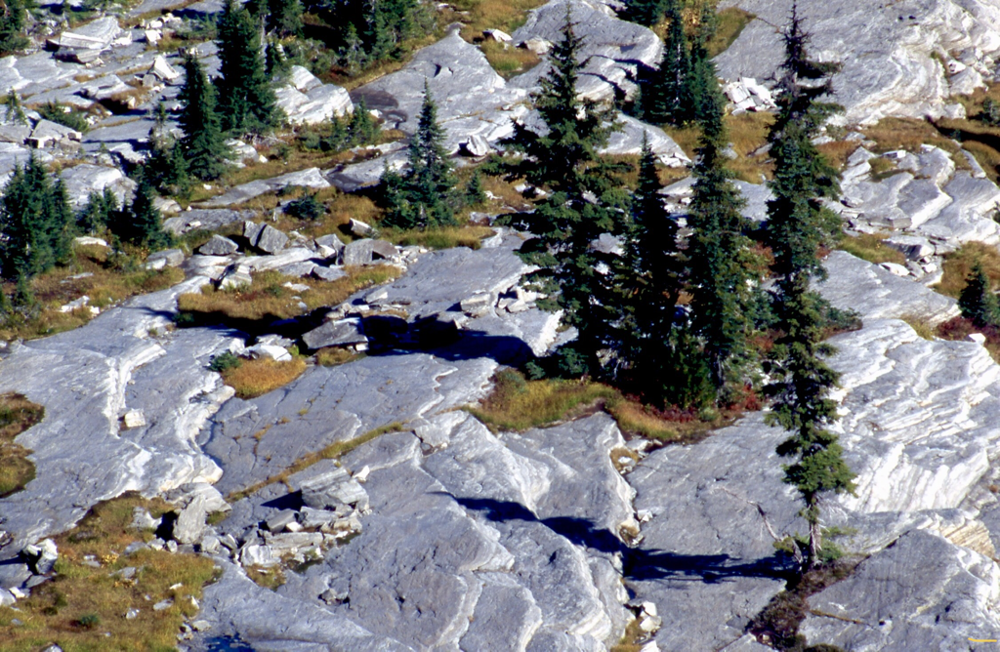
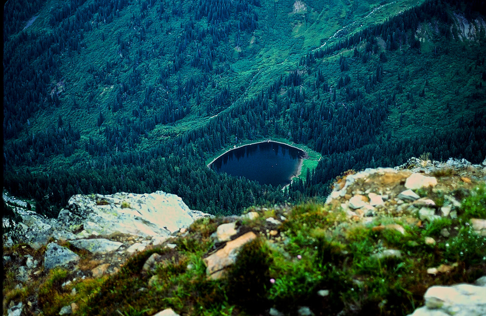

---
tags:
- Trails & Scrambles
- Hiking
- Backpacking
- Climbing
- Fishing
- Photography
- Scrambling
stats:
- label: Event Type
  icon: hiking
  value: Hiking, backpacking, climbing, fishing, photography, and scrambling
- label: Distance
  icon: map-marker-distance
  value: Cliff Lake 3 miles RT St. Paul Peak 6 miles RT. Rock Peak is about 10 miles
    RT.
- label: Elevation Gain
  icon: elevation-rise
  value: Cliff Lake 300 verts gain, with St. Paul Peak at 1970 verts.
- label: Acres
  icon: vector-square
  value: '40.8'
- label: Difficulty
  icon: speedometer
  value: Easy to Cliff Lake and Chicago Peak and difficult to St. Paul Peak
- label: Maps
  icon: map
  value: Kootenai National Forest, Elephant Peak topo
- label: GPS
  icon: crosshairs-gps
  value: 48°04’21" n 115°40’42" w
- label: Ranger District
  icon: pine-tree
  value: Cabinet R.D. 406.827.3533
- label: Sanders County Sheriff
  icon: shield-account
  value: CALL 911 FIRST or 406.827.3584
notes:
- Kootenai national forest/alerts
- <https://www.fs.usda.gov/alerts/kootenai/alerts-notices>
---

# Cliffst P Rock P

!!! warning "Before you go"

    A warning about the road to the cliff lake, St paul peak and rock peak road. After visiting the area
    wednesday 8.4.22, I want to tell you about the road. From f.r. 150, f.r. 2741 up to the trailhead,
    Is extremely rough' and cars wont make it to the trailhead. The walk up the road to the trailhead Is
    about 2.4 miles. and will save your vehicles from damage. Please use caution

## cliff lake, chicago peak 7018’, st. paul peak 7714’

## Description

We have added the areas sheriff’s emergency phone numbers for each trip write up under the ranger district
info. if an emergency ocurrs, evaluate your circumstances and call only if needed. The road to the trailhead
is the hardest part of this hike. High Clearance vehicle, and a chainsaw would be advised. When F.R. #150
comes to F.R. #2741, you may have to park here. F.R. 2741 is very rough for about .5 miles. The road
improves after that.

The wilderness boundary is within minutes of the trailhead. So almost immediately you in awe of your
surroundings and the view. As you walk over a small hill, the trail cuts down thru a forest of young (up to
20 years) Sub-Alpine Firs that are only 5-6 feet tall, and look like hula dancers. There are small ponds on
the plateau that cause excellent reflection images. Near the south edge of the plateau, the views of
infinite amount of climbing walls fills the scene below you. I believe, that an enthusiast could spend their
lives here and not climb all the routes. To the NW of the ponds, towers Chicago Peak 7018'. There are some
nice scrambles and technical climbs along it's .5 of a mile long face. The peak above and in front of you,
is the massive St.Paul Peak. The trail skirts the peak's base, and the edge of Cliff Lake. There are several
good camp sites along it's shore line. Behind the lake, St. Paul Peak fills the reflection.

## Option #1

From the south end of the lake, there is a faint trail heading NE and climbs the south face of St. Paul
Peak. Don't miss this scramblele. From on top, you have 360 degree views of the Cabinet Mountain Wilderness,
and Glacier National Park and the Bob Marshall Wilderness to the east. Below the summit to the NE some 2999'
below, is St. Paul Lake. A small round deep lake worth visiting. Retrace your route to get down.

## Option #2

From Cliff Lake, head east to a massive cliff/saddle that drops below you. Take a right turn (SE) and follow
this ridge across the valley and eventually up the North Face of Rock Peak. Near the north summit. The last
300 vertical feet is on steep loose scree. It can be difficult and dangerous to ascend.

## Option #3

A word of caution....the descent on bear grass is steep and requires great caution. remember to desend
backwards coming down. There is less chance of falls.

This option requires a very nice scramble up a relatively steep Bear Grass slope. Going up and down the
steepest part, I used the Bear Grass for hand holds. Descending I did it facing up hill using the Bear Grass
as hand holds. But the views are worth every bit of effort. The ascent is a little over 200verts. Once on
top, the views up and down the Cabinet Mountain Wilderness were great. But to the west, the entire length of
the American Selkirks is off in the distance. And most of the Proposed Scotchman Peaks Wilderness is right
next door. The summit is large with many photo ops.

## Directions

From Sandpoint, drive east on SH #200 towards Clark Fork and into Montana. Pass SH #56 road and two miles
past Noxon, Montana, near milepost 17, turn left (east) onto the Rock Creek Road # 150. After about 400 feet
take the

right fork for

about 8 miles to the Chicago Peak Road #2741.

You will pass the Engle Peak turnoff, the Rock Lake turnoff, then come to FR #2741. Turn right for about 7.1
miles.

but be aware… this road is not maintained for cars or low clearance vehicles, and is very rough. An Outback
could make it, but you will wish you hadn’t. At this turn, you may not be able to get any higher due to
rocky and rough road beds. You can park here and hike the 7.1 miles, to the trailhead. My suggestion is…
ONLY DRIVE FR #2741 AT YOUR OWN RISK.

The creators of this website can not be held responsible for any damage to your vehicle. you have been
warned.

---

## Cool things close by

Engle Peak, Rock Lake, Star Peak, Pillick Ridge, and Wanless Lake,

## Hazards

The road to the trailhead, after the FR#2741, eats cars. The towing fee could easily reach 1000$.

None to Cliff Lake. Sure footedness and lots of experience should be used going up and down, to reach St
Paul Peak. Summitting Rock Peak, take strength, endurance, experience. Do not attempt, unless you are well
experienced in near vertical rock hopping.

## R & P

Henry’s & Pizza Hut, in Libby, Clark Fork Pantry, Eicharts, Mr Sub & Jalapeños in Sandpoint

---

## Plan your trip

Click for Current NOAA Weather Conditions

(these subalpine firs, shown anove, are called "krummlolz." they can be well over 100 years old at only 6’
tall pnt trees)

## Photo gallery

### Picture (Image missing)

## Trail along side chicago peak in the meadows

---

## St paul peak in june in the sun

---

### Picture (Image missing) Details

St.paul peak on far left, with elephant peak in the distance. rock peak on far right after the first snow

## Scrambling st. paul peak with rock peak left hiker

### Picture (Image missing) Details (2)

## The view looking north. dead center is snowshoe and a peaks

## Cilff lake from the summit of st. paul peak

Chicago peak from st paul peak Top left along chicago peak's ridge is the trailhead just out of sight

---

### Picture (Image missing) Details (3)

## Cliff lake, below st. paul peak, chicago peak in back

---

## Mountain goat on the sw side of st paul peak, above cliff lake

---

## South face st. paul peak, ascent route

---

## Scrambling the s.w. face of st. paul peak. rock peak back middle

---

## The rock meadows above st. paul lake, se of st. paul peak

---

### Picture (Image missing) Details (4)

## Elephant peak 7938’ from the summit of rock peak image by chris h. 8.3.2022

---

## St. paul lake from st. paul peak

### Picture (Image missing) Details (5)

## The spokane mountaineers heading to the trailhead, with chicago peak 7018'

### Picture (Image missing) Details (6)
