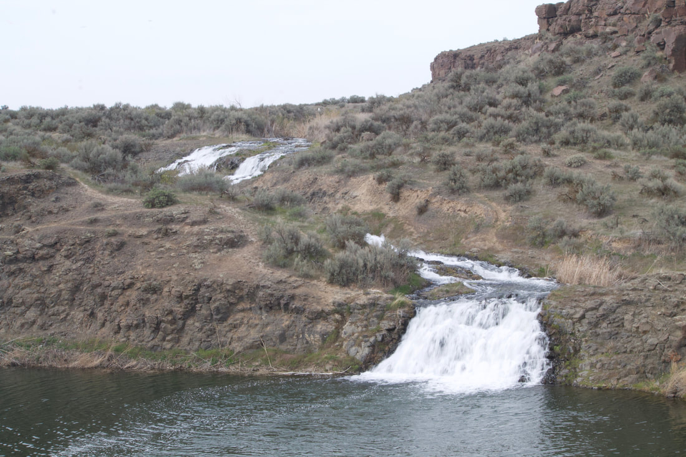
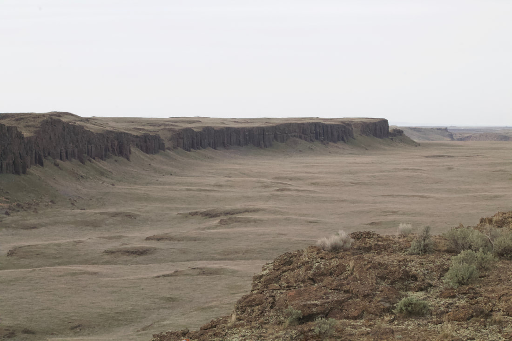
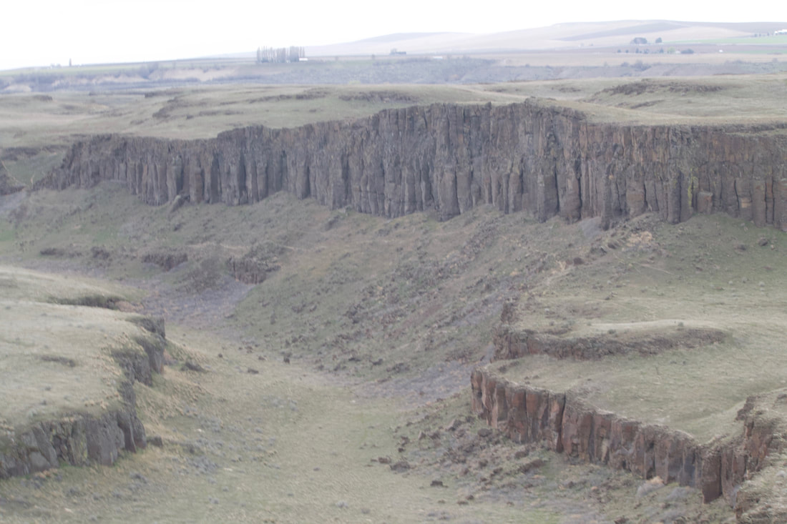
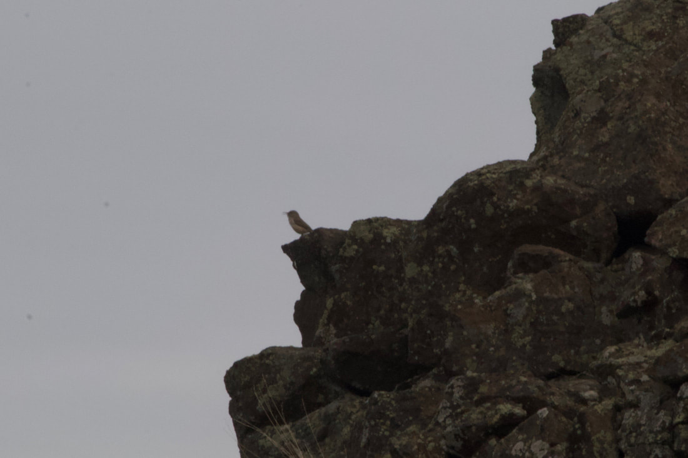
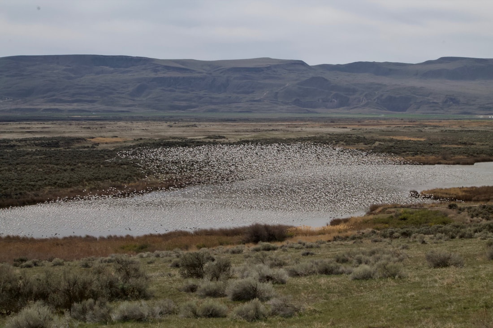

---
tags:
- Trails & Scrambles
- Easy
- Hiking
- Birding
stats:
- label: Event Type
  icon: hiking
  value: Hiking, Birding
- label: Distance
  icon: map-marker-distance
  value: 3 miles
- label: Elevation
  icon: terrain
  value: 200' gain and loss
- label: Difficulty
  icon: speedometer
  value: Easy
- label: Maps
  icon: map
  value: USGS Soda Lake and O'Sullivan Dam
- label: GPS
  icon: crosshairs-gps
  value: 46° 53’ 56.2"n 119° 15’ 57.4"w
- label: Managing Agency
  icon: domain
  value: U.S. Fish & Wildlife Service [509.546.8300](tel:509.546.8300)
- label: Grant County Sheriff
  icon: shield-account
  value: '[509.754.2011](tel:509.754.2011)'
- label: Adams County Sheriff
  icon: shield-account
  value: CALL 911 FIRST or [508.659.1122](tel:508.659.1122)
---

# Columbia National Wildlife Refuge

*Columbia national wildlife refuge 1,000’*

## Description

We have added the areas sheriff’s emergency phone numbers for each trip write up under the ranger district
info. if an
emergency ocurrs, evaluate your circumstances and call only if needed.
**Facts**

- 75,000 individual waterfowl roost and loaf here

- 50,000 square miles of Washington, Oregon and Idaho are covered in basalt

- In places the basalt is nearly three miles thick

- Lake Missoula covered 3,000 square miles, and contained an estimated 500 cubic miles of water at a maximum
  depth of
  2,000

- The flow rate of the flood is estimated at 600 million cubic feet per second

- There may have been as many as 100 separate flood events

- The Drumheller Channels National Natural Landmark area is one of the most spectacularly eroded areas of its
  size in
  the world

- Moses Lake 15 miles to the north was one of the largest permanent Indian encampments. Upto 6,000 people
  lived or
  traded here including tribes from the Dakotas, Montana and the Pacific coast.

- The local Sinkiuse-Columbia Tribe exchanged Columbia River salmon, camas roots and fiber from dogbane with
  the other
  tribes

### Hiking

- The areas including Marsh Loop, Crab Creek, Frog Lake and Upper/Lower Hampton Lake are closed for hiking
  October 1 to
  March 1

- The area around Royal Lake is closed year round

- Marsh Unit #1 and Corfu Road fields are closed February 1 to April 30

- The Mesa  west of Marsh Unit #2 is open year round and is adjacent to Washington Department of Fish and
  Wildlife areas
  that appear to be open to the public use

### Birding

- Royal Lake offers the best viewing of large numbers of birds from a distance

- Marsh Unit #1 has large numbers of Sandhill Cranes between February 1 and April 30 again from a distance

- Fields planted in corn last year will attract birds this year

### Bird Counts

- Thousands of Snow Geese

- Hundreds of Sandhill Cranes

- Hundreds of A. Coots

- Hundreds of Canada Geese

- Tens of Pin Tail Ducks

## Option #1

Bring a chair and a picnic lunch to Royal Lake and sit, watch and listen

## Option #2

Hike cross country on the Mesa west of the parking lot for Marsh Unit #2

## Option #3

Hike north cross country from the Hampton Lake boat launch

---

## Directions

Take I-90 to exit 182, turn left onto Rd O NE, turn right onto Rd 2 SE, turn left onto Rd M SE, turn right
onto WA-262
W, follow that for 2.5 miles and just before the dam turn left into the Refuge.

## Click on the right arrow in the upper left hand corner of the map below to reveal the map legend

---

## Cool things close by

Othello hosts a three day  Sandhill Crane Festival. Info is available here:
[www.othellosandhillcranefestival.org](https://www.othellosandhillcranefestival.org). Othello Mesas and Dry
Creek Trail,
Hanford Reach, Potholes Reservoir S.P.

## Hazards

Rattlesnakes

## R & P

If you like Mexican food Chuy’s Mi Carniceria will have just about anything you want including desserts, fresh
fruits
and hot food to go.

---

## Plan your trip

## Photo gallery

---

<!-- Missing Image: <!-- Missing Image: [*Picture (Image missing)*](assets/images/img-4567.jpg) --> -->

## Marsh unit #1 with loafing sandhill cranes 03-april-21

---

*Picture (Image missing)*

## Tundra swans

---

## Water fall near the crab creek trail head

---

## From the top of the mesa west of marsh unit #2

---

## Looking west from the mesa into wdfw lands

---

## A rock wren singing on the mesa

---

*Picture (Image missing)*

## 48 sandhill cranes flying north over hutchinson lake

## A coyote ran by and scared a couple thousand snow geese into flight

---

*Picture (Image missing)*

## I count about a thousand snow geese in this one photo

They are a noisy bunch resting on the water. they really make a racket when they take off flying
