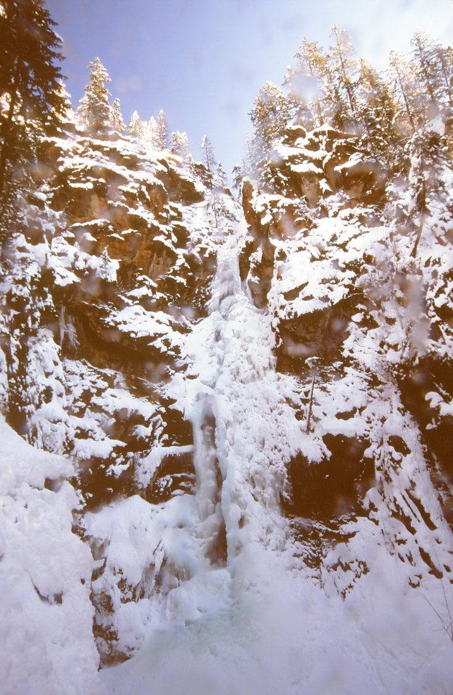

---
tags:
  - Waterfalls
stats:
  - label: Waterfall
    icon: waterfall
    value: Copper Falls
  - label: Drop
    icon: arrow-collapse-down
    value: 160'
  - label: Waterfall Type
    icon: waterfall
    value: Two tiers
  - label: Distance Car to Falls
    icon: map-marker-distance
    value: .6 miles
  - label: Maps
    icon: map
    value: Kaniksu N.F., Eastport topo Bonner Ranger District 208.267.5561
  - label: GPS
    icon: crosshairs-gps
    value: 48°58′20″ N 116°14′10″ W
---

# Copper Falls

## Description

Copper Falls is a tall falls tucked back in the woods very close to the U.S.-Canadian border in N. Idaho. It
is cool to visit in any season. From Hwy 95, turn right (SE) onto N.F. Road #2517, just past the Moyie River
and across from the Northwest Duty Free Store. Stay on #2517 for 2.5 miles to the marked trailhead. A sign
points the way to the falls.

### Option #1

Along the trail to the falls is a loop trail of about 1.4 miles that takes you up the left (W) side to an
observation deck. After you have visited the falls, do the loop for additional views.

## Directions

Drive north on Hwy 95 to the Northwest Duty Free Store, and turn right (SE). The Duty Free Store is about
.74 miles from the U.S.-Canadian border.

## Cool Things Close By

Robinson Lake & Campground, the Good Grief Tavern, Snyder Guard Station Historical District, the Moyie
Springs Waterfall, and of course the American Selkirks which has Myrtle Falls, U. & L. Snow Creek Falls, and
the Kootenai National Wildlife Refuge.

## Hazards

All waterfalls are a hazard due to their slippery nature. Always be extra careful near any waterfall.

## R & P

Good Grief Tavern, Jalapeños, and Eichardt's in Sandpoint.

## Photo Gallery

_An old image of Copper Falls on a sunny day in the winter._
