---
tags:

- Peaks & Mountains

- Hiking

- Backpacking

- No Trail. Yahooo

stats:

- label: Event Type
  icon: hiking
  value: Hiking, backpacking and equestrian. Maybe some mt biking to Cutoff Peak,
    but the very long ridge towards Smith Peak has many blow downs, and no trail.
    Yahooo

- label: Distance
  icon: map-marker-distance
  value: Cutoff Peak about 6 miles RT. Smith Peak from Cutoff Peak 8 miles RT

- label: Elevation
  icon: terrain
  value: To Cutoff Peak 1440' gain To Smith Peak about 2700'+

- label: Difficulty
  icon: speedometer
  value: Moderate to Cutoff Peak Difficult to Smith Peak

- label: Maps
  icon: map
  value: IPNF - Kaniksu N.F., USGS - Shorty Peak & Smith Peak

- label: GPS
  icon: crosshairs-gps
  value: 48° 53’ 46.0"n 116° 38’ 41.5"w

- label: Ranger District
  icon: pine-tree
  value: Bonners Ferry R.D. 208.267.5561

- label: Boundary County Sheriff
  icon: shield-account
  value: CALL 911 FIRST or 208.267.3151
notes:

- Idaho panhandle national forest/alerts

- <https://www.fs.usda.gov/alerts/ipnf/alerts-notices>
---

# Cutoff Peak 6844 And Smith Peaks North Ridge

*Cutoff peak 6844' and smith peak's 7653’ north ridge*

## Description

We have added the areas sheriff’s emergency phone numbers for each trip write up under the ranger district info. if an emergency ocurrs, evaluate your circumstances and call only if needed.
The first part of this trail is on an old roadbed for about .5 miles, then picks up Trail #17 for about 2.5 miles to Cutoff Peak. Along this section of the trail, it climbs steeply to a ridge top, with views of Cutoff Peak in the distance. A short distance on the ridge, Trail #17 meets up with Trail #18. As the trail continues south, it skirts Cutoff Peak and summits on the south flank. Once on the ridge, head north a short distance to a dilapidated old cabin. Wander about this area to the east for views of the Long Canyon drainage. Once back on Trail #18, the trial undulates to a higher point, where there is an excellent camp site. Although there is no trail to Smith Peak 4 miles one way, the ridge is wide and spectacular. There are several bumps along the ridge before a taller one closer to Smith Peak. About half way up this bump, there is a route to skirt the bump towards Smith Peak. As you access the saddle below Smith Peak and start climbing, you should skirt the NW side of Smith Peak to the west side. From here it's just a scramble up thru the trees and scree to the summit.

## Directions

Drive north past Bonners Ferry to State Highway 1 and follow it for about a mile to the Copeland turn off onto SH #45. In another mile bear left (west) across the Kootenai River to the West Side Road # 417. Turn right (NW) for 9 miles and stay to the left that switchbacks onto the Smith Creek Road #281. Road 281 is paved for about 6.5 miles, where you will turn left ( east) onto FR # 2443. Continue for 6.6 miles to the trailhead.

## Hazards

Once past Cutoff Peak, there is no real "trail", just a wide ridge line to stay centered on.
There is no water source along this route. Carry more then you will need.

## Cool things close by

Red Top Mt, Shorty and Lone Tree Peaks, and West Fork Lake.

## R & p

Jalapeños, Mr. Sub, Burger Express, Eichardt’s in Sandpoint

---

## Plan your trip

[Click for Current NOAA Weather Conditions](https://www.nws.noaa.gov/wtf/udaf/MapClick.php?lel=4000&uel=8000&polygon=48.756%2C-116.664%2C48.879%2C-116.843%2C48.964%2C-116.592%2C&area=NaN)

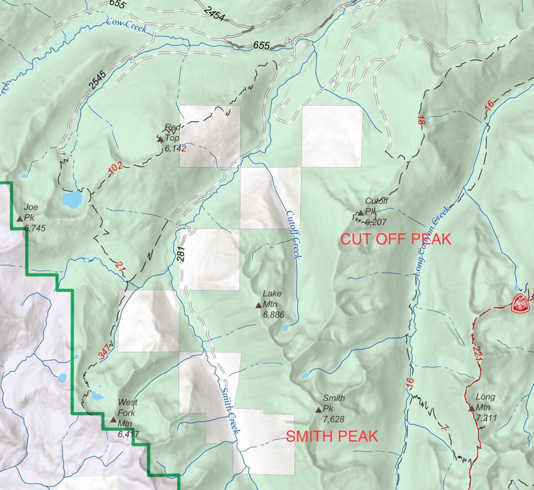

## Photo gallery

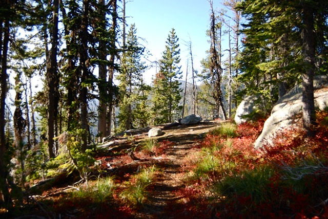"

## Near the start of the trail to cutoff peak on way to smith peak

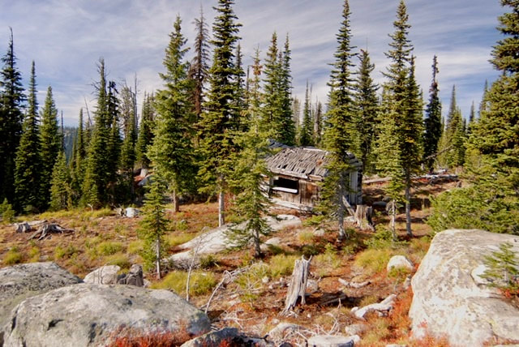

## An old lookout cabin on cutoff peak on way to smith peak

##

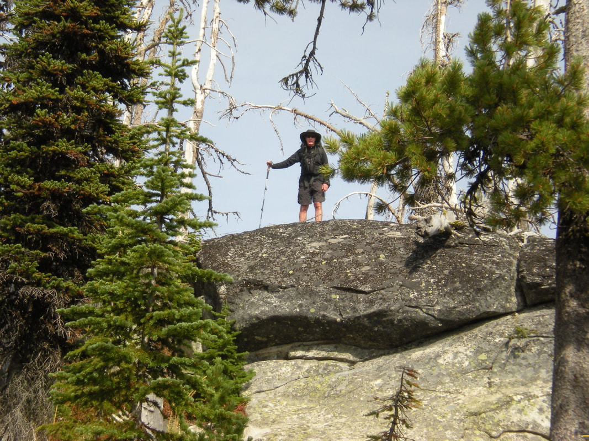

## chris on cutoff peak

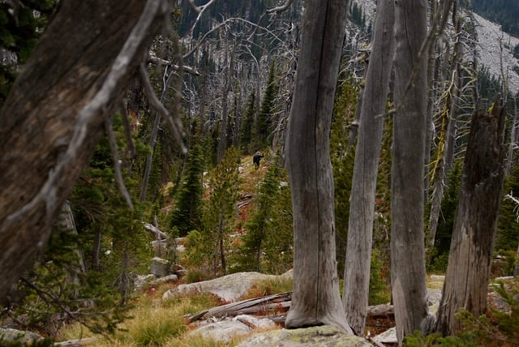

## Chris walking in a cool forest on the way to smith peak

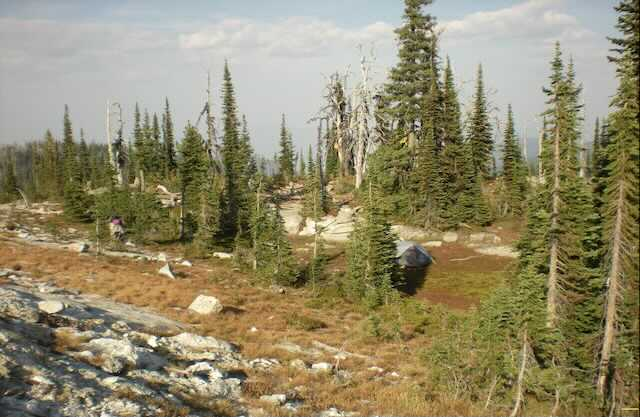

## The campsite about half way along the ridge

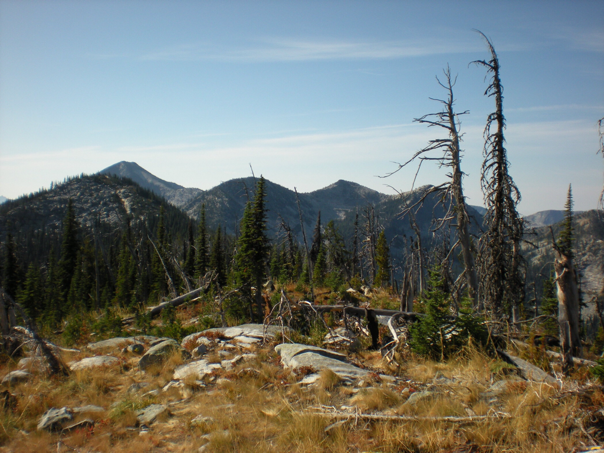

## Along the ridge to smith peak

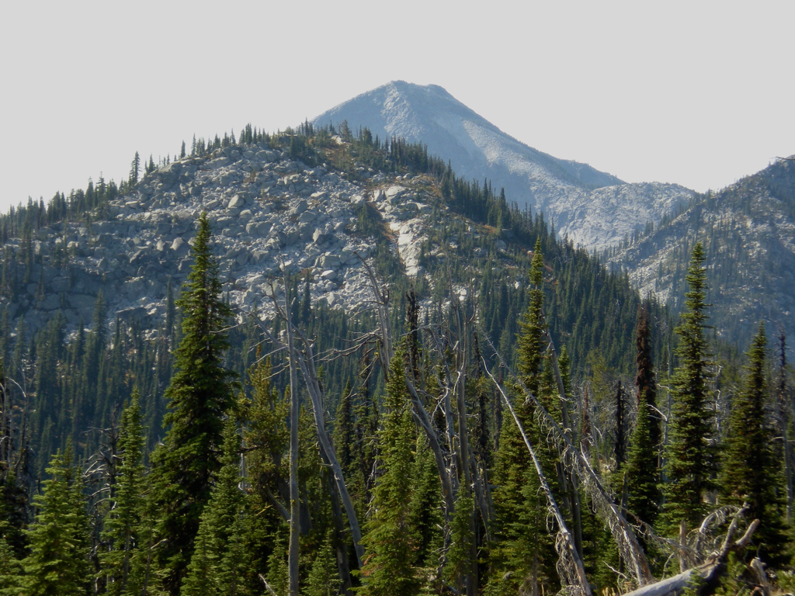

## The ridge walk to smith peak, smith peak top left

---

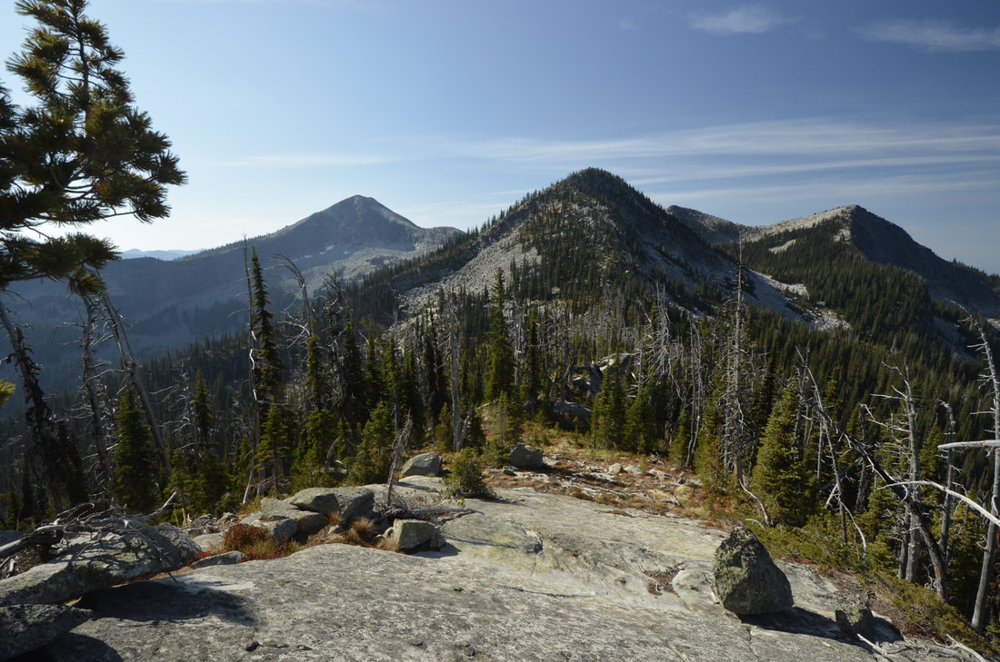

## On the ridge between cut off peak and smith peak image by chris herath

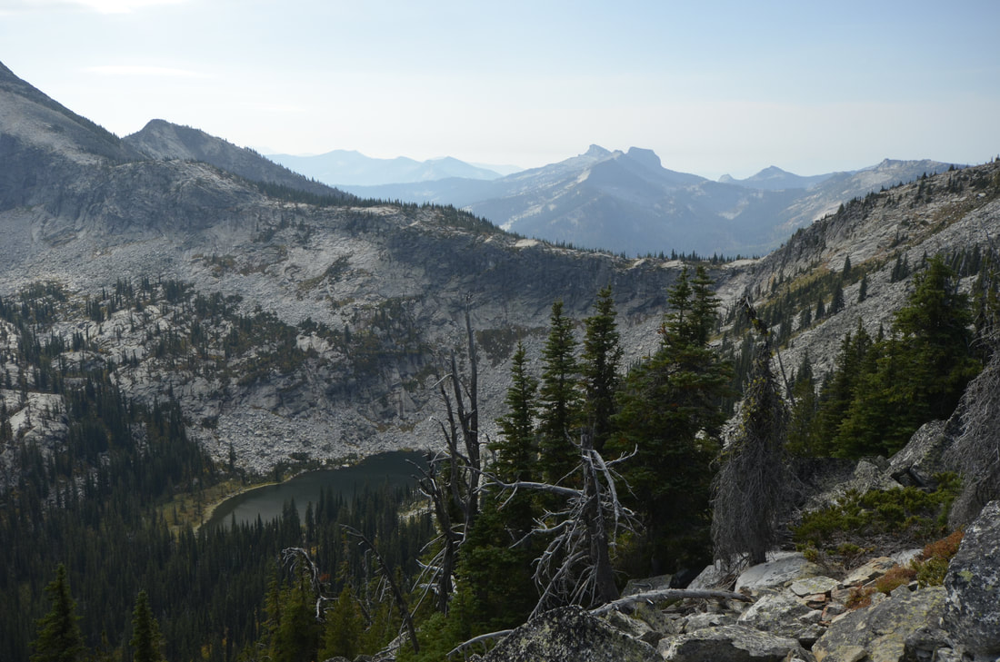

## Smith lake with lion head on the next ridge image by chris herath

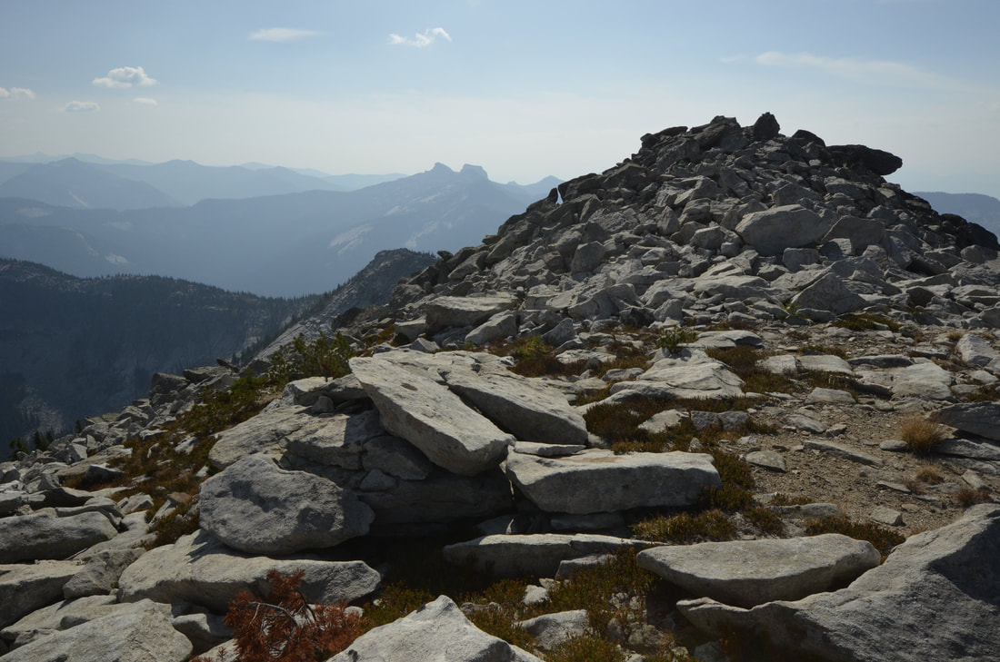

## The summit of smith peak image by chris herath

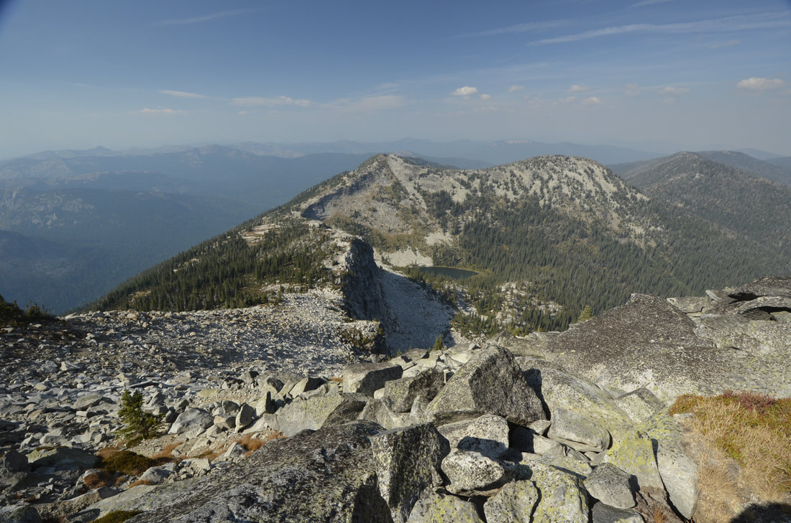

## Looking back towards cut off peak. the obvious ridge is the route. Image by chris herath

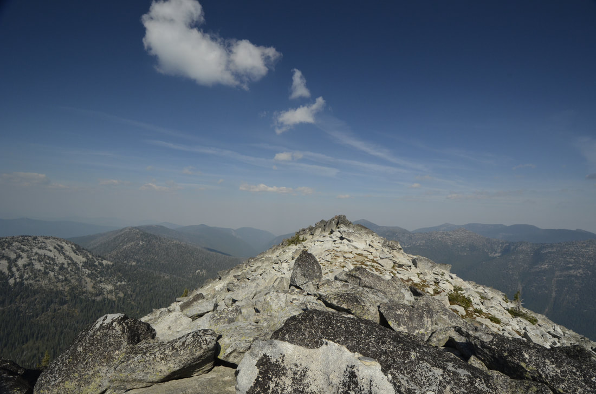

## One last look back at the summit of smith peak Image by chris herath

Wondering the mountains takes us on a path thru our soul. While a path thru our soul takes us to new heights. New heights expand our love of wandering.                                                                chic.  7.29.11
