# Deserts  Scablands

---

## Deserts & scablands

## Click on image to enlarge

---

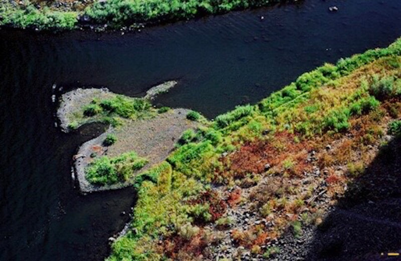{: data-src=" data-title="THE ENERGIZER BUNNY AT PALOUSE FALLS, WA." }

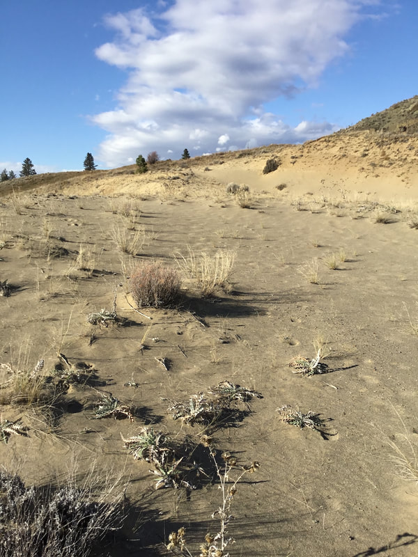"

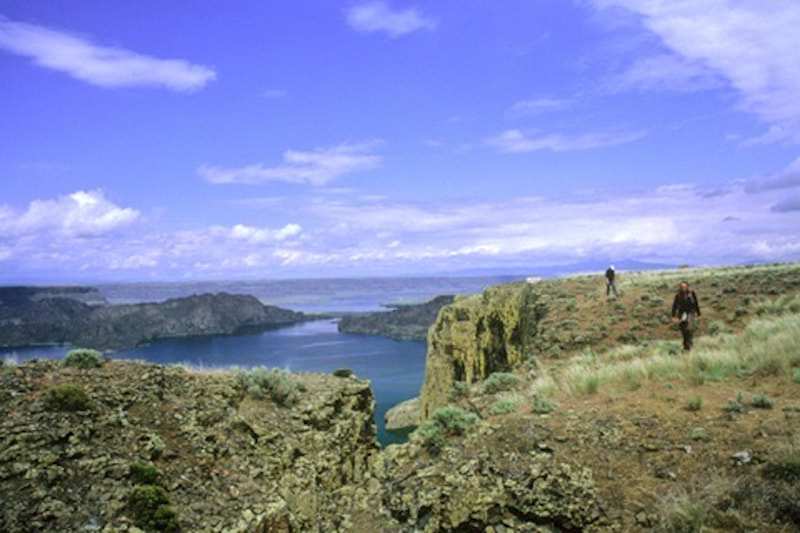{: data-src=" data-title="WALKING THE ROCK STEAMBOAT ROCK STATE PARK, WA" }

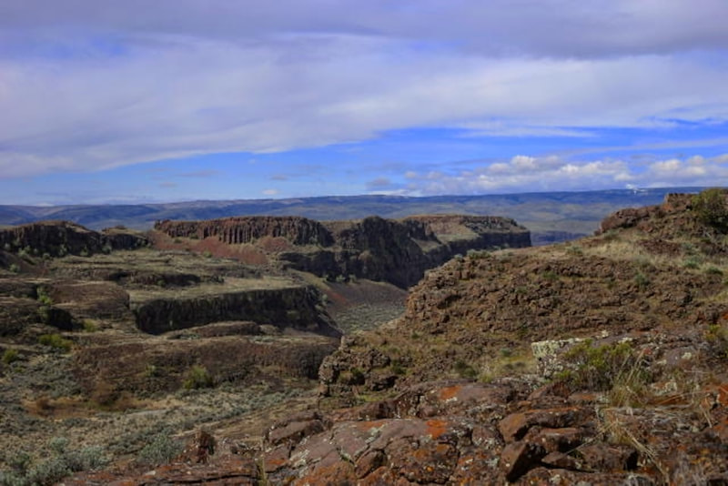"

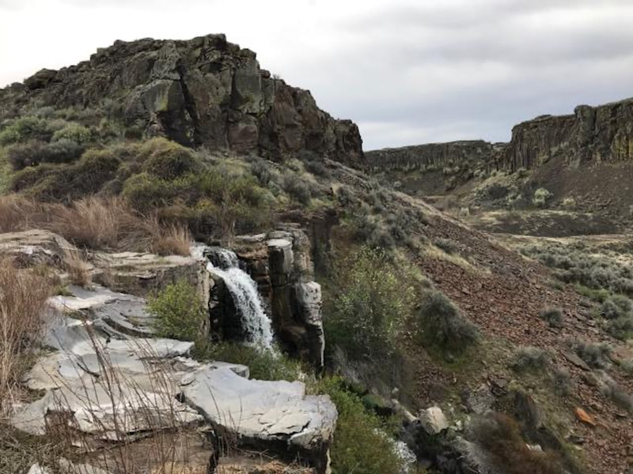{: data-src=" data-title="THE FALLS AT ANCIENT LAKE WASHINGTON SCABLANDS" }

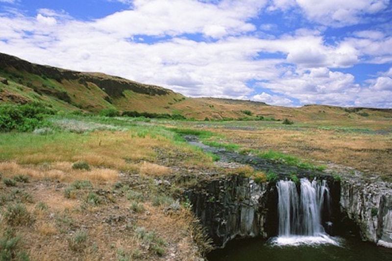"

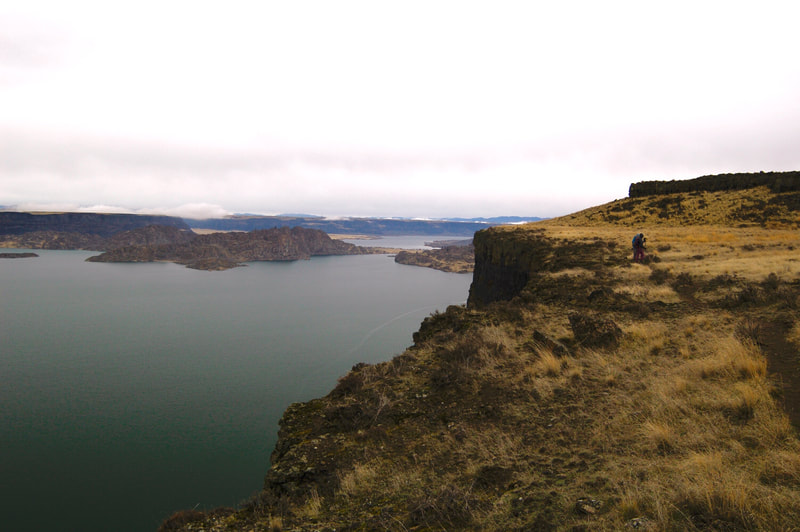{: data-src=" data-title="BANKS LAKE & STEAMBOAT ROCK WASHINGTON SCABLANDS" }

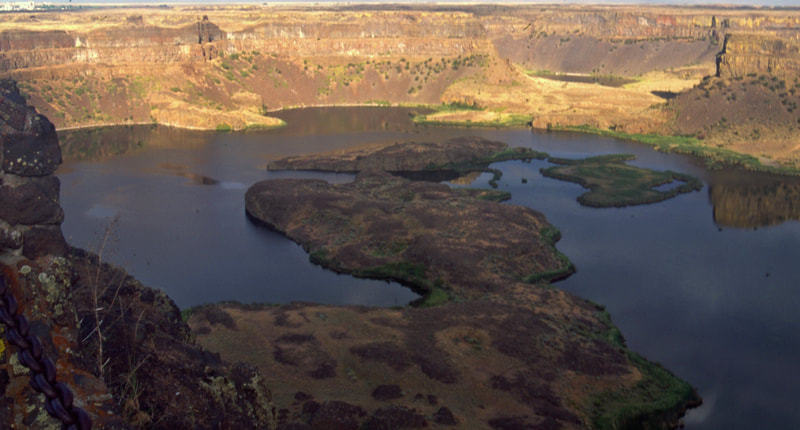"

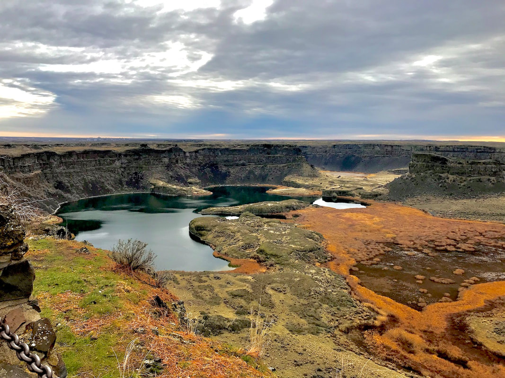{: data-src="assets/images/12262021645p_orig.jpeg" data-title="A WIDE VIEW OF DRY FALLS FROM THE VISITORS CENTER" }

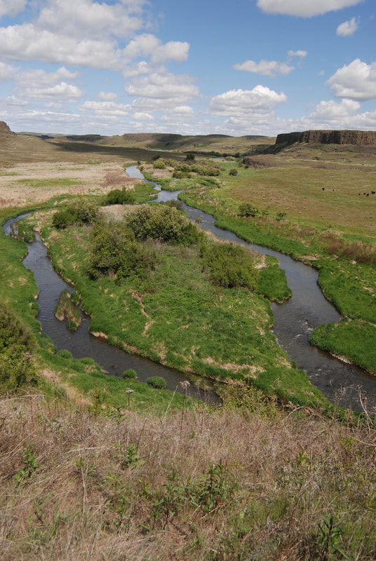"

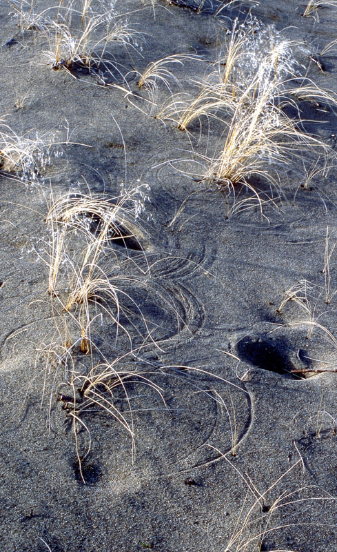{: data-src=" data-title="SAND DUNES AT HAWK CREEK FALLS STATE PARK" }

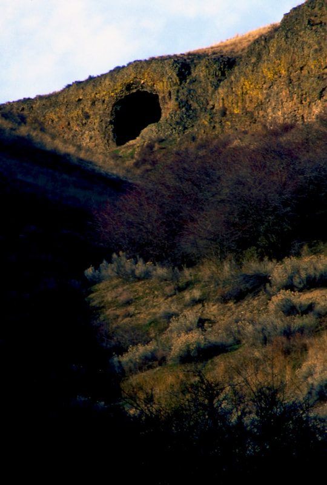"

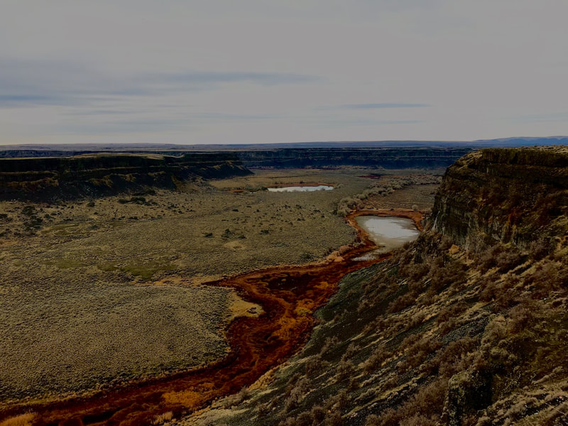{: data-src=" data-title="STEAMBOAT ROCK SATE PARK" }

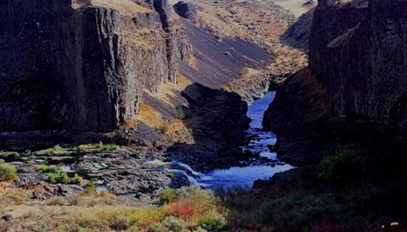"

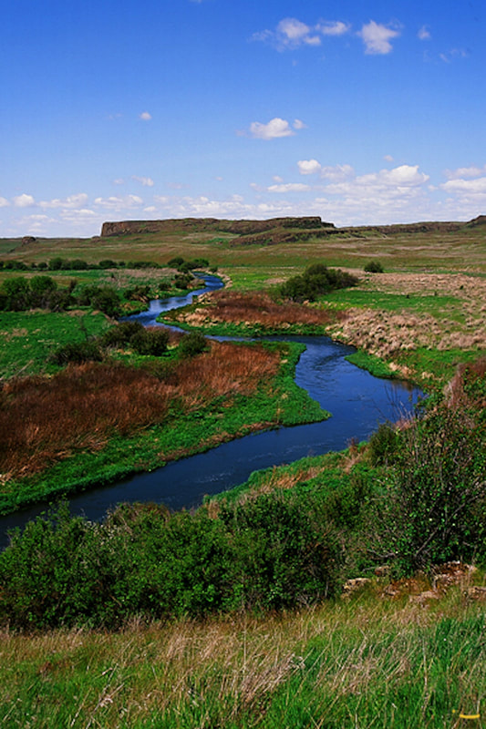{: data-src=" data-title="ROCK CREEK AT ESCURE RANCH, TOWELL FALLS" }

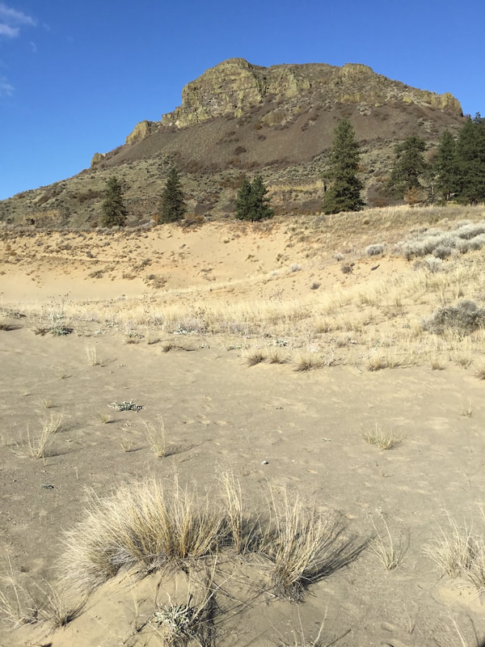"
